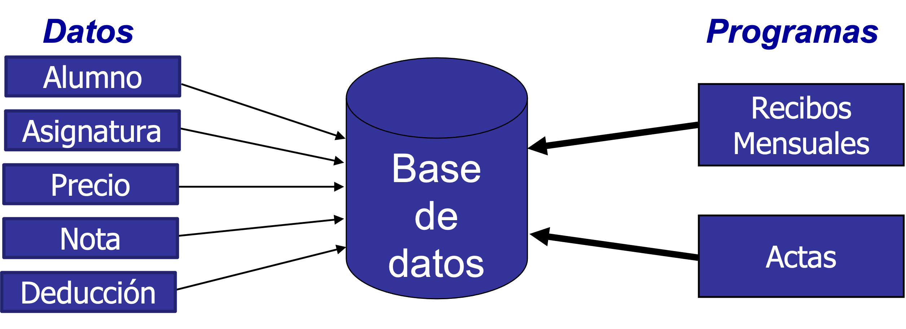
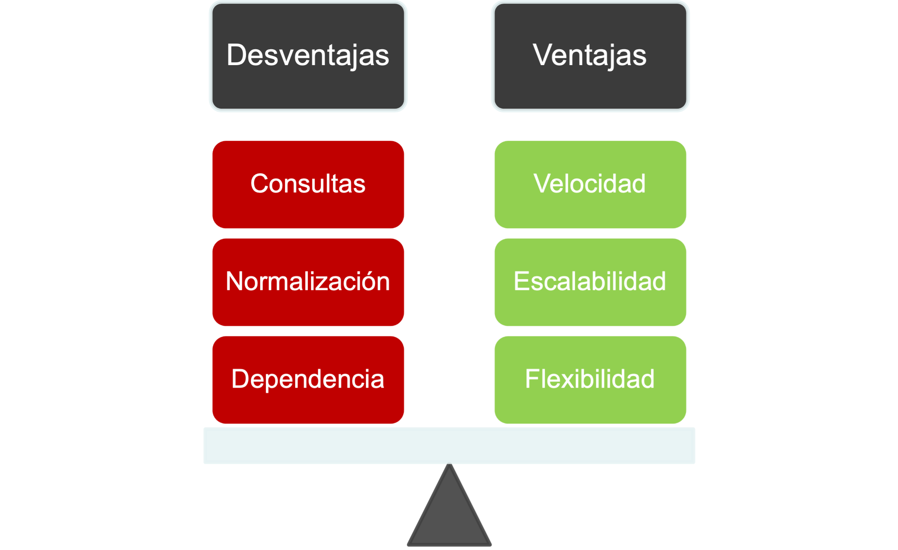

<!--
_header: ''
_footer: <br>Esta obra está bajo una [licencia de Creative Commons Reconocimiento-NoComercial-CompartirIgual 4.0 Internacional](http://creativecommons.org/licenses/by-nc-sa/4.0/). Icono diseñado por Flaticon
-->
<style>
img[alt~="center"] {
  display: block;
  margin: 0 auto;
}
img {
  background-color: transparent!important;
}
li {
  text-align: justify;
}
</style>


# TEMA 1

Introducción

---

## Introducción

# INTRODUCCIÓN A LAS BASES DE DATOS

---

## ¿Qué son los datos?

Corresponden a hechos o realidades del mundo real.

A partir de ellos, intentamos reconstruir la información del mundo real.

Son "almacenados" usando un método de comunicación (ej.: figuras o lenguajes) en un medio semipermanente de "registrarlos" (ej.: piedras o papel).

---

## ¿Qué son los datos?

**Generalmente**, el dato y su interpretación son recogidos juntos, en los lenguajes naturales
- Su altura es 175 cm
  - Dato: 175
  - Significado: altura en centímetros

**A veces**, los datos son separados de su interpretación
- Hora en un reloj
- Temperatura en un termómetro de la calle

---

## ¿Qué son los datos?

Los ordenadores han incrementado la separación entre datos y su significado:
- No se prestan para manipular en lenguaje natural
- El coste de almacenamiento es muy elevado

La interpretación de los datos es inherente a los programas que los utilizan:
- Dato: valores almacenados
- Información: significado de los datos

---

## Almacenamiento de datos

Existen dos aproximaciones para el almacenamiento de los datos utilizados por un programa informático:
- Sistemas basados en ficheros
- Bases de datos

---

<style scoped>
li { font-size: 0.9rem; }
p { font-size: 0.9rem; }
</style>

## Sistemas basados en ficheros

En los sistemas basados en ficheros cada programa utiliza sus propios datos. Esto provoca una ocupación inútil de memoria, la aparición de inconsistencias y duplicidad de información.

Además, existe dependencia física entre los programas y los datos:


---

### Sistemas basados en bases de datos

Cuando se utilizan bases de datos los programas "*comparten*" los datos:



---

## ¿Qué es una base de datos?

Definición 1:

> Conjunto de información (datos) **homogénea** de una organización, **almacenada** en un ordenador, y que permite realizar **consultas** y **actualizaciones** (inserciones, modificaciones y/o borrados).

---

## ¿Qué es una base de datos?

Definición 2:

> Conjunto **exhaustivo**, con redundancia controlada de **datos estructurados**, fiables y homogéneos, organizados con **independencia** de su utilización y de su implementación en máquina, accesibles en tiempo útil, **compartibles** por usuarios concurrentes que tienen necesidades de información diferentes y no predecibles en el tiempo.

---

## ¿Cómo se *utilizan* las bases de datos?

Las bases de datos se definen y manipulan mediante un **Sistema de Gestión de Bases de Datos** (SGDB)

---

## Introducción

# MODELOS DE DATOS

---

## ¿Qué es un modelo de datos?

Un modelo de datos permite describir las propiedades de la información almacenada en una base de datos:

- Estructuras de datos
- Restricciones
- Dependencias
- Dominios

Los modelos de datos son fundamentales para introducir la abstracción en una base de datos.

---

## Tipos de modelos de datos

<style scoped>
li { font-size: 0.8rem; }
p { font-size: 0.8rem; }
section { padding-left: 24px; }
</style>

Modelos de datos **conceptuales**
- Describen las estructuras de datos y las relaciones de integridad
- Utilizados en la etapa de análisis

Modelos de datos **lógicos**
- Orientados a las operaciones
- Dependientes del tipo de base de datos utilizada

Modelos de datos **físicos**
- Estructuras de datos de bajo nivel usadas para almacenar información
- Dependientes del SGDB


---

## Modelo conceptual

Identifica las **entidades** que se van a almacenar en las base de datos:
- Ejemplo: alumnos, asignaturas, departamentos...

Modela las **relaciones** existentes entre las entidades:
- Ejemplo: los alumnos se matriculan de asignaturas.

Son cercanos al **mundo real**.

Ayudan a comunicarse con los clientes de las empresa de desarrollo.

---

## Modelo lógico

Incluyen las **relaciones** y **atributos** del modelo conceptual.

La **normalización** se produce en este nivel:
- Evita duplicidad de información

Define conceptos propios de las bases de datos:
- Claves primarias:
    - Ejemplo: los alumnos son identificados de forma unívoca por su número de matricula
- Claves foráneas
    - Ejemplo: el alumno con número de matrícula aa0000 fue calificado con un 10 en la asignatura de bases de datos

Son cercanos a la base de datos.

---

## Modelo físico

Definen cómo debe almacenarse la información en un dispositivo físico.

Altamente dependientes del SGBD y de la versión del mismo.

Cercanos al Sistema Operativo.

Facilitan la rápida recuperación y manipulación de los datos almacenados.

---

## Introducción

# TIPOS DE BASES DE DATOS

---


---

<style scoped>
section {padding-right: 24px;}
</style>

## Bases de datos relacionales

Cumplen con el modelo relacional:
- Normalización

Es el tipo de base de datos más utilizado.

Utilizan el lenguaje SQL (*Structured Query Languaje*) para consultar y manipular datos.

Los datos son almacenados en tablas:
- Es posible "unir" diferentes tablas para recuperar información


---

## Bases de datos no relacionales

No cumplen el modelo relacional.

De "*reciente*" aparición.

También llamadas `NoSQL`.



---

<style scoped>
li { font-size: 0.8rem; }
p { font-size: 0.8rem; }
section {padding-right: 24px;}
</style>

## Bases de datos documentales

La información es almacenada en documentos.

Los documentos contienen información semi-estructurada.

Escalabilidad vertical (máquina más potente) y horizontal (más máquinas).

Muy eficientes para la manipulación de datos.

Aconsejan duplicar información:
- Mejora el rendimiento de las consultas

Consultas muy limitadas.


---

<style scoped>
li { font-size: 0.8rem; }
p { font-size: 0.8rem; }
section {padding-right: 24px;}
</style>

## Bases de datos clave-valor

Almacena toda la información en pares `<clave, valor>`.
- La clave es única.
- El valor puede ser cualquier objeto.
- Ejemplo:
    - Clave: `aa0000`
    - Valor: `nombre = "Juan"; apellidos = "García Torres"`

Altamente divisibles

Escalabilidad horizontal

Suelen almacenarse en memoria


---

<style scoped>
section {padding-right: 24px;}
</style>

## Bases de datos de alta escalabilidad 

Bases de datos distribuidas.

Masivamente escalable (escalabilidad lineal).

Orientadas a columnas:
- Optimizadas para la completa recuperación de datos de columnas de datos (analítica de datos).

Pensadas para entornos con pocas escrituras.


---

<style scoped>
li { font-size: 0.9rem; }
p { font-size: 0.9rem; }
section {padding-right: 24px;}
</style>

## Bases de datos orientadas a grafos

Representan la información mediante un grafo:
- Nodos: entidades
- Aristas: relaciones

Completamente normalizadas:
- No duplican información

Muy versátiles.

Utilizan un lenguaje de consultas complejo.

Computacionalmente costosas.


---

## Introducción

# ARQUITECTURA CLIENTE-SERVIDOR

---

## Arquitectura cliente-servidor

Las bases de datos funcionan bajo una arquitectura cliente-servidor:
- La base de datos es el servidor
- Las aplicaciones que se conectan a la base de datos son los clientes

Esta arquitectura permite compartir los datos entre diferentes aplicaciones:
- Un solo servidor
- Múltiples clientes


---

<style scoped>
li { font-size: 0.9rem; }
p { font-size: 0.9rem; }
section {padding-right: 24px;}
</style>

## Infraestructura física

Habitualmente, la base de datos (servidor) y la aplicación (cliente) se separan en diferentes máquinas físicas.

Existe un protocolo de comunicación entre el cliente y el servidor.
- ¿Cómo se realizan las peticiones?
- ¿Cómo se responde?


---

## Ventajas

Se centraliza el acceso a los datos evitando inconsistencias.

Facilita la escalabilidad:
- Se puede aumentar la capacidad de clientes y servidores por separado.

Mejora el mantenimiento del sistema:
- El mantenimiento de la base de datos depende exclusivamente de la propia base de datos.

Facilita el desarrollo de aplicaciones al abstraerse de la gestión de los datos.


---

## Desventajas

Se puede congestionar el acceso a los datos si el ratio cliente/servidor no es adecuado.

No hay robustez frente a caídas o ataques al servidor:
- Este riesgo se minimiza si se replica el servidor

Existe dependencia de la conexión a la base de datos para el funcionamiento de la aplicación.

---

## Conexión con la base de datos

La conexión a base de datos se realiza a partir de un URL (*Universal Resource Location*).

Ejemplo:

```
jdbc:mysql://mydb.com:3306/dbname
```
