<!--
_header: ''
_footer:  Esta obra está bajo una [licencia de Creative Commons Reconocimiento-NoComercial-CompartirIgual 4.0 Internacional](http://creativecommons.org/licenses/by-nc-sa/4.0/). Icono diseñado por Flaticon
-->

# TEMA 2

Modelado de datos

---

## Modelado de datos

# EL MODELO ENTIDAD-RELACIÓN

---

## Modelado conceptual: ¿Por qué?

- El ser humano suele tener problemas para transmitir información concreta
- Los clientes tienden a proporcionar información superflua cuando se pregunta por requisitos
- Nuestra mente funciona mejor cuando trabaja con abstracciones:
  - Diagramas
  - Esquemas

---

## ¿Cuál prefieres?

> Pues como le iba diciendo, necesito que me construya una aplicación para gestionar mi gasolinera low-cost. Ya sabe, la gente echa diésel o gasolina y luego me pagan. Algunos me piden factura, y resoplan cuando les pido los datos de la empresa, sobre todo aquellos que son clientes fijos. ¡Se me olvidaba! Tengo que llevar un registro de los litros que se gastan en cada repostaje, además de cuándo se realizó.

- Requisitos de datos:
  - Facturas que se emiten a clientes.
  - Litros de combustible repostado y fecha.
  - Guardar la información de los clientes.
  - Tipos de combustible.
  
---

## ¿Cuál prefieres?

> Pues como le iba diciendo, necesito que me construya una aplicación para gestionar mi gasolinera low-cost. Ya sabe, la gente echa diésel o gasolina y luego me pagan. Algunos me piden factura, y resoplan cuando les pido los datos de la empresa, sobre todo aquellos que son clientes fijos. ¡Se me olvidaba! Tengo que llevar un registro de los litros que se gastan en cada repostaje, además de cuándo se realizó.

- Requisitos de datos:
  - ~~Facturas~~ que se emiten a ~~clientes~~.
  - Litros de ~~combustible~~ repostado y fecha.
  - Guardar la información de los ~~clientes~~.
  - Tipos de ~~combustible~~.
  
**¿Qué tienen en común facturas, clientes, combustibles?**

---

## Entidad

~~Factura~~, ~~cliente~~, ~~combustible~~ son objetos o cosas del mundo real que tienen existencia por sí mismas.

---

## Entidad

- Una entidad agrupa una serie de ocurrencias de objetos/cosas en una base de datos.
- Clientes de la gasolinera (ocurrencias):
  - Pepe Pérez, con CIF 12345678X y correo electrónico pepito.palotes@gmail.com
  - Transportes La Bomba S.L., con CIF B87654321 y correo electrónico info@labomba.es

---

## Entidad

- Una entidad agrupa una serie de ocurrencias de objetos/cosas en una base de datos.
- Clientes de la gasolinera (ocurrencias):
  - ~~Pepe Pérez~~, con CIF ~~12345678X~~ y correo electrónico ~~pepito.palotes@gmail.com~~
  - ~~Transportes La Bomba S.L.~~, con CIF ~~B87654321~~ y correo electrónico ~~info@labomba.es~~

¿Qué tienen en común los fragmentos subrayados?

---

## Atributos

El ~~nombre~~, ~~CIF~~ y ~~correo electrónico~~ de los clientes definen las propiedades de la entidad `Cliente`

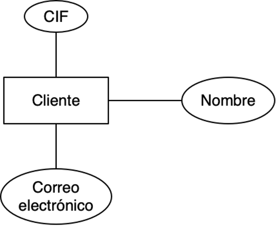

---

## Dominios

- Cada atributo tiene un conjunto de valores permitidos:
  - **CIF**: cadenas de 8 dígitos y una letra, donde la letra y los dígitos están relacionados por una función matemática.
  - **Nombre**: cadenas de caracteres
  - **Correo electrónico**: direcciones de correo válidas, de la forma usuario@dominio 

Es **obligatorio** definir el dominio de todos los atributos

---

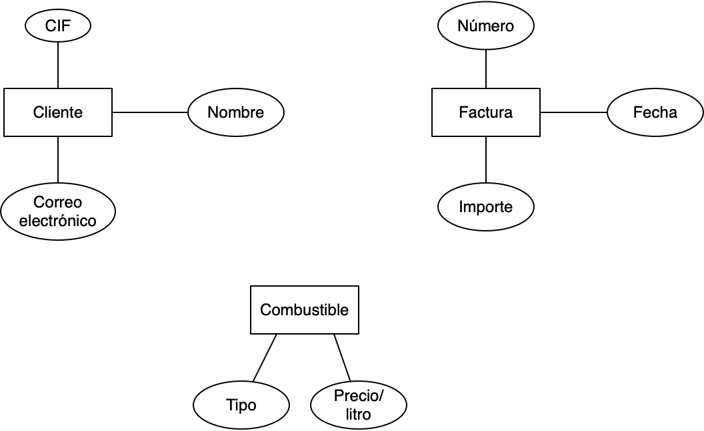

¿Entonces la base de datos para la gasolinera queda definida por estas entidades y sus atributos?

---

## Relaciones

Las _facturas_ **se emiten** para _clientes_.

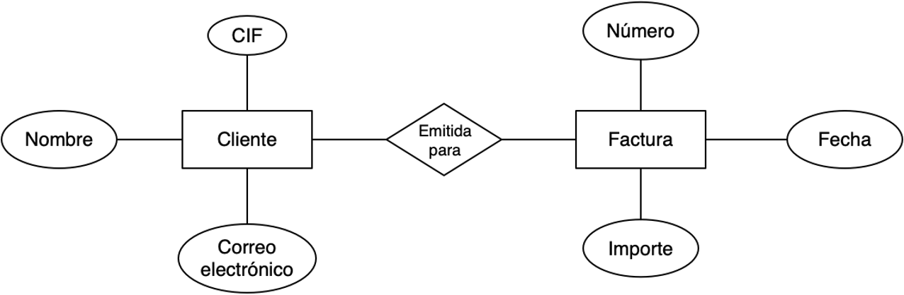

---

## Relaciones

Los _clientes_ **repostan** _combustible_.

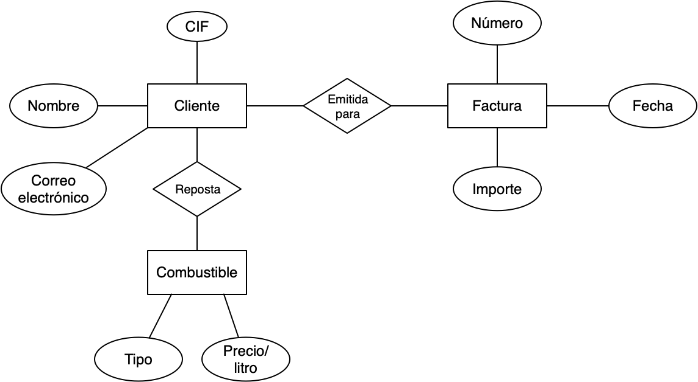

---

## Relaciones

- Las relaciones representan asociaciones entre ocurrencias de entidades
- Pueden tener atributos propios:

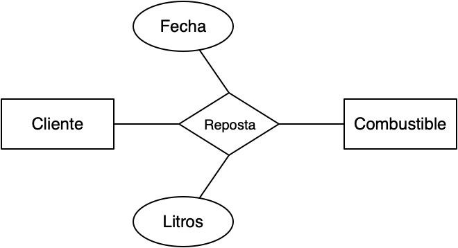

---

## Relaciones

- Es importante definir el rol que las entidades juegan en las relaciones:

---

## Relaciones

- El grado de una relación nos indica el número de entidades implicadas en ella.

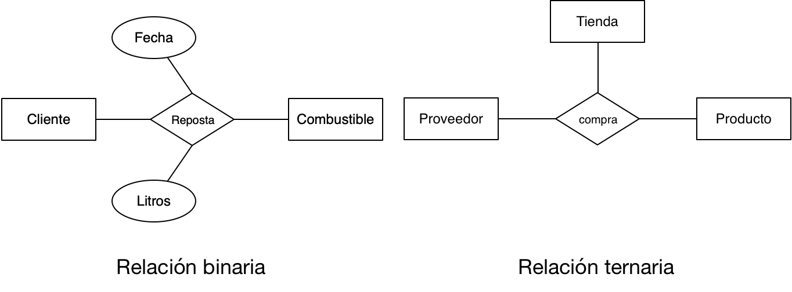

---

## Relaciones reflexivas

- Una relación reflexiva relaciona **ocurrencias de la misma entidad**.
- En este caso, **es obligatorio** especificar el rol de la entidad en ambos sentidos de la relación.

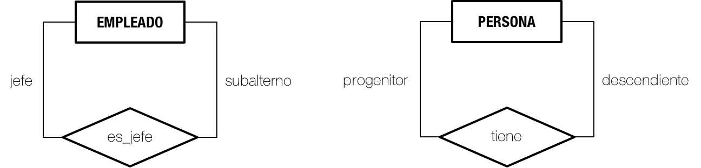

---

## Cardinalidad

- Número de ocurrencias de entidad que se pueden asociar como máximo/mínimo a otra a través de una relación.
- Mediante cardinalidades máximas y mínimas se pueden representar restricciones del cliente al modelo de datos.
- Valores posibles:
  - Máximo: 1, N
  - Mínimo: 0, 1

---

## Cardinalidad mínima y máxima

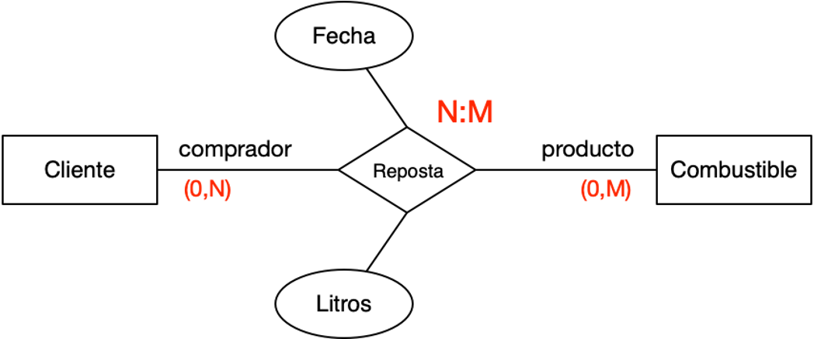

Veamos, paso a paso, cómo se calculan las cardinalidades de la relación `Reposta`.

---

## Cardinalidad mínima y máxima

- Para una ocurrencia de combustible:
  - ¿Cuántos clientes como mínimo lo repostarán? Ninguno, puede que una ocurrencia de combustible nunca sea repostada por algún cliente, luego cardinalidad mínima 0.
  - ¿Cuántos clientes como máximo lo repostarán? Más de uno, luego cardinalidad N.

Recuerda las opciones posibles: cardinalidad mínima (0, 1), cardinalidad máxima (1, N).

---

## Cardinalidad mínima y máxima

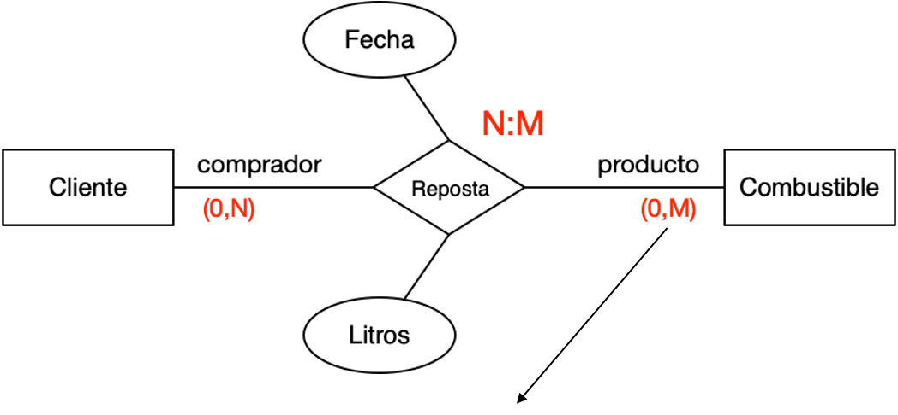

- Para una ocurrencia de cliente:
  - ¿Cuántos combustibles repostará como mínimo? Ninguno, puede que el cliente se registre y no vuelva nunca, luego cardinalidad mínima 0.
  - ¿Cuántos combustibles repostará como máximo? Más de uno, puede que el cliente tenga varios vehículos, luego cardinalidad M (para diferenciarlo de la N).

Recuerda las opciones posibles: cardinalidad mínima (0, 1), cardinalidad máxima (1, N).

---

## Cardinalidad mínima y máxima

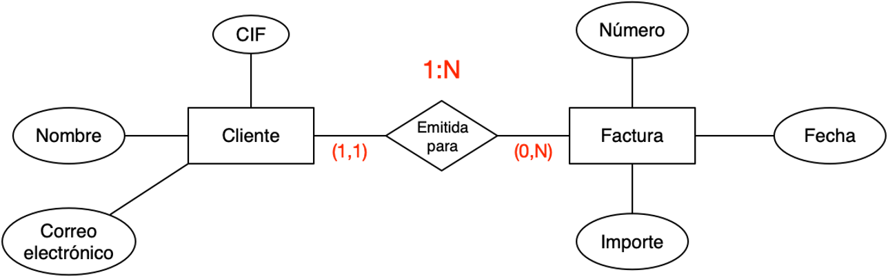

Veamos, paso a paso, cómo se calculan las cardinalidades de la relación `Emitida para`.

---

## Cardinalidad mínima y máxima

- Para una ocurrencia de factura:
  - ¿Para cuántos clientes se emitirá como mínimo? Las facturas tienen que emitirse obligatoriamente para un cliente, luego cardinalidad mínima 1.
  - ¿Para cuantos clientes se emitirá como máximo? No tiene sentido que una factura se emita a más de un cliente (de hecho es ilegal), luego cardinalidad máxima 1.

Recuerda las opciones posibles: cardinalidad mínima (0, 1), cardinalidad máxima (1, N)

---

## Cardinalidad mínima y máxima

- Para una ocurrencia de cliente:
  - ¿Cuántas facturas se le emitirán como mínimo? En un momento dado, puede ocurrir que no se haya facturado todavía al cliente, luego cardinalidad mínima 0.
  - ¿Cuántas facturas se le emitirán como máximo? Podemos emitir multitud de facturas a un cliente, luego cardinalidad máxima N.

Recuerda las opciones posibles: cardinalidad mínima (0, 1), cardinalidad máxima (1, N)

---

## Cardinalidad en relaciones _n_-arias

- En el caso de las relaciones n-arias, la cardinalidad hay que definirla entre pares de las entidades que están relacionadas.
- Por ejemplo, en una ternaria:

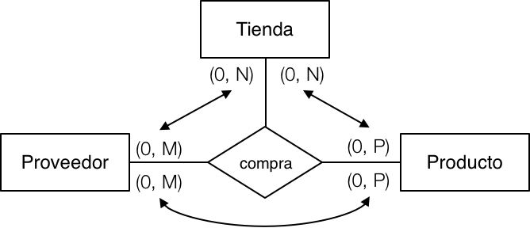

---

## Clave de entidad

- Atributo o conjunto de atributos que **identifican unívocamente** cada ocurrencia de una entidad.
- Si una entidad no tiene clave, se le considera **entidad débil** y que tiene dependencia de **Identificación**.
- Se subraya el nombre de los atributos que formen parte de la clave.

---

## Entidad débil

- Una entidad débil es aquella cuya existencia está supeditada a la existencia de otra entidad.
- Dos tipos:
  - Entidad débil con relación de identificación
  - Entidad débil con relación de existencia
- La representación en el modelo ER tanto de la entidad débil como de la relación con la entidad fuerte es la siguiente:

---

## Entidad débil (identificación)

- La entidad débil no tiene clave
- Necesita de la clave de otra entidad con la que se relaciona:

Dos surtidores de la base de datos pueden tener el mismo número si están en gasolineras distintas ➡️ El surtidor ‘adquiere’ la clave de `Gasolinera`. En algunas notaciones, el atributo discriminador se indica con subrayado discontinuo, como es el caso del número de surtidor.

---

## Entidad débil (existencia)

- La existencia de una ocurrencia está condicionada a la existencia de otra ocurrencia.

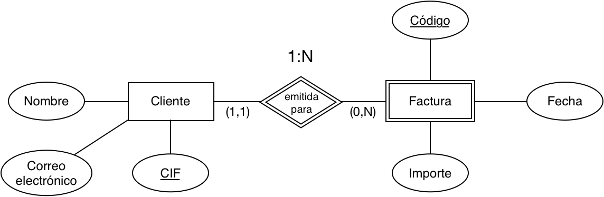

Aunque `Factura` tenga clave, si se da de baja un cliente hay que dar de baja todas sus facturas.

---

## El modelo Entidad-Relación (ER)

- Formulado por P.P-S. Chen en 1976
- Modelo de datos conceptual que representa un esquema de BBDD
- Descripción sencilla y global de una BBDD
- Se construye a partir de los requisitos de datos

---

## El modelo Entidad-Relación (ER)

---

## Notación alternativa: Martin

- Se representan las cardinalidades mínimas y máximas en la línea de la relación.
- Desaparece el rombo, se relacionan las entidades directamente, con el nombre de la relación.

---

## Notación alternativa: Martin

Reglas de transformación de Chen a Martin (relaciones):

se transforma en

---

## Notación alternativa: Martin

Reglas de transformación de Chen a Martin (relación N:M):

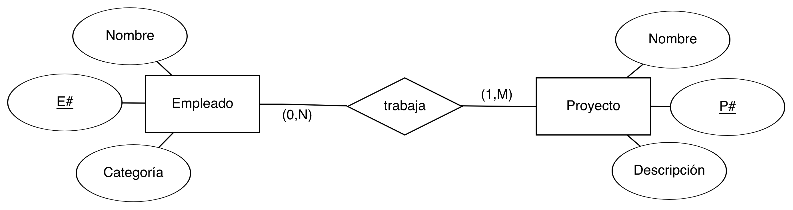

se transforma en

---

## Notación alternativa: Martin

Reglas de transformación de Chen a Martin (entidad débil):

`Empleado` es entidad débil, por eso la línea de la relación ahora es continua.

---

## Conclusiones

- ¿Por qué?
  - Necesitamos especificar las restricciones de una forma clara, concisa, fácilmente entendible y sin ambigüedades.
- ¿Cómo?
  - Utilizando un modelo formal para el diseño conceptual de la base de datos.
- ¿Qué?
  - Modelo Entidad-Relación.

---

## Modelado de datos

# EJEMPLOS

---

## Foro

Un conocido foro de coches nos ha encargado el diseño conceptual de su BD:

- El foro se estructura en hilos, que tendrán un título, un número identificador, una categoría y será necesario saber la fecha en la que se creó y el usuario que lo hizo.
- Los usuarios del foro se identifican por su nombre de usuario. Es necesario almacenar su correo electrónico y ciudad donde vive.
- Los usuarios añaden respuestas a un hilo, que constan de un mensaje y, opcionalmente, una URL de imagen. Para ordenar las respuestas, hay que conocer la fecha y hora en la que se realizó, así como su posición relativa en el hilo.
- En una respuesta se puede citar el texto de otra, situación que conviene registrar en la base de datos.

---

Una posible solución:

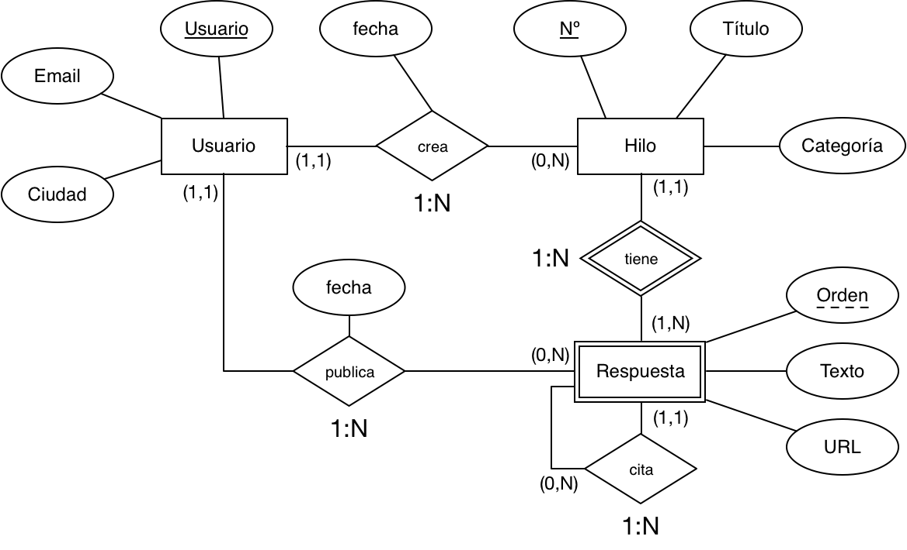

---

## Base de datos de películas

- Las películas se identifican por su título y año de lanzamiento. Además, tienen una duración (en minutos), una productora, al menos un director y también al menos un actor y un género.
- Los actores se identifican por su nombre y fecha de nacimiento. Actúan en al menos una película, donde interpretan un personaje.
- Los directores se identifican también por nombre y fecha de nacimiento. Además de dirigir, pueden también actuar en películas.
- Las productoras se identifican por su nombre y dirección. Producen al menos una película.

---

Una posible solución:

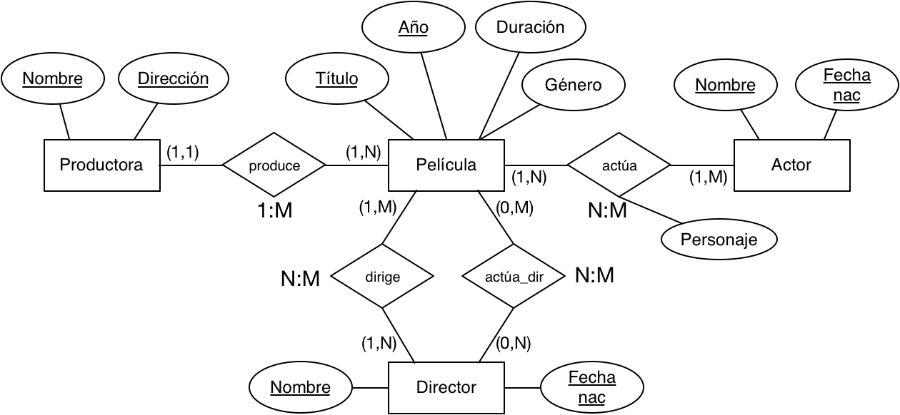

---

## Modelado de datos

# EJEMPLO PASO A PASO 
“La ETSISI”

---

## La ETSISI

En la ETSISI nos han pedido que diseñemos el diagrama entidad relación para posteriormente crear una base de datos de la información relativa a los alumnos

---

## Nuestro modelo

En la ETSISI se imparten estudios que pueden ser de tipo grado o máster, para los que tenemos que guardar el nombre, el número máximo de alumnos y las asignaturas que incluyen, que pueden ser compartidas entre títulos. También debemos indicar en qué aula concreta se imparte cada asignatura (que tendrán un aforo máximo según si hay que mantener distancia de seguridad o no).

Por otro lado, tenemos alumnos que se identifican por su Nombre, DNI y E-mail. Los alumnos se matriculan en una asignatura concreta y en un cuatrimestre concreto (una asignatura puede impartirse en varios cuatrimestres). Hay que saber la fecha en la que realizan la matrícula. También se lleva un registro de las calificaciones obtenidas por cada alumno en las convocatorias de exámenes de cada asignatura (indicando mes y año).

Por último, también hay que registrar los profesores y las asignaturas que imparten. Un profesor tiene los mismos datos que un alumno, pero también su número de cuenta y su número de empleado. Además, para facilitar que se cubran posibles bajas, para cada profesor hay que indicar aquellos que pueden cubrirle.

---

## ¿Qué entidades observamos?

En la ETSISI se imparten estudios que pueden ser de tipo grado o máster, para los que tenemos que guardar el nombre, el número máximo de alumnos y las ~~asignaturas~~ que incluyen, que pueden ser compartidas entre ~~títulos~~. También debemos indicar en qué ~~aula~~ concreta se imparte cada asignatura (que tendrán un aforo máximo según si hay que mantener distancia de seguridad o no).

Por otro lado, tenemos ~~alumnos~~ que se identifican por su Nombre, DNI y E-mail. Los alumnos se matriculan en una asignatura concreta y en un ~~cuatrimestre~~ concreto (una asignatura puede impartirse en varios cuatrimestres). Hay que saber la fecha en la que realizan la matrícula. También se lleva un registro de las ~~calificaciones~~ obtenidas por cada alumno en las convocatorias de exámenes de cada asignatura (indicando mes y año).

Por último, también hay que registrar los ~~profesores~~ y las asignaturas que imparten. Un profesor tiene los mismos datos que un alumno, pero también su número de cuenta y su número de empleado. Además, para facilitar que se cubran posibles bajas, para cada profesor hay que indicar aquellos que pueden cubrirle.

---

## Entidades

- "Calificación” cada ocurrencia de calificación necesitará de un estudiante y de una asignatura. No tendrá una clave primaria propia,  por lo que es una entidad débil 

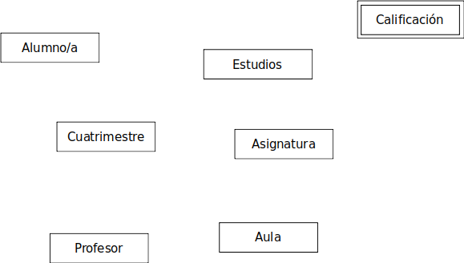

---

## ¿Qué atributos observamos?

En la ETSISI se imparten estudios que pueden ser de ~~tipo~~ grado o máster, para los que tenemos que guardar el ~~nombre, el número máximo~~ de alumnos y las asignaturas que incluyen, que pueden ser compartidas entre títulos. También debemos indicar en qué ~~aula~~ concreta se imparte cada asignatura (~~que tendrán un aforo máximo según si hay que mantener distancia de seguridad o no~~).

Por otro lado, tenemos alumnos que se identifican por su ~~Nombre, DNI y E-mail~~. Los alumnos se matriculan en una asignatura concreta y en un cuatrimestre concreto (una asignatura puede impartirse en varios cuatrimestres). Hay que saber la ~~fecha~~ en la que realizan la matrícula. También se lleva un registro de las ~~calificaciones~~ obtenidas por cada alumno en las convocatorias de exámenes de cada asignatura (indicando ~~mes y año~~).

Por último, también hay que registrar los ~~profesores~~ y las asignaturas que imparten. Un profesor tiene los mismos datos que un alumno, pero también su ~~número de cuenta y su número de empleado~~. Además, para facilitar que se cubran posibles bajas, para cada profesor hay que indicar aquellos que pueden cubrirle.

---

## Atributos

- La "Fecha" de matriculación estará en la relación, puesto que no tenemos entidad Matrícula

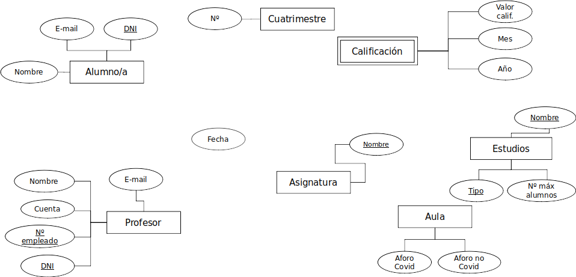

---

## ¿Qué relaciones observamos?

En la ETSISI se imparten ~~estudios~~ que pueden ser de tipo grado o máster, para los que tenemos que guardar el nombre, el número máximo de alumnos y ~~las asignaturas que incluyen~~, que pueden ser compartidas entre títulos. También debemos indicar ~~en qué aula concreta se imparte cada asignatura~~ (que tendrán un aforo máximo según si hay que mantener distancia de seguridad o no).

Por otro lado, tenemos alumnos que se identifican por su Nombre, DNI y E-mail. Los ~~alumnos se matriculan en una asignatura concreta y en un cuatrimestre concreto~~ (~~una asignatura puede impartirse en varios cuatrimestres~~). Hay que saber la fecha en la que realizan la matrícula. También se lleva un ~~registro de las calificaciones obtenidas por cada alumno en las convocatorias de exámenes de cada asignatura~~ (indicando mes y año).

Por último, también hay que ~~registrar los profesores y las asignaturas que imparten~~. Un profesor tiene los mismos datos que un alumno, pero también su número de cuenta y su número de empleado. Además, para facilitar que se cubran posibles bajas, para cada ~~profesor hay que indicar aquellos que pueden cubrirle~~.

---
## Relaciones

- Las asignaturas que incluyen (los estudios)

---
## Relaciones

- Indicar en qué aula concreta se imparte cada asignatura

---
## Relaciones

- Los alumnos se matriculan en una asignatura concreta y en un cuatrimestre concreto

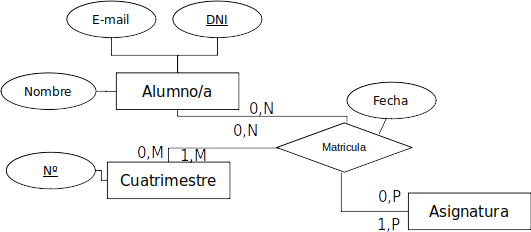

---
## Relaciones

- Una asignatura puede impartirse en varios cuatrimestres

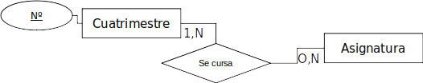

---
## Relaciones

- Registro de las calificaciones obtenidas por cada alumno en las convocatorias de exámenes de cada asignatura

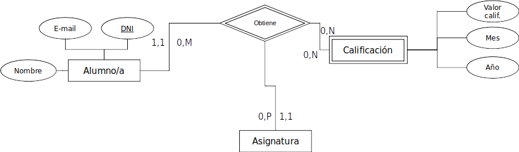

---
## Relaciones

- Registrar los profesores y las asignaturas que imparten

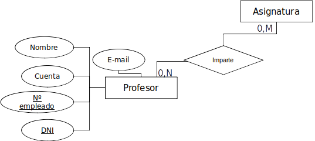

---
## Relaciones

- Para cada profesor hay que indicar aquellos que pueden cubrirle

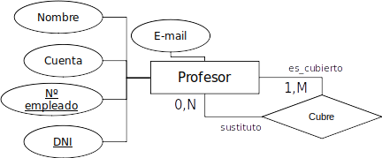

---

## Relaciones Completo

