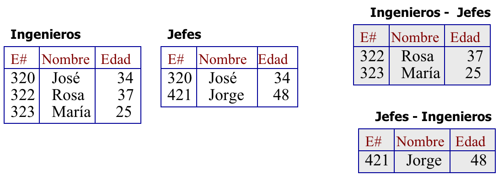
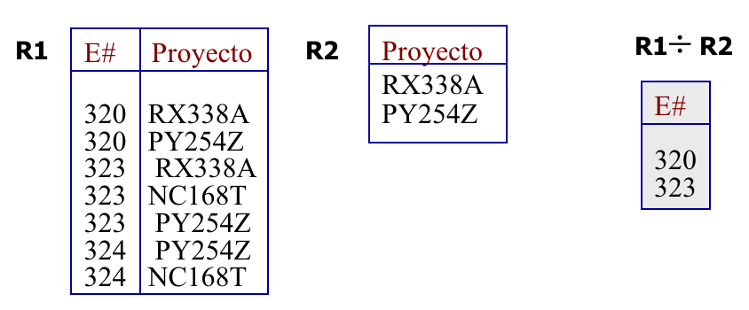
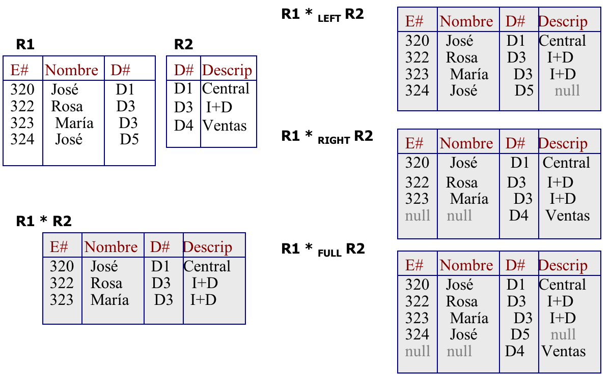
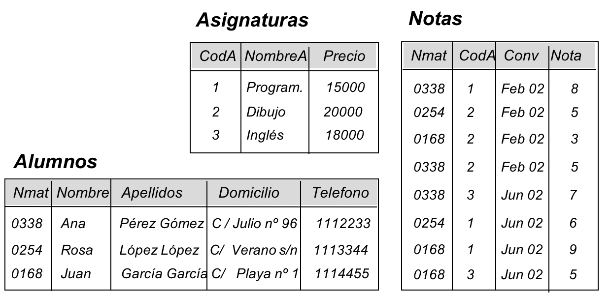

<!-- _class: titlepage -->

# Tema 3. Modelo relacional

## Bases de datos - Curso 2023-2024

### Departamento de Sistemas Informáticos

#### E.T.S.I. de Sistemas Informáticos - UPM

##### 13 de febrero de 2024

[](https://creativecommons.org/licenses/by-nc-sa/4.0/)

---

<!-- _class: section -->
# MODELADO LÓGICO DE BASES DE DATOS

---

# Elementos del modelo relacional

Como modelo de datos que es, el **Modelo Relacional** consta de tres partes diferentes:

- **Parte estructural**: Relaciones, también llamadas **tablas**
- **Parte operativa**: Álgebra Relacional
- **Parte semántica**: Restricciones de Integridad

---

# Elementos del modelo - Parte estructural (I)

Proporciona una representación uniforme de la información

- Acceso a los datos: *navegación lógica*

Ventajas:

- Simplicidad de la estructura.
- Sencillez en la definición de los operadores.
- Todas las consultas realizadas son simétricas.
- El **modelo relacional** se basa en una **base matemática potente**
  - Similar a la *Teoría de Conjuntos*.

---

# Elementos del modelo - Parte estructural (II)

Las relaciones de este modelo pueden definirse de manera matemática:

<cite>

$R$ es una relación sobre los conjuntos $D_1,D_2,\ldots,D_n$, si es un
subconjunto del producto cartesiano $D_1\times D_2\times \ldots \times
D_n$

</cite>

$D_1, D_2, \ldots, D_n$ se denominan **dominios**

- Son los diferentes conjuntos sobre los que se define la relación

---

# Elementos del modelo - Parte estructural (III)

Cada **atributo** de una relación está asociado a un único dominio:

- Ej: $D_\textrm{COLOR} = \left \{ \textrm{Rojo}, \textrm{Negro},
  \textrm{Azul},\textrm{Verde} \right \}$
- Los **nombres de los atributos** que definen una relación <i>no pueden
  repetirse</i>
- <i>Los dominios sí</i> pueden estar repetidos

Los elementos que componen una relación se denominan **tuplas**

- **Grado de una relación**: número de atributos sobre el que se define
  la relación
- **Cardinalidad de una relación**: número de tuplas que contiene la
  relación en un momento dado

---

# Elementos del modelo - Parte estructural (y IV)

<div class="columns">
<div class="column">

Representación de una relación:

| $A_1$    | $A_2$    | $A_3$    | $\dots$  | $A_n$    |
| -------- | -------- | -------- | -------- | -------- |
| $a_{11}$ | $a_{12}$ | $a_{13}$ | $\dots$  | $a_{1n}$ |
| $a_{21}$ | $a_{22}$ | $a_{23}$ | $\dots$  | $a_{2n}$ |
| $\vdots$ | $\vdots$ | $\vdots$ | $\ddots$ | $\vdots$ |
| $a_{m1}$ | $a_{m2}$ | $a_{m3}$ | $\dots$  | $a_{mn}$ |

</div>
<div class="column">

Denominamos:

- **Relación**: La tabla
- **Grado**: El número de atributos (columnas) de la tabla
  - En este caso el grado es *n*.
- **Tupla**: Cada una las filas de la tabla

La misma tabla puede respresentarse textualmente del siguiente modo:

$$R \left ( A_1,A_2,\ldots,A_n \right )$$

</div>
</div>

---

# Esquemas de relación (I)

Toda relación puede definirse de dos formas:

- **Extensión**: Especificando todas y cada una de las tuplas que componen
  la relación
- **Intensión**: Especificando el esquema de la relación

Se define un esquema de relación como:

<cite>
Estructura abstracta que define una relación a través de un
nombre, un conjunto de atributos y un conjunto de restricciones que
caracterizan a esa relación.
</cite>

$$
r = R(T,L)
$$

Siendo $R$ el nombre de la relación $r$, $T$ el conjunto de atributos
que la definen y $L$ el conjunto de restricciones que la caracterizan

---

# Esquemas de relación (II)

Las restricciones de comportamiento suelen ser de dos tipos:

- Asignación de los atributos a dominios
- Relaciones entre los atributos

Concepto de realización de una relación:

<cite>

Es la asignación de valores al conjunto $T$ de atributos del esquema de
relación, de tal forma que se cumplan todas y cada una de las
restricciones del conjunto $L$ de restricciones.

</cite>

---

# Esquemas de relación (y III)

¿Qué es el **esquema de una base de datos relacional**?

- El conjunto de **esquemas de relación** correspondiente a cada una de
  las relaciones que la forman

Por tanto, una realización válida de la **base de datos relacional**
será el conjunto de realizaciones válidas de cada una de sus esquemas
de relación.

---

# Condiciones del modelo - Parte estructural (I)

1. Cada tabla debe contener un solo tipo de filas
2. Una tabla no puede contener filas duplicadas
3. Cada columna debe estar identificada por un nombre específico
4. Cada columna tiene que ser única, no pudiendo existir columnas
   duplicadas
5. Cada valor en una columna tiene que ser único, no permitiéndose
   valores múltiples para un atributo
6. Cada columna debe extraer sus valores de un dominio
7. Un mismo dominio podrá servir para columnas diferentes
8. Las filas pueden estar en cualquier orden
9. Las columnas pueden estar en cualquier orden

---

# Elementos del modelo - Parte estructural (I)

Definición de **base de datos relacional**:

<cite>

Conjunto de **relaciones de formato fijo** cuyo **contenido** es **variable en el tiempo**

</cite>

Los atributos serán símbolos tomados de un conjunto finito $\mathbb{U}$

- $\mathbb{U} \equiv$ «universo» del modelo conceptual
- Usaremos $A,B,\ldots$ para denotar atributos simples y $V,W,X\ldots$
  para designar conjuntos de los mismos o descriptores

**NOTA**: En adelante denominaremos indistintamente «descriptor» a un
atributo simple o a un conjunto de atributos

---

# Elementos del modelo - Parte estructural (y II)

En el Modelo Relacional se distingue entre dos tipos de relaciones:

- **Relaciones básicas**: son aquellas relaciones que se definen con
  independencia del resto de relaciones existentes en la *BD*
  relacional
- **Relaciones derivadas**: son aquellas otras relaciones que son
  resultado de la aplicación de los operadores relacionales sobre las
  relaciones básicas

---

# Elementos del modelo - Parte semántica (I)

Concepto de clave (definición **no** formal):

<cite>Descriptor mínimo cuyo valor determina de forma unívoca el valor
del resto de los atributos de la relación</cite>

Se debe cumplir que:

- Cada relación tiene **al menos una** clave
- Si hay más de una, desde el punto de vista teórico todas son iguales
  - En la práctica cada clave se denomina **clave candidata**
    - La práctica $\equiv$ al definir la _BD_ relacional en un SGBD
    - Una se elegirá como **clave principal** o **clave primaria**
    - El resto se denominarán **claves alternativas**

---

# Elementos del modelo - Parte semántica (II)

Cada relación tendrá una combinación de atributos que, tomados en
conjunto, **identifican de forma única cada tupla**

- Esta combinación se la denomina **clave** de una relación

| DNI | Nombre | Domicilio | Teléfono |
|-----|--------|-----------|----------|
| 321 | Pepe   | Aquí      | 987      |
| 134 | Pepe   | Allí      | 789      |
| 123 | Juan   | Allí      |          |

¿Cuál será la clave para esta relación?

---

# Elementos del modelo - Parte semántica (III)

**Requisito obligatorio**

<cite>Toda relación debe contar con **al menos una clave**</cite>

Tipos de claves

- Principal o primaria
- Secundarias o alternas
- Foráneas o externas
- Simples (formadas por un único atributo)
- Compuestas (formadas por más de un atributo)

---

# Elementos del modelo - Parte semántica (IV)

Restricciones semánticas del modelo relacional:

1. **Restricción de integridad de entidad**. Ningún valor de la clave
   primaria de una relación puede ser nulo o tener algún componente
   nulo. Asimismo, una clave primaria no admite valores repetidos
2. **Restricción de integridad de dominio**. Un atributo no puede tomar
   valores que excedan del rango asociado
3. **Restricción de Integridad referencial**: Cualquier atributo de una
   relación que sea declarado como clave foránea solo puede contener
   valores nulos o valores existentes que provienen, o bien de la clave
   primaria o bien de una clave candidata de la relación a la que
   referencia. En otras palabras, si un atributo que es clave foránea
   toma un determinado valor, dicho valor tiene que existir como clave
   primaria o candidata en la relación a la que referencia dicha clave
   foránea

---

# Elementos del modelo - Parte semántica (V)

```text
PROVEEDORES (COD_PROV, NOMBRE)
ARTÍCULOS (COD_ART, DESCRIPCIÓN)
SUMINISTROS (COD_PROV, COD_ART, CANTIDAD, FECHA)
```

Si `SUMINISTROS` posee la tupla: (*P2*, *A012*, 1000, *13/01/98*):

- **Integridad de entidad**: `COD_PROV` y `COD_ART` no pueden poseer
  valores nulos
- **Integridad referencial**: Dos condiciones:
  1. En `PROVEEDORES` existe una tupla tal que `COD_PROV=P2`
  2. En `ARTICULOS` existe otra tupla etal que `COD_ART=A012`

**Conclusión**: No podrá existir una tupla en la relación `SUMINISTROS`
tal que figure un código de proveedor o un código de artículo que no
existan previamente en sus respectivas relaciones de `PROVEEDORES` y
`ARTICULOS`.

---

<!-- _class: section -->
# PASO A TABLAS

---

# Paso a tablas: Entidades

1. Toda **entidad** se corresponde con una relación.
2. Los atributos de la entidad se transforman en atributos de la relación.
3. Los atributos de la clave de la entidad son los atributos de la clave de la relación.


---

# Paso a tablas: Relaciones N:M

Siempre se transforman en una tabla, incluyendo tanto los atributos de
la relación N:M como las claves de las entidades relacionadas


Generalmente, la clave de la nueva tabla suele ser la unión de las
claves de las entidades relacionadas, aunque **no siempre es así** y
debe estudiarse cada caso de forma particular

---

# Paso a tablas: Relaciones 1:N

Añadir la clave de la entidad de la parte "uno" de la relación a la
relación de la entidad de la parte "muchos", además de los atributos que
tenga la relación 1:N


---

# Paso a tablas: Relaciones 1:1

- Si la cardinalidad mínima es **igual** en ambos extremos de la
  relación, se añade la clave de una de las entidades a la entidad
  restante, incluyendo los atributos de la relación si los hubiere
- Si la cardinalidad mínima es **diferente** en los extremos de la
  relación, se añade la clave de la entidad *"uno"* a la tabla de la
  entidad *"cero"*


---

# Paso a tablas: Relaciones n-arias

Estudiar las relaciones de dos en dos y aplicar las reglas de relaciones
binarias


**¡CUIDADO!**: se puede mejorar el diseño estudiando redundancias.

---

# Paso a tablas: Ejemplo completo

Dado el siguiente modelo ER, transformarlo al modelo relacional:


---

# Paso a tablas: Ejemplo completo (solución)


---

<!-- _class: section -->
# NORMALIZACIÓN

---

# ¿Qué son las formas normales?

Las formas normales en bases de datos son una serie de reglas o
directrices que se utilizan para diseñar esquemas de bases de datos
relacionales de manera que se minimicen las redundancias de datos y se
asegure la integridad de la información almacenada

El objetivo principal de las formas normales es **eliminar las anomalías
en la inserción, borrado o actualización de datos**, es decir, evitar
introducir datos que la estrucutra de la base de datos no lo permita o
perder información por una actualización o un borrado. Esto, además,
garantiza *a posteriori* que una base de datos esté bien estructurada y
optimizada para consultas

---

<style scoped>
table th:nth-child(1), table th:nth-child(4) {
  text-decoration: underline;
}
</style>

# Problemas de inserción, borrado y actualización

| Num_mat | Nombre | Telefono  | Asignatura | Profesor | Nota |
| ------- | ------ | --------- | ---------- | -------- | ---- |
| cd2521  | Pepe   | 672842132 | BD         | Fernando | 9.0  |
| cd0252  | Luisa  | 689252092 | BD         | Fernando | 5.5  |
| ce2314  | Andrés | 600878423 | POO        | Agustín  | 7.0  |
| cb0023  | Ana    | 689023492 | AL         | Soledad  | 8.5  |
| cd2521  | Pepe   | 672842132 | AL         | Soledad  | 7.5  |

- ¿Añadir la asignatura IA? No sé los datos de alumnos (**problema de
  inserción**)
- ¿Borrar las notas de Andrés? Adios a asignatura POO (**problema de
  borrado**)
- ¿Y si Pepe cambia la asignatura de BD? Hay que cambiar la información
  en varios sitios para mantener la consistencia (**problema de
  actualización**)

---

# ¿Cuáles son las formas normales (FN)?

Existen varios niveles, desde la primera forma normal (1FN) a la quinta (5FN)

- Cada nivel: Reglas específicas para organizar los datos de manera más
  eficiente
- Una BBDD en **3FN** ofrece un nivel óptimo de normalización para
  minimizar redundancias y asegurar la integridad de los datos
  - Por ello, **no estudiaremos formas normales por encima de la 3FN**

Para garantizar una correcta normalización de una base de datos
necesitamos conocer **TODAS** las claves de las relaciones que la componen

- El proceso no se va a estudiar, las veremos de forma práctica
- Así conoceremos sus características principales y ventajas que ofrecen
  - Pero no nos volveremos locos sacando dependencias funcionales<sup>1
    </sup>

> <sup>1</sup> Por si queréis saber un poco más sobre el tema:
> <https://en.wikipedia.org/wiki/Functional_dependency>
---

# Dependencia funcional (I)

Las FN fundamentan su definición en el concepto de **dependencias
funcionales**

- Relación entre dos conjuntos de atributos $X, Y$ de una tabla en la
  que el valor de $X$ determina unívocamente el valor de $Y$
- Es decir, establece una regla sobre cómo los valores en ciertas
  columnas están relacionados entre sí

---

<style scoped>
table th:nth-child(1) {
  text-decoration: underline;
}
</style>

# Dependencia funcional (y II)

| Num_mat | Nombre | DNI       |
| ------- | ------ | --------- |
| cd2521  | Pepe   | 66843526Y |
| cd0252  | Luisa  | 47645869N |
| ce2314  | Andrés | 44568145X |
| ca2511  | Andrés | 50311320Q |

Por ejemplo, la tabla se presentan las siguientes dependencias
funcionales:

- `Num_mat` $\rightarrow$ `Nombre` y `Num_mat` $\rightarrow$ `DNI`
- `DNI` $\rightarrow$ `Nombre` y `DNI` $\rightarrow$ `Num_mat`
- Pero no entre `Nombre` $\rightarrow$ `Num_mat` ni `Nombre` $\rightarrow$ `DNI`.

---

<style scoped>
table th:nth-child(1) {text-decoration: underline;}
</style>

# Primera Forma Normal (1FN, I)

Una tabla está 1FN si todas sus columnas contienen valores atómicos

- Es decir, valores indivisibles y no listas de valores

Por ejemplo, la siguiente tabla **NO** está en 1FN porque _Antonio_
tiene dos teléfonos

| DNI        | Nonmbre | Apellidos    | Teléfonos              |
| ---------- | ------- | ------------ | ---------------------- |
| 12345678-Z | Antonio | Pérez García | [645923412, 663231983] |
| 42384109-P | Marta   | Picas López  | 634176823              |
| 02932416-P | Sara    | Gómez Lucas  | 637923001              |

---

<style scoped>
table th:nth-child(1), table:last-of-type th:nth-child(2) {
  text-decoration: underline;
}
</style>

# Primera Forma Normal (1FN, y II)

Este problema se podría solucionar dividiendo la tabla en:

<div class="columns">
<div class="column">

| DNI        | Nonmbre | Apellidos    |
| ---------- | ------- | ------------ |
| 12345678-Z | Antonio | Pérez García |
| 42384109-P | Marta   | Picas López  |
| 02932416-P | Sara    | Gómez Lucas  |

</div>
<div class="column">

| DNI        | Teléfono  |
| ---------- | --------- |
| 12345678-Z | 645923412 |
| 12345678-Z | 663231983 |
| 42384109-P | 634176823 |
| 02932416-P | 637923001 |

</div>

---

## Segunda Forma Normal (2FN, I)

Una tabla está en 2FN si:

1. Está en 1NF
2. Todos los atributos que no forman parte de ninguna clave (denominados
   atributos no principales) dependen funcionalmente por completo de
   toda la clave y no solo de una parte de ella

---

<style scoped>
table > * > * > * {
  font-size: 0.70rem;
}

table th:nth-child(1), table th:nth-child(2) {
  text-decoration: underline;
}
</style>

# Segunda Forma Normal (2FN, II)

La siguiente tabla **NO** está en 2FN...

| Chef  | Plato             | Restaurante       |
| ----- | ----------------- | ----------------- |
| Ramón | Pasta carbonara   | La pequeña Italia |
| Ramón | Pizza margarita   | La pequeña Italia |
| Lucía | Costillas asadas  | El asador         |
| Ana   | Patatas bravas    | El capricho       |
| Ana   | Pizza margarita   | El capricho       |

A pesar de estar en 1FN, la columna *Restaurante* es dependiente
únicamente *Chef*.

---

<style scoped>
table th:nth-child(1), table:last-of-type th:nth-child(2) {
  text-decoration: underline;
}
</style>

# Segunda Forma Normal (2FN, y III)

Podríamos dividir la tabla anterior en:

<div class="columns">
<div class="column">

| Chef  | Restaurante       |
| ----- | ----------------- |
| Ramón | La pequeña Italia |
| Lucía | El asador         |
| Ana   | El capricho       |

</div>
<div class="column">

| Chef  | Plato             |
| ----- | ----------------- |
| Ramón | Pasta carbonara   |
| Ramón | Pizza margarita   |
| Lucía | Costillas asadas  |
| Ana   | Patatas bravas    |
| Ana   | Pizza margarita   |

</div></div>

Ahora los atributos que dependen de la clave lo hacen de forma completa

---

## Tercera Forma Normal (3FN, I)

Una tabla estará en 3FN si:

1. Está en 2NF
2. Ninguna columna no clave depende transitivamente de la clave primaria

Esto es, no debe haber dependencias funcionales indirectas entre
columnas no clave y la clave primaria

- Dicho de otro modo, la 3FN busca evitar que los atributos no clave
  dependan funcionalmente de otros atributos no clave, garantizando así
  la integridad de los datos

---

<style scoped>
table th:nth-child(1) {
  text-decoration: underline;
}
</style>

# Tercera Forma Normal (3FN, II)

La siguiente tabla **NO** está en 3FN...

| Id | Título                  | Autor             | Editorial |
| -- | ----------------------- | ----------------- | --------- |
| 1  | El marciano             | Andy Weir         | Alfaguara |
| 2  | Hail Mary               | Andy Weir         | Alfaguara |
| 3  | El imperio final        | Brandon Sanderson | SM        |
| 4  | El pozo de la ascensión | Brandon Sanderson | SM        |
| 5  | El héroe de las eras    | Brandon Sanderson | SM        |

A pesar de estar en 2FN, *Editorial* depende de *Autor* y no
directamente de libro

---

<style scoped>
table th:nth-child(1) {
  text-decoration: underline;
}
</style>

## Tercera Forma Normal (3FN, III)

Será necesario dividir la tabla anterior en:

| Id | Título                  | Autor             |
| -- | ----------------------- | ----------------- |
| 1  | El marciano             | Andy Weir         |
| 2  | Hail Mary               | Andy Weir         |
| 3  | El imperio final        | Brandon Sanderson |
| 4  | El pozo de la ascensión | Brandon Sanderson |
| 5  | El héroe de las eras    | Brandon Sanderson |

| Autor             | Editorial |
| ----------------- | --------- |
| Andy Weir         | Alfaguara |
| Brandon Sanderson | SM        |

---

<style scoped>
table th:nth-child(1) {
  text-decoration: underline;
}

table tr:last-child td:last-child {
  background-color: #FFA5A5;
}
</style>

## Tercera Forma Normal (3FN, y IV)

**¡CUIDADO!** Si los autores no siempre publican con la misma editorial
la tabla **SI** está en 3FN:

| Id | Título                  | Autor             | Editorial  |
| -- | ----------------------- | ----------------- | ---------- |
| 1  | El marciano             | Andy Weir         | Alfaguara  |
| 2  | Hail Mary               | Andy Weir         | Alfaguara  |
| 3  | El imperio final        | Brandon Sanderson | SM         |
| 4  | El pozo de la ascensión | Brandon Sanderson | SM         |
| 5  | El héroe de las eras    | Brandon Sanderson | Salamandra |

---

## Una cosa más ...

El diseño de bases de datos siguiendo las formas normales es una buena
práctica para evitar problemas como la pérdida de datos, inconsistencias
y dificultades en la gestión de la información. Sin embargo, es
importante recordar que en algunos casos, desnormalizar una base de
datos (romper las formas normales) puede ser necesario para optimizar el
rendimiento en consultas específicas, pero debe hacerse de manera
consciente y justificada

---

<!-- _class: section -->
# ÁLGEBRA RELACIONAL

---

# Lenguajes de acceso a BBDD relacionales

- Álgebra Relacional
  - Lenguaje procedimental (se indica qué y cómo obtenerlo)
  
- Cálculo Relacional
  - Lenguaje no procedimental (se indica qué pero no cómo obtenerlo)
  - Dos tipos: Orientado a Tuplas y Orientado a Dominios

Álgebra y Cálculo Relacional son equivalentes en poder expresivo

> Toda la sección ha sido extraída de Pedro Pablo Alarcón (2012),
> *Álgebra relacional*. Aplicación de la Gestión de Información,
> Departamento de OEI, Escuela Universitaria de Informática, Universidad
> Politécnica de Madrid.

---

# Álgebra Relacional y sus operadores

El **Álgebra Relacional** es un conjunto cerrado de operaciones que:

- Actúan sobre relaciones
- Producen relaciones como resultados
- Pueden combinarse para construir expresiones más complejas

**Operadores básicos**: Unión, Diferencia, Producto Cartesiano,
Selección, Proyección.

**Operadores derivados**: Intersección, Join, División, Asociación

---

# Unión

$R \cup S$

- La unión de dos relaciones $R$ y $S$, es otra relación que contiene
  las tuplas que están en $R$, o en $S$, o en ambas, eliminándose
  las tuplas duplicadas
- $R$ y $S$ **deben ser unión-compatible**, es decir, definidas sobre el
  mismo conjunto de atributos


---

# Diferencia

$R - S$

- Produce una nueva relación que están en la relación $R$, pero no están
  en $S$
- $R$ y $S$ **deben ser unión-compatible**, que en el contexto de las
  BBDD quiere decir:
  - Tienen el mismo número de columnas
  - Los tipos de datos en cada columna correspondiente son compatibles entre sí



---

# Producto cartesiano

$R \times S$

- Define una relación que es la concatenación de cada una de las filas
  de la relación $R$ con cada una de las filas de la relación $S$


---

# Selección

$\sigma_\textrm{predicado} (R)$

- Es un operador unario.
- Define una relación con los mismos atributos que $R$ y que contiene
  solo aquellas filas de $R$ que satisfacen la condición especificada
  (predicado)


---

# Proyección

$\prod_{col_1,\ldots,col_n}(R)$

- Es un operador unario.
- Define una relación que contiene un subconjunto vertical de $R$ con
  los valores de los atributos especificados, eliminando filas
  duplicadas en el resultado


---

# Intersección

$R\cap S$

- Define una relación que contiene el conjunto de todas las filas que
  están tanto en la relación $R$ como en $S$
- $R$ y $S$ deben ser unión-compatible
- Equivalencia con operadores básicos: $R \cap S = R - (R - S)$


---

# División

$R\div S$

- Define una relación sobre el conjunto de atributos $C$, incluido en la
  relación $R$, y que contiene el conjunto de valores de $C$, que en las
  tuplas de $R$ están combinadas con cada una de las tuplas de $S$
- Condiciones:
  - $\textrm{grado}(R) > \textrm{grado} (S)$
  - $\textrm{atributos}(S) \subset \textrm{atributos}(R)$
- Equivalencia con operadores básicos:
  - $X_1=\prod_C(R)$
  - $X_2=\prod_C((S\times X_1)-R)$
  - $R\div S=X_1-X_2$

---

# Ejemplo de división



---

# Unión natural (Natural Join)

$R \Join S$ o $R * S$

- El resultado es una relación con los atributos de ambas relaciones y
  se obtiene combinando las tuplas de ambas relaciones que tengan el
  mismo valor en los atributos comunes
- Normalmente la operación de join se realiza entre los atributos
  comunes de dos tablas que corresponden a la clave primaria de una
  tabla y la clave foránea correspondiente de la otra tabla
- Método:
  - Se realiza el producto cartesiano $R \times S$
  - Se seleccionan aquellas filas del producto cartesiano para las que
    los atributos comunes tengan el mismo valor
- Se elimina del resultado una ocurrencia (columna) de cada uno de los
  atributos comunes
- Equivalencia con operadores básicos: $R\Join_F S=\sigma_F(R\times S)$

---

# Outer Join

Variante del `Join` en la que se intenta mantener toda la información de
los operandos

- Sí, incluso para aquellas filas que no participan en el `Join`
- Se *rellenan con nulos* las tuplas que no tienen correspondencia en el
  `Join`.

Existen tres variantes:

- $\Join_{\textrm{LEFT}}$: se tienen en cuenta todas las filas del
  primer operando
- $\Join_{\textrm{RIGHT}}$: se tienen en cuenta todas las filas del
  segundo operando
- $\Join_{\textrm{FULL}}$: se tienen en cuenta todas las filas de ambos
  operandos

---

# Ejemplos de Join



---

# Asociación o $\theta\textrm{-Join}$

$R\Join_F S$ o $R *_F S$

- Define una relación que contiene las tuplas que satisfacen el
  predicado $F$ en el producto cartesiano $R \times S$
- El predicado $F$ es de la forma $R.a_i~\theta~S.b_i$ donde $\theta$
  representa un operador de comparación: $(<, \leq, >, \geq, =, \neq)$
- El predicado no tiene por que definirse sobre atributos comunes
- **Equijoin**: Si el predicado $F$ contiene únicamente el operador de
  igualdad

---

# Base de datos para los ejemplos



---

# Obtener los apellidos y teléfono de los alumnos de nombre Rosa

$$\prod_{\textrm{apellidos},\textrm{telefono}} (\sigma_{\textrm{nombre}='\textrm{Rosa}'}(Alumnos))$$

|Apellidos  |Telefono|
|-----------|--------|
|López López|1113344 |

---

# Obtener las notas obtenidas en la asignatura de Inglés

$$\prod_{\textrm{nombre},\textrm{apellidos},\textrm{nota}}(\sigma_{\textrm{nombreA}='\textrm{Inglés}'}(Alumnos\Join Notas\Join Asignaturas))$$

|Nombre|Apellidos    |Nota|
|------|-------------|----|
|Ana   |Pérez Gómez  |7   |
|Juan  |García García|5   |

---

# Obtener los alumnos que figuren matriculados en todas las asignaturas

$$\prod_{\textrm{Nmat},\textrm{codA}}(Notas)\div\prod_{\textrm{codA}}(Asignaturas)$$

|Nmat|
|----|
|0338|
|0168|

---

# Otra alternativa al anterior

$$\prod_{\textrm{nombre},\textrm{apellidos}}(Alumnos\Join (\prod_{\textrm{Nmat},\textrm{codA}}(Notas)\div \prod_{\textrm{codA}}(Asignaturas)))$$

|Nombre|Apellidos    |
|------|-------------|
|Ana   |Pérez Gómez  |
|Juan  |García García|

---

# Obtener los alumnos que figuren matriculados en las asignaturas de Inglés y Dibujo

$$\prod_{\textrm{Nmat}}(\sigma_{\textrm{nombreA}='\textrm{Inglés}'}(Asignaturas)\Join Notas) \bigcap \prod_{\textrm{Nmat}}(\sigma_{\textrm{nombreA}='\textrm{Dibujo}'}(Asignaturas)\Join Notas)$$

|Nmat|
|----|
|0338|
|0168|

---

# Obtener los alumnos que no han suspendido ninguna asignatura

$$\prod_{\textrm{Nmat}}(\sigma_{\textrm{nota}\geq 5}(Notas))-\prod_{\textrm{Nmat}}(\sigma_{\textrm{nota}<5}(Notas))$$

|Nmat|
|----|
|0338|
|0254|

---

<!--class: endpage-->
# Gracias
