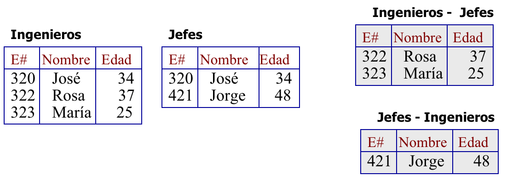
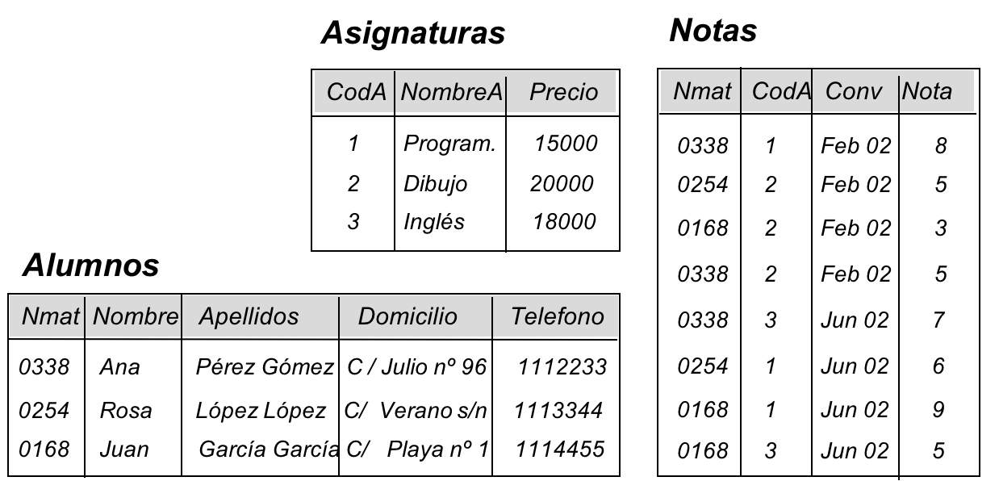

<!--
_header: ''
_footer:  Esta obra está bajo una [licencia de Creative Commons Reconocimiento-NoComercial-CompartirIgual 4.0 Internacional](http://creativecommons.org/licenses/by-nc-sa/4.0/). Icono diseñado por Flaticon
-->

# TEMA 3

## Modelo relacional

---

## Índice

1. El modelo relacional.
2. Transformación del modelo Entidad-Relación a modelo relacional (paso a tablas).
3. Normalización.
4. Álgebra relacional.

---

## Modelado lógico de bases de datos

# EL MODELO RELACIONAL

---

## Elementos del modelo relacional

Como modelo de datos que es, el Modelo Relacional consta de tres partes diferentes:

- **Parte Estructural**: Relaciones (también llamadas Tablas).
- **Parte Operativa**: Álgebra Relacional.
- **Parte Semántica**: Restricciones de Integridad

---

## Elementos del modelo (Parte Estructural)

- Proporciona una representación uniforme de la información.
- Acceso a los datos: *navegación lógica*.
- Ventajas:
  - Simplicidad de la estructura.
  - Sencillez en la definición de los operadores.
  - Todas las consultas realizadas son simétricas.
  - La definición del Modelo Relacional está basada en una **base matemática potente**. Es similar a la *Teoría de Conjuntos*.

---

## Elementos del modelo (Parte Estructural)

Las relaciones de este modelo pueden definirse de manera matemática:

> $R$ es una relación sobre los conjuntos $D_1,D_2,\ldots,D_n$, si es un subconjunto del producto cartesiano $D_1\times D_2\times \ldots \times D_n$.

Los diferentes conjuntos $D_1,D_2,\ldots,D_n$ sobre los que se define la relación se denominan **dominios**.

---

## Elementos del modelo (Parte Estructural)

- Cada **atributo** de la relación está asociado a un único dominio:
  - Ej: $D_\textrm{COLOR} = \left \{ \textrm{Rojo},\textrm{Negro},\textrm{Azul},\textrm{Verde} \right \}$
  - Los nombres de los atributos que definen una relación no pueden repetirse.
  - Los dominios sí pueden estar repetidos.
- Los elementos que componen una relación se denominan **tuplas**.
- **Grado de una relación**: número de atributos sobre el que se define la relación.
- **Cardinalidad de una relación**: número de tuplas que contiene la relación en un momento dado.

---

## Elementos del modelo (Parte Estructural)

Representación gráfica de una relación:

| $A_1$    | $A_2$    | $A_3$    | $\dots$  | $A_n$    | 
| -------- | -------- | -------- | -------- | -------- |
| $a_{11}$ | $a_{12}$ | $a_{13}$ | $\dots$  | $a_{1n}$ |
| $a_{21}$ | $a_{22}$ | $a_{23}$ | $\dots$  | $a_{2n}$ |
| $\vdots$ | $\vdots$ | $\vdots$ | $\ddots$ | $\vdots$ |
| $a_{m1}$ | $a_{m2}$ | $a_{m3}$ | $\dots$  | $a_{mn}$ |

---

## Elementos del modelo (Parte Estructural)

Denominamos:
- **Relación**: a la tabla.
- **Grado**: al número de atributos (columnas) de la tabla. En este caso el grado es *n*.
- **Tupla**: a cada una las filas de la tabla.

La misma tabla puede respresentarse textualmente del siguiente modo:

$$R \left ( A_1,A_2,\ldots,A_n \right )$$

---

## Esquemas de relación

- Toda relación puede definirse de dos formas:
  - Por extensión: especificando todas y cada una de las tuplas que componen la relación.
  - Por intensión: especificando el esquema de la relación.
- Se define un esquema de relación como:

> Estructura abstracta que define una relación a través de un nombre, un conjunto de atributos y un conjunto de restricciones que caracterizan a esa relación.

$$
r = R(T,L)
$$

donde $R$ es el nombre de la relación $r$, $T$ el conjunto de atributos que definen a $r$ y $L$ el conjunto de restricciones que caracterizan a $r$.

---

## Esquemas de relación

Las restricciones de comportamiento suelen ser de dos tipos:

- Asignación de los atributos a dominios.
- Relaciones entre los atributos.

Concepto de realización de una relación:
> Es la asignación de valores al conjunto T de atributos del esquema de relación, de tal forma que se cumplan todas y cada una de las restricciones del conjunto L de restricciones.

---

## Esquemas de relación

El esquema de una **base de datos relacional** será el conjunto de esquemas de relación correspondiente a cada una de las relaciones que la formen.

Por tanto, una realización válida de la **base de datos relacional** será el conjunto de realizaciones válidas de cada una de sus esquemas de relación.

---

## Condiciones del modelo (Parte Estructural)

1. Cada tabla debe contener un solo tipo de filas.
2. Una tabla no puede contener filas duplicadas.
3. Cada columna debe estar identificada por un nombre específico.
4. Cada columna tiene que ser única, no pudiendo existir columnas duplicadas.
5. Cada valor en una columna tiene que ser único, no permitiéndose valores múltiples para un atributo.
6. Cada columna debe extraer sus valores de un dominio.
7. Un mismo dominio podrá servir para columnas diferentes.
8. Las filas pueden estar en cualquier orden.
9. Las columnas pueden estar en cualquier orden.

---

## Elementos del modelo (Parte Estructural)

Definición de **base de datos relacional**:

> Conjunto de relaciones de formato fijo cuyo contenido es variable en el tiempo.

Los atributos serán símbolos tomados de un conjunto finito $\mathbb{U}$ ("universo" del modelo conceptual). Usaremos $A,B,\ldots$ para denotar atributos simples y $V,W,X\ldots$, para designar conjuntos de los mismos o descriptores.

**NOTA**: en adelante denominaremos indistintamente "descriptor" a un atributo simple o a un conjunto de atributos.

---

## Elementos del modelo (Parte Estructural)

En el Modelo Relacional se distingue entre dos tipos de relaciones:

- **Relaciones básicas**: son aquellas relaciones que se definen con independencia del resto de relaciones existentes en la *BD* relacional.
- **Relaciones derivadas**: son aquellas otras relaciones que son resultado de la aplicación de los operadores relacionales sobre las relaciones básicas.

---

## Elementos del modelo (Parte Semántica)

Concepto de clave (definición **no** formal):

> Descriptor mínimo cuyo valor determina de forma unívoca el valor del resto de los atributos de la relación.

Se debe cumplir que:

- Cada relación tiene **al menos una** clave.
- Si hay varias claves, desde el punto de vista puramente teórico todas son iguales. En la práctica, es decir, cuando se define la BD relacional en un SGBD, cada clave se denomina *clave candidata*, y una de ellas se elegirá como **CLAVE PRINCIPAL O PRIMARIA**, quedando el resto como **claves alternativas**.

---

## Elementos del modelo (Parte Semántica)

Cada relación tendrá una combinación de atributos que, tomados en conjunto, **identifican de forma única cada tupla**. A esta combinación se la conoce como **CLAVE** de una relación

| DNI | Nombre | Domicilio | Teléfono |
|-----|--------|-----------|----------|
| 321 | Pepe   | Aquí      | 987      |
| 134 | Pepe   | Allí      | 789      |
| 123 | Juan   | Allí      |          |

¿Cuál será la clave para esta relación?

---

## Elementos del modelo (Parte Semántica)

**Requisito obligatorio**:
> Toda relación debe contar con **al menos una clave**.

Tipos de claves
- Principal o primaria
- Secundarias a alternas
- Foráneas o externas
- Simples (formadas por un único atributo)
- Compuestas (formadas por más de un atributo)

---

## Elementos del modelo (Parte Semántica)

Restricciones semánticas del modelo relacional:

1. **Restricción de Integridad de Entidad**. Ningún valor de la clave primaria de una relación puede ser nulo o tener algún componente nulo. Asimismo, una clave primaria no admite valores repetidos.
2. **Restricción de Integridad de Dominio**. Un atributo no puede tomar valores que excedan del rango asociado.
3. **Restricción de Integridad Referencial**: Cualquier atributo de una relación que sea declarado como clave foránea solo puede contener valores nulos o valores existentes que provienen, o bien de la clave primaria o bien de una clave candidata de la relación a la que referencia. En otras palabras, si un atributo que es clave foránea toma un determinado valor, dicho valor tiene que existir ya sea como clave primaria o candidata en la relación a la que referencia dicha clave foránea.

---

Ejemplo:

>PROVEEDORES (~~COD_PROV~~, NOMBRE)
>ARTÍCULOS (~~COD_ART~~, DESCRIPCIÓN)
>SUMINISTROS (~~COD_PROV~~, ~~COD_ART~~, CANTIDAD, ~~FECHA~~)

Si en `SUMINISTROS` existe la tupla: (*P2*, *A012*, 1000, *13/01/98*)

Por la restricción de integridad referencial **es obligado** que en `PROVEEDORES` exista una tupla tal que ~~COD_PROV~~=*P2*. Así mismo, en la relación `ARTICULOS` deberá existir otra tupla en la que se verifique ~~COD_ART~~=*A012*

**Conclusión**: no podrá existir una tupla en la relación `SUMINISTROS` en la que figure un código de proveedor o un código de artículo que no existan previamente en sus respectivas relaciones de `PROVEEDORES` y `ARTICULOS`.

---

## Modelado lógico de bases de datos

# PASO A TABLAS 

---

## Paso a tablas: Entidades

1. Toda **entidad** se corresponde con una relación.
2. Los atributos de la entidad se transforman en atributos de la relación.
3. Los atributos de la clave de la entidad son los atributos de la clave de la relación.

---

## Paso a tablas: Relaciones N:M

Siempre se transforman en una tabla, incluyendo tanto los atributos de la relación N:M como las claves de las entidades relacionadas.

Generalmente, la clave de la nueva tabla suele ser la unión de las claves de las entidades relacionadas, aunque **no siempre es así** y debe estudiarse cada caso de forma particular.

---

## Paso a tablas: Relaciones 1:N

Añadir la clave de la entidad de la parte "uno" de la relación a la relación de la entidad de la parte "muchos", además de los atributos que tenga la relación 1:N

---

## Paso a tablas: Relaciones 1:1

- Si la cardinalidad mínima es **igual** en ambos extremos de la relación, se añade la clave de una de las entidades a la entidad restante, incluyendo los atributos de la relación si los hubiere.
- Si la cardinalidad mínima es **diferente** en los extremos de la relación, se añade la clave de la entidad *"uno"* a la tabla de la entidad *"cero"*.

---

## Paso a tablas: Relaciones n-arias

Estudiar las relaciones de dos en dos y aplicar las reglas de relaciones binarias. **¡CUIDADO!**, se puede mejorar el diseño estudiando redundancias.

---

## Paso a tablas: Ejemplo completo

Dado el siguiente modelo ER, transformarlo al modelo relacional:

---

## Paso a tablas: Ejemplo completo (solución)

---

## Modelado lógico de bases de datos

# NORMALIZACIÓN

---

## ¿Qué son las formas normales?

Las formas normales en bases de datos son una serie de reglas o directrices que se utilizan para diseñar esquemas de bases de datos relacionales de manera que se minimicen las redundancias de datos y se asegure la integridad de la información almacenada. 

El objetivo principal de las formas normales es **eliminar las anomalías en la inserción, borrado o actualización de datos**, es decir, evitar introducir datos que la estrucutra de la base de datos no lo permita o perder información por una actualización o un borrado. Esto, además, garantiza *a posteriori* que una base de datos esté bien estructurada y optimizada para consultas.

---

## Problemas de inserción, borrado y actualización

| Num_mat | Nombre | Telefono  | Asignatura | Profesor | Nota |
| ------- | ------ | --------- | ---------- | -------- | ---- |
| cd2521  | Pepe   | 672842132 | BD         | Fernando | 9.0  |
| cd0252  | Luisa  | 689252092 | BD         | Fernando | 5.5  |
| ce2314  | Andrés | 600878423 | POO        | Agustín  | 7.0  |
| cb0023  | Ana    | 689023492 | AL         | Soledad  | 8.5  |
| cd2521  | Pepe   | 672842132 | AL         | Soledad  | 7.5  |

- ¿Qué sucede si quiero añadir la asignatura IA? No puedo porque no conozco los datos de los alumnos (**problema de inserción**).
- ¿Qué sucede si borro las notas de Andrés? Se pierde la información de la asignatura POO (**problema de borrado**).
- ¿Qué sucede si Pepe cambia su teléfono o las asignaturas de BD o AL cambian de profesor? Se debe cambiar la información en varios sitios para mantener la consistencia de la base de datos (**problema de actualización**).

---

## ¿Cuáles son las formas normales?

Existen diferentes niveles de formas normales, desde la primera forma normal (1FN) hasta la quinta forma normal (5FN). Cada nivel se basa en reglas específicas para organizar los datos de manera más eficiente. 

En general, una base de datos en **tercera forma normal (3FN)** ofrece un nivel óptimo de normalización para minimizar las redundancias y asegurar la integridad de los datos. Por ello, **no estudiaremos las formas normales por encima de la 3FN**.

Para garantizar la correcta normalización de una base de datos es necesario conocer TODAS las claves de las relaciones que la compongan. Esto requiere de un proceso que no vamos a estudiar en este curso puesto que vamos a tratar las formas normales de forma práctica con el objetivo de enunciar sus características principales y conocer las ventajas que ofrecen.

---

## Dependencia funcionales

Las formas normales fundamentan su definición en el concepto de **dependencias funcionales**. En bases de datos, una dependencia funcional se refiere a **una relación entre dos conjuntos de atributos (columnas) en una tabla, en la que el valor de un conjunto de atributos determina unívocamente el valor de otro conjunto de atributos**. En otras palabras, una dependencia funcional establece una regla que indica cómo los valores en ciertas columnas están relacionados entre sí.

Por ejemplo, la siguiente tabla presenta una dependencias funcionales entre `Num_mat` &rarr; `Nombre` y `DNI` &rarr; `Nombre` pero no entre `Nombre` &rarr; `Num_mat` ni `Nombre` &rarr; `DNI`.

| Num_mat | Nombre | DNI       | 
| ------- | ------ | --------- | 
| cd2521  | Pepe   | 66843526Y | 
| cd0252  | Luisa  | 47645869N | 
| ce2314  | Andrés | 44568145X | 
| ca2511  | Andrés | 50311320Q |

---

## Primera Forma Normal (1FN)

Una tabla estará en 1FN si:
1. Todas las columnas contienen valores atómicos, es decir, valores indivisibles (no listas de valores).

---

## Primera Forma Normal (1FN)

La siguiente tabla **NO** está en 1FN...

| DNI        | Nonmbre | Apellidos    | Teléfonos              |
| ---------- | ------- | ------------ | ---------------------- |
| 12345678-Z | Antonio | Pérez García | [645923412, 663231983] |
| 42384109-P | Marta   | Picas López  | 634176823              |
| 02932416-P | Sara    | Gómez Lucas  | 637923001              |

... porque:
- *Antonio* tiene dos teléfonos.

---

## Primera Forma Normal (1FN)

Este problema se podría solucionar dividiendo la tabla en:

| DNI        | Nonmbre | Apellidos    |
| ---------- | ------- | ------------ |
| 12345678-Z | Antonio | Pérez García | 
| 42384109-P | Marta   | Picas López  | 
| 02932416-P | Sara    | Gómez Lucas  | 

| DNI        | Teléfono  |
| ---------- | --------- |
| 12345678-Z | 645923412 |
| 12345678-Z | 663231983 |
| 42384109-P | 634176823 |
| 02932416-P | 637923001 |

---

## Segunda Forma Normal (2FN)

Una tabla está en 2FN si:
1. Está en 1NF.
2. Todos los atributos que no forman parte de ninguna clave (denominados atributos no principales) dependen funcionalmente por completo de toda la clave y no solo de una parte de ella.

---

## Segunda Forma Normal (2FN)

La siguiente tabla **NO** está en 2FN...

| Chef  | Plato             | Restaurante       |
| ----- | ----------------- | ----------------- |
| Ramón | Pasta carbonara   | La pequeña Italia |
| Ramón | Pizza margarita   | La pequeña Italia |
| Lucía | Costillas asadas  | El asador         |
| Ana   | Patatas bravas    | El capricho       |
| Ana   | Ceviche de lubina | El capricho       |

... porque:
- A pesar de estar en 1FN, la columna *Restaurante* es dependiente únicamente *Chef*.

---

## Segunda Forma Normal (2FN)

Será necesario dividir la tabla anterior en:

| Chef  | Restaurante       |
| ----- | ----------------- |
| Ramón | La pequeña Italia |
| Lucía | El asador         |
| Ana   | El capricho       |

| Chef  | Plato             | 
| ----- | ----------------- | 
| Ramón | Pasta carbonara   | 
| Ramón | Pizza margarita   | 
| Lucía | Costillas asadas  | 
| Ana   | Patatas bravas    | 
| Ana   | Ceviche de lubina |

---

## Tercera Forma Normal (3FN)

Una tabla estará en 3FN si:
1. Está en 2NF.
2. Ninguna columna no clave depende transitivamente de la clave primaria. Esto significa que no debe haber dependencias funcionales indirectas entre columnas no clave y la clave primaria. Dicho de otro modo, la 3FN busca evitar que los atributos no clave dependan funcionalmente de otros atributos no clave, garantizando así la integridad de los datos.

---

## Tercera Forma Normal (3FN)

La siguiente tabla **NO** está en 3FN...

| Id | Título                  | Autor             | Editorial |
| -- | ----------------------- | ----------------- | --------- |
| 1  | El marciano             | Andy Weir         | Alfaguara |
| 2  | Hail Mary               | Andy Weir         | Alfaguara |
| 3  | El imperio final        | Brandon Sanderson | SM        |
| 4  | El pozo de la ascensión | Brandon Sanderson | SM        |
| 5  | El héroe de las eras    | Brandon Sanderson | SM        |

... porque:
- A pesar de estar en 2FN, *Editorial* depende de *Autor* y no directamente de libro.

---

## Tercera Forma Normal (3FN)

Será necesario dividir la tabla anterior en:

| Id | Título                  | Autor             | 
| -- | ----------------------- | ----------------- |
| 1  | El marciano             | Andy Weir         |
| 2  | Hail Mary               | Andy Weir         |
| 3  | El imperio final        | Brandon Sanderson | 
| 4  | El pozo de la ascensión | Brandon Sanderson |
| 5  | El héroe de las eras    | Brandon Sanderson |

| Autor             | Editorial |
| ----------------- | --------- |
| Andy Weir         | Alfaguara |
| Brandon Sanderson | SM        |

---

## Tercera Forma Normal (3FN)

**¡CUIDADO!** Si los autores no siempre publican con la misma editorial la tabla **SI** estaría en 3FN:

| Id | Título                  | Autor             | Editorial  |
| -- | ----------------------- | ----------------- | ---------- |
| 1  | El marciano             | Andy Weir         | Alfaguara  |
| 2  | Hail Mary               | Andy Weir         | Alfaguara  |
| 3  | El imperio final        | Brandon Sanderson | SM         |
| 4  | El pozo de la ascensión | Brandon Sanderson | SM         |
| 5  | El héroe de las eras    | Brandon Sanderson | Salamandra |

---

## Una cosa más...

El diseño de bases de datos siguiendo las formas normales es una buena práctica para evitar problemas como la pérdida de datos, inconsistencias y dificultades en la gestión de la información. Sin embargo, es importante recordar que en algunos casos, desnormalizar una base de datos (romper las formas normales) puede ser necesario para optimizar el rendimiento en consultas específicas, pero debe hacerse de manera consciente y justificada.

---

## Modelado lógico de bases de datos

# ÁLGEBRA RELACIONAL

Esta sección a sido extraida de:

> Pedro Pablo Alarcón (2012), *Álgebra relacional*. Aplicación de la Gestión de Información, Departamento de OEI, Escuela Universitaria de Informática, Universidad Politécnica de Madrid.

---

## Introducción

Lenguajes de acceso a bases de datos relacionales:

- Álgebra Relacional
  - Lenguaje procedimental (se indica qué y cómo obtenerlo)
- Cálculo Relacional
  - Lenguaje no procedimental (se indica qué pero no cómo obtenerlo)
  - Dos tipos: Orientado a Tuplas y Orientado a Dominios

Álgebra y Cálculo Relacional son equivalentes en poder expresivo.

---

## Álgebra Relacional y sus operadores

El **Álgebra Relacional** es un conjunto cerrado de operaciones que:

- Actúan sobre relaciones
- Producen relaciones como resultados
- Pueden combinarse para construir expresiones más complejas

**Operadores básicos**: Unión, Diferencia, Producto Cartesiano, Selección, Proyección.

**Operadores derivados**: Intersección, Join, División, Asociación

---

## Unión

- $R \cup S$
  - La unión de dos relaciones $R$ y $S$, es otra relación que contiene las tuplas que están en $R$, o en $S$, o en ambas, eliminándose las tuplas duplicadas.
  - $R$ y $S$ **deben ser unión-compatible**, es decir, definidas sobre el mismo conjunto de atributos.

---

## Diferencia

- $R - S$
  - La diferencia de dos relaciones $R$ y $S$, es otra relación que contiene las tuplas que están en la relación $R$, pero no están en $S$.
  - $R$ y $S$ **deben ser unión-compatible**.

---

## Producto cartesiano

- $R \times S$
  - Define una relación que es la concatenación de cada una de las filas de la relación $R$ con cada una de las filas de la relación $S$.

---

## Selección

- $\sigma_\textrm{predicado} (R)$
  - Es un operador unario.
  - Define una relación con los mismos atributos que $R$ y que contiene solo aquellas filas de $R$ que satisfacen la condición especificada (predicado).

---

## Proyección

- $\prod_{col_1,\ldots,col_n}(R)$
  - Es un operador unario.
  - Define una relación que contiene un subconjunto vertical de $R$ con los valores de los atributos especificados, eliminando filas duplicadas en el resultado.

---

## Intersección

- $R\cap S$
  - Define una relación que contiene el conjunto de todas las filas que están tanto en la relación $R$ como en $S$.
  - $R$ y $S$ deben ser unión-compatible.
  - Equivalencia con operadores básicos:
  $R\cap S=R-(R-S)$

---

## División

- $R\div S$
  - Define una relación sobre el conjunto de atributos $C$, incluido en la relación $R$, y que contiene el conjunto de valores de $C$, que en las tuplas de $R$ están combinadas con cada una de las tuplas de $S$.
  - Condiciones:
    - $\textrm{grado}(R) > \textrm{grado} (S)$
    - $\textrm{atributos}(S) \subset \textrm{atributos}(R)$
  - Equivalencia con operadores básicos:
    - $X_1=\prod_C(R)$
    - $X_2=\prod_C((S\times X_1)-R)$
    - $R\div S=X_1-X_2$

---

## Ejemplo de división

---

## Unión natural (Natural Join)

- $R\Join S$ o $R * S$
  - El resultado es una relación con los atributos de ambas relaciones y se obtiene combinando las tuplas de ambas relaciones que tengan el mismo valor en los atributos comunes.
  - Normalmente la operación de join se realiza entre los atributos comunes de dos tablas que corresponden a la clave primaria de una tabla y la clave foránea correspondiente de la otra tabla.
  - Método:
    - Se realiza el producto cartesiano $R\times S$.
    - Se seleccionan aquellas filas del producto cartesiano para las que los atributos comunes tengan el mismo valor.
  - Se elimina del resultado una ocurrencia (columna) de cada uno de los atributos comunes.
  - Equivalencia con operadores básicos: $R\Join_F S=\sigma_F(R\times S)$.

---

## Outer Join

- Es una variante del `Join` en la que se intenta mantener toda la información de los operandos, incluso para aquellas filas que no participan en el `Join`.
- Se *rellenan con nulos* las tuplas que no tienen correspondencia en el `Join`.
- Tres variantes:
  - $\Join_{\textrm{LEFT}}$: se tienen en cuenta todas las filas del primer operando.
  - $\Join_{\textrm{RIGHT}}$: se tienen en cuenta todas las filas del segundo operando.
  - $\Join_{\textrm{FULL}}$: se tienen en cuenta todas las filas de ambos operandos.

---

## Ejemplos de Join

---

## Asociación o $\theta\textrm{-Join}$

- $R\Join_F S$ o $R *_F S$
  - Define una relación que contiene las tuplas que satisfacen el predicado $F$ en el producto cartesiano $R\times S$.
  - El predicado $F$ es de la forma $R.a_i \theta S.b_i$ donde $\theta$ representa un operador de comparación:
  $(<, \leq, >, \geq, =, \neq)$.
  - El predicado no tiene por que definirse sobre atributos comunes.
  - **Equijoin**: Si el predicado $F$ contiene únicamente el operador de igualdad.

---

## Base de datos para los ejemplos

---

## Ejemplos (I)

> Obtener los apellidos y teléfono de los alumnos de nombre Rosa

$$\prod_{\textrm{apellidos},\textrm{telefono}} (\sigma_{\textrm{nombre}='\textrm{Rosa}'}(Alumnos))$$

|Apellidos  |Telefono|
|-----------|--------|
|López López|1113344 |

> Obtener las notas obtenidas en la asignatura de Inglés

$$\prod_{\textrm{nombre},\textrm{apellidos},\textrm{nota}}(\sigma_{\textrm{nombreA}='\textrm{Inglés}'}(Alumnos\Join Notas\Join Asignaturas))$$

|Nombre|Apellidos    |Nota|
|------|-------------|----|
|Ana   |Pérez Gómez  |7   |
|Juan  |García García|5   |

---

## Ejemplos (II)

> Obtener los alumnos que figuren matriculados en todas las asignaturas

$$\prod_{\textrm{Nmat},\textrm{codA}}(Notas)\div\prod_{\textrm{codA}}(Asignaturas)$$

|Nmat|
|----|
|0338|
|0168|

Otra alternativa:
$$\prod_{\textrm{nombre},\textrm{apellidos}}(Alumnos\Join (\prod_{\textrm{Nmat},\textrm{codA}}(Notas)\div \prod_{\textrm{codA}}(Asignaturas)))$$

|Nombre|Apellidos    |
|------|-------------|
|Ana   |Pérez Gómez  |
|Juan  |García García|

---

## Ejemplos (III)

> Obtener los alumnos que figuren matriculados en las asignaturas de Inglés y Dibujo

$$\prod_{\textrm{Nmat}}(\sigma_{\textrm{nombreA}='\textrm{Inglés}'}(Asignaturas)\Join Notas) \bigcap \prod_{\textrm{Nmat}}(\sigma_{\textrm{nombreA}='\textrm{Dibujo}'}(Asignaturas)\Join Notas)$$

|Nmat|
|----|
|0338|
|0168|

> Obtener los alumnos que no han suspendido ninguna asignatura

$$\prod_{\textrm{Nmat}}(\sigma_{\textrm{nota}\geq 5}(Notas))-\prod_{\textrm{Nmat}}(\sigma_{\textrm{nota}<5}(Notas))$$

|Nmat|
|----|
|0338|
|0254|
