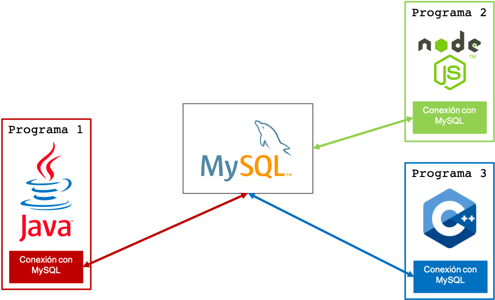

<!--
_header: ''
_footer:  Esta obra está bajo una [licencia de Creative Commons Reconocimiento-NoComercial-CompartirIgual 4.0 Internacional](http://creativecommons.org/licenses/by-nc-sa/4.0/). Icono diseñado por Laura Reen.
-->
<style>
img[alt~="center"] {
  display: block;
  margin: 0 auto;
}
img {
  background-color: transparent!important;
}
li {
  text-align: justify;
}
s {
  background-color: yellow;
  text-decoration: none;
}
p {
  text-align: justify;
}
/*Tablas centradas*/
table {
  width: auto;
  margin-left: auto;
  margin-right: auto
}
</style>

# TEMA 6

# Programación contra bases de datos


---

## Índice

1. Arquitectura cliente-servidor
2. Drivers nativos
3. Object Relational Mapping (ORM)

---

# ARQUITECTURA CLIENTE-SERVIDOR

## Programación contra bases de datos

---

## Arquitectura cliente-servidor

- Las bases de datos funcionan de acuerdo con una arquitectura cliente-servidor.
- El servidor, que contiene los datos, escucha las peticiones de los clientes.
- Los clientes solicitan al servidor que realicen operaciones sobre los datos: creación, actualización, borrado y consulta de los datos.
- Habitualmente, el servidor y los clientes se ejecutan en dispositivos físicos diferentes.

---

## MySQL Client/Server Protocol

Para comunicarse, el servidor y los clientes necesitan “hablar” el mismo idioma.

MySQL dispone de un protocolo que implementan tanto el servidor como los clientes para establecer la comunicación:

- Se denomina MySQL Client/Server Protocol.
- Se ejecuta sobre TCP.
- El cuerpo de los mensajes incluye sentencias SQL.

Más información en [la documentación de MySQL](https://dev.mysql.com/doc/internals/en/client-server-protocol.html).

---

## Esquema

Esquema básico de la arquitectura:


---

## Esquema

En las sesiones de prácticas de la asignatura, la arquitectura era la siguiente:


---

## Esquema con varios clientes

Lo habitual es que un mismo servidor reciba conexiones de diferentes clientes:


---

## Clientes de MySQL

- El cliente no tiene por qué ser *phpMyAdmin*.
- El cliente puede ser cualquier software que implemente el protocolo *MySQL Client/Server Protocol*.
- La mayoría de lenguajes de programación incorporan librerías (extensiones) para comunicarse con *MySQL* a través de clases y funciones de alto nivel.

---

## Clientes de MySQL

La base de datos es común para todos los programas. Cada programa se comunica con la base de datos a través de su conector:



---

# DRIVERS NATIVOS

## Programación contra bases de datos

---

## Open Database Connectivity

Open DataBase Connectivity (ODBC) es un estándar de acceso a las bases de datos.
El objetivo de ODBC es hacer posible el acceder a cualquier dato desde cualquier aplicación.

- Se crea una capa intermedia entre la aplicación y el SGBD.
- Esta capa actúa de traductor entre ODBC y el SGBD.
- Permite utilizar diferentes bases de datos sin cambiar la aplicación.


---

## Java Database Connectivity

- Java Database Connectivity (JDBC) es una API que permite la ejecución de operaciones sobre bases de datos desde Java.
- Es independiente a la base de datos y al sistema operativo.
- Dispone de clases e interfaces que permiten gestionar la operativa con la base de datos.
  - Conexión con base de datos.
  - Operaciones CRUD.

---
<style scoped>
  li {font-size: 0.9rem}
  p {font-size: 0.9rem}
</style>

## Java Database Connectivity

JDBC ha evolucionado con 4 versiones:

- **Tipo 1**: transforma las llamadas *JDBC* en llamadas *ODBC*. La traducción es lenta.
- **Tipo 2**: transforma las llamadas *JDBC* en llamadas nativas de la API del SGBD. Evita el proceso de traducción pero requiere instalar la librería del SGBD en el cliente.
- **Tipo 3**: crea una capa intermedia (middleware) para la gestión de las llamadas al SGBD. Evita instalar la librería del SGBD en el cliente pero el middleware añade latencia.
- **Tipo 4**: realiza llamadas a la API de cada SGBD. Es Java puro y no añade latencia, pero cada SGBD requiere un driver específico.

---

## JDBC Tipo 4

En la actualidad, se utiliza JDBC de Tipo 4 por ser el que mejor rendimiento reporta.


---

## MySQL Connector/J8.0

- La implementación más reciente de JDBC para MySQL se denomina MySQL Connector/J8.0.
- Requiere Java 1.8.x para funcionar.
- Funciona con MySQL 5.6, 5.7 y 8.0.
- Implementa JDBC 4.2.
- Incluido en el JDK de Java.
- Puedes encontrar toda la documentación en el siguiente [enlace](https://dev.mysql.com/doc/connector-j/8.0/en/).

---

## Instalación

- La descarga de **MySQL Connector/J8.0** es gratuita.
- Depende de la plataforma (Windows/Linux/macOS).
- Consiste en un `.jar` que debemos añadir al `CLASSPATH` de nuestro proyecto.
- Contiene todas las clases e interfaces necesarias para operar con el servidor de MySQL.
- Está disponible en Maven.

---

## Uso del conector

Toda aplicación que haga uso de MySQL Connector/J8.0 debe seguir los siguientes pasos:

1. Definir el SGBD a utilizar (cargar el driver).
2. Establecer conexión con la base de datos.
3. Ejecutar sentencias o llamadas a procedimientos.
4. Liberar recursos.

---

## Paso 1: definir la base de datos a utilizar

```java
import java.sql.Connection;
// Se importan las clases de JDK
import java.sql.DriverManager;
import java.sql.SQLException;
public class LoadDriver {
  public static void main(String[] args) {
    try {
      // Usamos el driver JDBC de MySQL
      Class.forName("com.mysql.cj.jdbc.Driver").newInstance();
    } catch (Exception ex) {
      // manejar el error
    }
  }
}
```

---

## Paso 2: conexión con la base de datos

```java
import java.sql.Connection;
import java.sql.DriverManager;
import java.sql.SQLException;

Connection conn = null;
// ...
try {
  conn = DriverManager.getConnection(
    "jdbc:mysql://localhost/test?" + "user=minty&password=greatsqldb"
    );
// Trabajar con la BBDD
} catch (SQLException ex) {
  // manejar los errores
}
```

La conexión con la base de datos se define mediante una **cadena de conexión**. Una alternativa para especificarla es:

```java
conn = DriverManager.getConnection("jdbc:mysql://localhost/test", ”user", ”pass");
```

---

## Sintaxis de la URL de conexión

- Para conectar con una base de datos debemos definir la URL de conexión.
- Debe tener el siguiente formato:

```text
protocol://hosts[:port][/database][?properties]
```

Por ejemplo, para conectarnos a la base de datos de las reformas, usaríamos:

```text
jdbc:mysql://localhost:3306/reformas?user=usuario&password=pass
```

---
<style scoped>
  li {font-size: 0.9rem}
  p {font-size: 0.9rem}
</style>

## Paso 3: ejecutar sentencias

- La ejecución de las sentencias se realiza a partir de la clase `Statement`.
- Se pueden crear nuevos `Statement` a partir del método `createStatement()` de la clase `Connection`.
- Para ejecutar las sentencias usaremos:.
  - `executeQuery(String)` si la sentencia es un `SELECT`.
  - `executeUpdate(String)` si la sentencia es un `INSERT`, `UPDATE` o `DELETE`.
  - `execute(String)` para cualquier sentencia.
- Los resultados se devuelven en una instancia de la clase ResultSet.

---

## Paso 3: ejecutar sentencias

```java
import java.sql.Connection;
import java.sql.DriverManager;
import java.sql.SQLException;
import java.sql.Statement;
import java.sql.ResultSet;

// se asume que hay creada una conexión JDBC

Statement stmt = null;
ResultSet rs = null;
try {
  stmt = conn.createStatement();
  rs = stmt.executeQuery("SELECT foo FROM bar");
  // ahora se pueden utilizar los resultados...
} catch (SQLException ex){
  // manejar los errores
}
```

---
<style scoped>
  pre {font-size: 0.7rem}
</style>

## Paso 3: ejecutar sentencias (alternativa)

```java
import java.sql.Connection;
import java.sql.DriverManager;
import java.sql.SQLException;
import java.sql.Statement;
import java.sql.ResultSet;

// se asume que hay creada una conexión JDBC

Statement stmt = null;
ResultSet rs = null;
try {
  stmt = conn.createStatement();
  if (stmt.execute("SELECT foo FROM bar")) {
    rs = stmt.getResultSet();
  }
  // ahora se pueden utilizar los resultados...
} catch (SQLException ex){
  // manejar los errores
}
```

---

## Paso 3: llamar a procedimientos

Para invocar un procedimiento debemos usar la clase `CallableStatement`. La llamada a un procedimiento implica:

1. Preparar la llamada (alto coste computacional, conviene reutilizar llamadas anteriores si es posible).
2. Registrar los parámetros de salida (si existen)
3. Establecer los parámetros de entrada (si existen)
4. Llamar al procedimiento
5. Recuperar los resultados

---
<style scoped>
  p {font-size: 0.7rem}
</style>

## Paso 3: llamar a procedimientos

Supongamos que tenemos definido el siguiente procedimiento:

```sql
CREATE PROCEDURE demoSp (IN inputParam VARCHAR(255), INOUT inOutParam INT)
BEGIN
  ...
END
```

La ejecución desde código quedaría:

```java
import java.sql.CallableStatement;
import java.sql.Types;

CallableStatement cStmt = conn.prepareCall("{call demoSp(?, ?)}");
cStmt.setString(1, "abc"); // alternativa: cStmt.setString(“inputParam”, “abc”);

cStmt.registerOutParameter(2, Types.INTEGER);
cStmt.setInt(2, 1); // alternativa: cStmt.setInt(“inOutParam”, 1);

cStmt.execute();

outputValue = cStmt.getInt(2);
// alternativa: outputValue = cStmt.getInt("inOutParam");
```

---

## Paso 4: liberar recursos

**Debemos** cerrar todos los recursos que se hayan abierto.

Para cerrar `Statement`:

```java
Statement stmt;
// ...
stmt.close();
```

Para cerrar conexiones:

```java
Connection conn;
// ...
conn.close();
```

---

## PreparedStatement

El uso de la clase `Statement` esta desaconsejado cuando se quiere parametrizar una sentencia.

La clase `Statement` construye sentencias SQL parametrizadas mediante la concatenación de objetos de tipo `String`:

```java
String name = "Alice";
int age = 27;

Statement stmt = conn.createStatement();
stmt.executeUpdate("INSERT INTO people (name, age) VALUES ('" + name + ”'," + age + ")");
```

Esto favorece los ataques de tipo *SQL Injection*.

---

## PreparedStatement

Alternativamente podemos usar las clase `PreparedStatement`.

Parametriza una llamada mediante la inclusión del carácter `?` en la sentencia SQL.

Requiere establecer el valor de cada parámetro antes de ejecutar la llamada:

```java
String name = "Alice";
int age = 27;

PreparedStatement stmt = conn.prepareStatement("INSERT INTO people (name, age) VALUES (?, ?)");

// OJO: los índices empiezan en 1
stmt.setString(1, name);
stmt.setInt(2, age);

stmt.executeUpdate();
```

---

<style scoped>
  li {font-size: 0.9rem}
  p {font-size: 0.9rem}
</style>

## ResultSet

La clase `ResultSet` nos permite recuperar los resultados devueltos por una consulta.

Funciona como un cursor que apunta a una fila del resultado.

El método `next()` permite avanzar el cursor:

- Devuelve el valor falso cuando ha alanzado la última posición.
- El cursor se inicia en la posición anterior a la primera fila.

Se proporcionan *getters* para recuperar los atributos de una fila.

La recuperación puede hacerse por el número de columna (comienza en 1) o por el nombre de la misma (case-insensitive).

---

## ResultSet

```java
PreparedStatement stmt;
stmt = conn.prepareStatement("SELECT name, age FROM people WHERE age > ?");

stmt.setInt(1, 30);

// OJO: solo executeQuery devuelve una instancia de ResultSet
ResultSet rs = stmt.executeQuery();

while (rs.next()) {
  String name = rs.getString("name"); // Podemos acceder por nombre...
  int age = rs.getInt(2);             // ... y por índice

  System.out.println("name = " + name + "; age = " + age);
}

rs.close(); // Estamos obligados a cerrar el objeto
```

---

# OBJECT RELATIONAL MAPPING (ORM)

## Programación contra bases de datos

---

## Por qué necesitamos ORM

- La mayoría de lenguajes de programación actuales son orientados a objetos.
- El modelo relacional y la orientación a objetos tienen importantes diferencias que dificultan el desarrollo software.
- Es necesario invertir gran cantidad de tiempo y recursos para desarrollar aplicaciones que se comuniquen con la base de datos.
- Los ORM buscan reducir la brecha entre ambos paradigmas para simplificar el proceso de desarrollo software.

---

## Características de un ORM

- Los ORM se encargan de representar las tablas de la base de datos mediante una estructura de clases.
- Toda la interacción entre el programa y la base de datos se realiza a través del ORM:
  - Creación de tablas
  - Inserción y modificación de datos
  - Consultas
- El desarrollador no necesita conocer SQL, aunque es recomendable entender su funcionamiento

---

## Cuándo debemos usar un ORM

Distinguimos **dos** tipos de aplicaciones:

- **Aplicaciones centradas en los datos**: se caracterizan por tener una alta dependencia con el SGBD y delegar la mayoría operativa a procedimientos almacenados. **No aptas para ORM**.
- **Aplicaciones centradas en el modelo de datos**: la lógica de la aplicación gira en torno al modelo de datos. Las consultas de datos son simples. La mayoría de aplicaciones actuales siguen esta filosofía. **Aptas para ORM**.

---

## Hibernate

- Hibernate es el ORM más popular para Java
- Independiente del SGBD
- Define el modelo de clases mediante anotaciones
- Se encarga de traducir métodos de Java en consultas SQL
- No es necesario conocer SQL para su utilización


---

## Hibernate: Instalación

Haremos uso de Maven para instalar la librería en nuestro proyecto (fichero `pom.xml`). Requerimos tanto *Hibernate* como *Connector/J*:

```xml
<dependencies>
    <dependency>
        <groupId>org.hibernate</groupId>
        <artifactId>hibernate-core</artifactId>
        <version>5.4.9.Final</version>
    </dependency>
    <dependency>
        <groupId>mysql</groupId>
        <artifactId>mysql-connector-java</artifactId>
        <version>8.0.18</version>
    </dependency>
</dependencies>
```

---

## Hibernate: ejemplo de uso

Vamos a estudiar el funcionamiento de *Hibernate* mediante el siguiente ejemplo:

- Se quiere desarrollar una aplicación para gestionar las visualizaciones de series por parte de los usuarios.
- Un usuario estará definido por su alias y podrá ver todos los capítulos de las series que quiera.
- Un capítulo, que dispondrá de un título y una duración, pertenecerá a una serie.
- Una serie estará caracterizada por su título y género y dispondrá de un número indeterminado de capítulos.

---

## Hibernate: ejemplo de uso (modelo ER)


---

## Hibernate: ejemplo de uso (modelo relacional)


---
<style scoped>
  li {font-size: 0.7rem}
  pre {font-size:0.6rem}
  p {font-size: 0.7rem}
</style>

## Hibernate: ejemplo de uso (clases Java)


Las relaciones entre las entidades se logran a través de los atributos de las clases:

- **Relación 1:N** con una instancia de la clase.
- **Relación N:M** con un `Set` de instancias de la clase.

```java
public class Usuario {
  private Long id;
  private String alias;
  private Set<Capitulo> capitulos;
  // …
}
```

---
<style scoped>
  li {font-size: 0.7rem}
  pre {font-size:0.6rem}
  p {font-size: 0.7rem}
</style>

## Hibernate: ejemplo de uso (clases Java)


En el caso de las series, incluiremos un conjunto de capítulos que pertenecen a ella.

```java
public class Serie {
  private Long id;
  private String titulo;
  private String genero;
  private Set<Capitulo> capitulos;
  // …
}
```

---
<style scoped>
  li {font-size: 0.7rem}
  pre {font-size:0.6rem}
  p {font-size: 0.7rem}
</style>

## Hibernate: ejemplo de uso (clases Java)


En el caso de los capítulos, incluiremos una referencia a la serie a la que pertenecen.

```java
public class Capitulo {
  private Long id;
  private String titulo;
  private Integer duracion;
  private Serie serie;
  private Set<Usuario> usuarios;
  // …
}
```

---
<style scoped>
  li {font-size: 0.9rem}
  pre {font-size:0.6rem}
  p {font-size: 0.9rem}
</style>

## Hibernate: ejemplo de uso (anotaciones)

Debemos indicar cómo construir nuestro modelo relacional a partir de las clases anteriores

Disponemos de las siguientes anotaciones:

- `@Entity`: define una clase como una entidad de nuestro modelo
- `@Table`: define una tabla asociada a una entidad
- `@Column`: define una columna de una tabla
- `@Id`: define una columna de una tabla como clave primaria de dicha tabla
- `@ManyToOne` / `@OneToMany`: define relaciones 1:N
- `@ManyToMany`: define relaciones N:M

---

## Hibernate: ejemplo (anotaciones básicas)

```java
@Entity
@Table(name = "usuario")
public class Usuario {

  @Id
  @Column(name = "id")
  private Long id;

  @Column(name = "alias", nullable = false)
  private String alias;

  // …
}
```

---

## Hibernate: ejemplo (anotaciones básicas)

```java
@Entity
@Table(name = "capitulo")
public class Capitulo {
  @Id
  @Column(name = "id")
  private Long id;

  @Column(name = "titulo", nullable = false)
  private String titulo;

  @Column(name = "duracion", nullable = false)
  private Integer duracion;

  // ...
}
```

---

## Hibernate: ejemplo (anotaciones básicas)

```java
@Entity@Table(name = "serie")
public class Serie {
  @Id
  @Column(name = "id")
  private Long id;

  @Column(name = "titulo", nullable = false)
  private String titulo;

  @Column(name = "genero", nullable = false)
  private String genero;

  // ...
}
```

---
<style scoped>
  li {font-size: 0.9rem}
  pre {font-size:0.6rem}
  p {font-size: 0.9rem}
</style>

## Hibernate: atributo `@Column`

Permite vincular un atributo de la clase con una columna de un tabla.

Admite los siguiente parámetros:

- `name`: nombre de la columna (default: nombre del atributo).
- `unique`: el valor del atributo no puede repetirse (default: false).
- `nullable`: el valor puede ser nulo (default: true).
- `length`: longitud de la cadena de caracteres si el atributo es de tipo String (default: 255).
- `precision`: número de dígitos decimales si el atributo es Double (default: 0).

---
<style scoped>
  li {font-size: 0.9rem}
  pre {font-size:0.6rem}
  p {font-size: 0.9rem}
</style>

## Hibernate: atributo `@GeneratedValue`

Permite crear identificadores únicos de forma automática. Los atributos de las clases se instancian **cuando el objeto es creado** en la base de datos.

```java
@Entity@Table(name = "serie")
public class Serie {
  @Id
  @GeneratedValue
  @Column(name = "id")
  private Long id;
}

Serie lost = new Serie("Lost", "SciFi");

System.out.println(lost.getId()); // null

session.beginTransaction();
session.save(lost);
session.getTransaction().commit();

System.out.println(lost.getId()); // 1
```

---

## Hibernate: relaciones 1:N

Las relaciones 1:N requieren dos anotaciones:

- `@ManyToOne`: indica que muchas instancias de una clase se relacionan con una de otra.
  - Requiere definir el atributo de dicha relación mediante la etiqueta `@JoinColumn`.
- `@OneToMany`: indica que una instancia de una clase clase se relaciona con muchas de otra.

---

## Hibernate: relaciones 1:N


---
<style scoped>
  li {font-size: 0.9rem}
  pre {font-size:0.6rem}
  p {font-size: 0.9rem}
</style>

## Hibernate: relaciones 1:N (cascada)

- Tanto a `@ManyToOne` como a `@OneToMany` se les puede añadir el parámetro `cascade = CascadeType.ALL`.
- Esto permite que las actualizaciones en el modelo se propaguen a la base de datos.
- Por defecto está **desactivado** (`cascade = 0`).

```java
Serie lost = new Serie("Lost", "SciFi");
Capitulo lost1x01 = new Capitulo("Pilot, Part1", 42, lost);
Capitulo lost1x02 = new Capitulo("Pilot, Part2", 41, lost);

lost.getCapitulos().add(lost1x01);
lost.getCapitulos().add(lost1x02);

session.beginTransaction();
// Si CascadeType.ALL se insertarán en la BD tanto la serie como los capítulos
session.saveOrUpdate(lost);
session.getTransaction().commit();
```

---

## Hibernate: relaciones N:M

- Las relaciones **N:M** requieren etiquetar las dos clases con `@ManyToMany`.
- Todas las relaciones **N:M** tienen dos elementos:
  - La clase poseedora de la relación.
  - La clase no-poseedora (inversa) de la relación.
- Se debe etiquetar con `@JoinTable` la clase poseedora para definir la tabla de relación.

---

## Hibernate: relaciones N:M


---
<style scoped>
  li {font-size: 0.8rem}
  pre {font-size:0.6rem}
  p {font-size: 0.8rem}
</style>

## Hibernate: relaciones N:M (cascada)

- `@ManyToMany` admite el parámetro `cascade = CascadeType.ALL`.
- Permite mantener la consistencia entre las clases y los datos almacenados en el SGBD.
- Si no se define, las nuevas filas de la tabla de relación sólo se generan al guardar los cambios en la clase poseedora.


---

## Hibernate: creación de las tablas

- Una vez realizadas las anotaciones, *Hibernate* crea de manera automática todas las tablas en la base de datos.
- **No es necesario** que ejecutemos ninguna sentencia `CREATE TABLE`.
- Si las tablas ya existieran, *Hibernate* usará dichas tablas.
- Su estructura debe coincidir con las anotaciones que hayamos hecho en las clases.

---
<style scoped>
  li {font-size: 0.8rem}
  pre {font-size:0.6rem}
  p {font-size: 0.8rem}
</style>

## Hibernate: Session

Hibernate gestiona todas las conexione al SGBD a través de la clase `Session`.

Las instancias de Session son creadas mediante un patrón factoría con el objeto `SessionFactory`.

```java
// configuración de la factoría
StandardServiceRegistry registry = new StandardServiceRegistryBuilder()
    .configure()
    .build();

// Creación de la factoría
SessionFactory sessionFactory = new MetadataSources(registry)
    .buildMetadata()
    .buildSessionFactory();

// Apertura, uso y cierre de sesión
Session session = sessionFactory.openSession();
// uso...
session.close();
```

---

## Hibernate: configuración de `SessionFactory`

Para configurar `SessionFactory` necesitamos el fichero de configuración `hibernate.cfg.xml`.

En el se definen las propiedades para conectar *Hibernate* con el SGBD.

Este fichero **es dependiente del SGBD**.

Es un **error muy común** olvidarse de configurar este fichero, por lo que el proyecto no funcionará.

---

## Hibernate: fichero de configuración

```xml
<hibernate-configuration>
    <session-factory>
      <!-- Parámetros de conexión al SGBD -->
      <property name="connection.driver_class">com.mysql.jdbc.Driver</property>
      <property name="connection.url">jdbc:mysql://localhost:3306/series</property>
      <property name="connection.username">root</property>
      <property name="connection.password">root</property>

      <!-- Dialecto: MySQL 8.0 -->
      <property name="dialect">org.hibernate.dialect.MySQL8Dialect</property>

      <!-- Propiedades de la conexión -->
      <property name="connection.pool_size">10</property>
      <property name="hibernate.current_session_context_class">thread</property>
      <property name="show_sql">true</property>

      <!-- Gestión del modelo de datos -->
      <property name="hibernate.hbm2ddl.auto">update</property>

      <!-- IMPORTANTE: clases que tienen anotaciones -->
      <mapping class="datamodel.Serie"/>
      <mapping class="datamodel.Capitulo"/>
      <mapping class="datamodel.Usuario"/>
    </session-factory>
</hibernate-configuration>
```

---

## Hibernate: propiedad `hibernate.hbm2ddl.auto`

Esta propiedad del fichero de configuración permite definir la gestión del modelo de datos:

- `validate`: valida el esquema, **no** hace cambios en la base de datos.
- `update`: actualiza el esquema si es necesario.
- `create`: crea el esquema **destruyendo los datos existentes**.
- `create-drop`: borra el esquema cuando `SessionFactory` es cerrado explícitamente.

---

## Hibernate: funcionamiento transaccional

Todas las operaciones de escritura de Hibernate con el SGBD es recomendable hacerlas de manera transaccional.

Esquema de funcionamiento:

1. Apertura de la transacción:

```java
session.beginTransaction();
```

2. Operaciones de escritura.
3. *Commit* de la transacción:

```java
session.getTransaction().commit();
```

---

## Hibernate: operaciones de escritura

Crear un nuevo registro (INSERT):

```java
Serie lost = new Serie("Lost", "SciFi");
session.beginTransaction();
session.save(lost);
session.getTransaction().commit();
```

Actualizar un registro (UPDATE):

```java
lost.setGenero("Sci-Fi");
session.beginTransaction();
session.update(lost);
session.getTransaction().commit();
```

---

## Hibernate: operaciones de escritura

Crear o actualizar un registro:

```java
Serie lost = new Serie("Lost", "SciFi");
session.beginTransaction();
session.saveOrUpdate(lost);
session.getTransaction().commit();
```

Borrar un registro (DELETE):

```java
session.beginTransaction();
session.delete(lost);
session.getTransaction().commit();
```

---

## Hibernate: operaciones de lectura

Las operaciones de lectura **no** requieren transacciones.

Recuperar un registro a partir de su clave primaria:

```java
Serie lost = session.load(Serie.class, 1L);
```

Para consultas más avanzadas se utiliza *Hibernate Query Language (HQL)*:

```java
Query query = session.createQuery("from Serie where genero = :genero");
query.setParameter("genero", "SciFi");
List <Serie> list = query.getResultList();
```

---

## Hibernate: consideraciones finales

- Las clases anotadas deben tener un constructor vacío para que *Hibernate* pueda funcionar.
- Se pueden añadir todos los constructores y métodos que sean necesario a las clases para su funcionamiento dentro de la aplicación.
- Para hacer persistente un cambio debe llamarse a `save`, `update` o `saveOrUpdate`.
- Los identificadores numéricos deben ser de tipo `Long`.
- Todos los métodos vistos anteriormente pueden arrojar excepciones que **deben ser tratadas**.

---

## Hibernate: secuencia de comandos (I)

```java
// Creación de la serie lost
Serie lost = new Serie("Lost", "SciFi");

// Creación de dos capítulos
Capitulo lost1x01 = new Capitulo("Pilot, Part1", 42, lost);
Capitulo lost1x02 = new Capitulo("Pilot, Part2", 41, lost);

// Vinculación de los capítulos a su serie
lost.getCapitulos().add(lost1x01);
lost.getCapitulos().add(lost1x02);

// Los cambios se almacenan en la base de datos
session.beginTransaction();
session.saveOrUpdate(lost);
session.getTransaction().commit();
```

---

## Hibernate: secuencia de comandos (II)

```java
// Actualización de la serie Lost
lost.setGenero("Sci-Fi");

// Cambios a la base de datos
session.beginTransaction();
session.saveOrUpdate(lost);
session.getTransaction().commit();
```

---

## Hibernate: secuencia de comandos (III)

```java
// Creación de la serie Friends
Serie friends = new Serie ("Friends", "Comedia");

// Creación de un capítulo y vinculación con la serie
Capitulo friends1x01 = new Capitulo("The Pilot", 21, friends);
friends.getCapitulos().add(friends1x01);

// Cambios a la base de datos
session.beginTransaction();
session.saveOrUpdate(friends);
session.getTransaction().commit();
```

---

## Hibernate: secuencia de comandos (IV)

```java
// Creación de dos usuarios
Usuario alice = new Usuario("Alice");
alice.getCapitulos().add(lost1x01);
lost1x01.getUsuarios().add(alice);
alice.getCapitulos().add(friends1x01);
friends1x01.getUsuarios().add(alice);

Usuario bob = new Usuario("Bob");
bob.getCapitulos().add(friends1x01);
friends1x01.getUsuarios().add(bob);

session.beginTransaction();
session.saveOrUpdate(alice);
session.saveOrUpdate(bob);
session.getTransaction().commit();
```

---

## Hibernate: estado de la tabla `Serie`


---

## Hibernate: estado de la tabla `Capitulo`


---

## Hibernate: estado de la tabla `Usuario`


---

## Hibernate: estado de la tabla `Visualizaciones`


