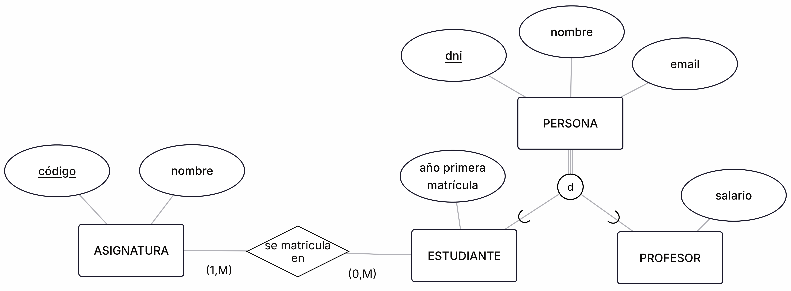

<!-- _class: titlepage -->

# Modelo Entidad-Relación extendido (paso a tablas)

## Bases de datos

### Departamento de Sistemas Informáticos

#### E.T.S.I. de Sistemas Informáticos

##### Universidad Politécnica de Madrid

---

# Paso a tablas de la generalización/especialización

Proceso a seguir

1. Creamos una relación (tabla) para la superclase, incluyendo todos sus atributos
1. Para cada subclase:
    1. Creamos una relación, incluyendo sus atributos
    1. La clave de la superclase se añade como clave primaria y externa (referenciando a la clave primaria de la superclase)
1. Seguir aplicando las reglas de paso a tablas de las relaciones con las entidades.

---

# Ejemplo

---

# Licencia<!--_class: license -->

Esta obra está licenciada bajo una licencia [Creative Commons Atribución-NoComercial-CompartirIgual 4.0 Internacional](https://creativecommons.org/licenses/by-nc-sa/4.0/).

Puede encontrar su código en el siguiente enlace: <https://github.com/bbddetsisi/material-docente>
