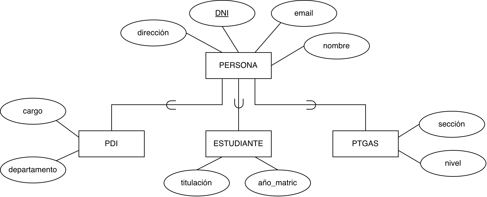
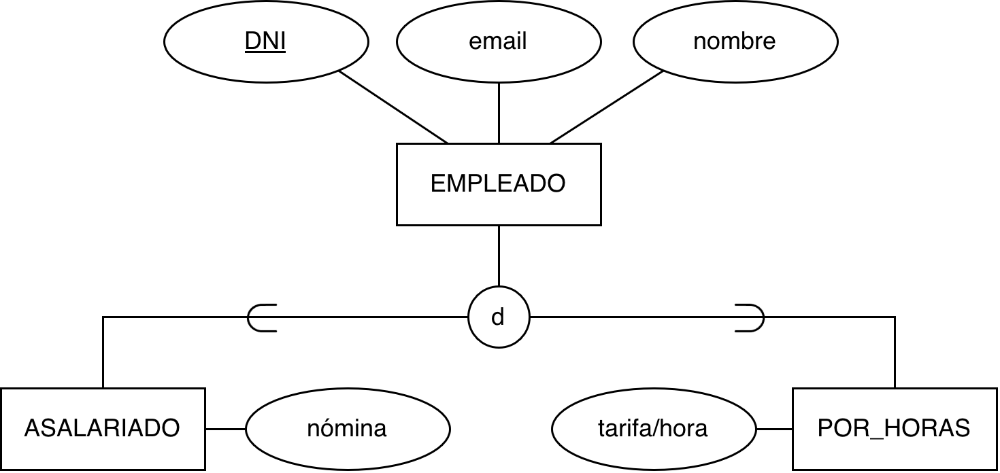
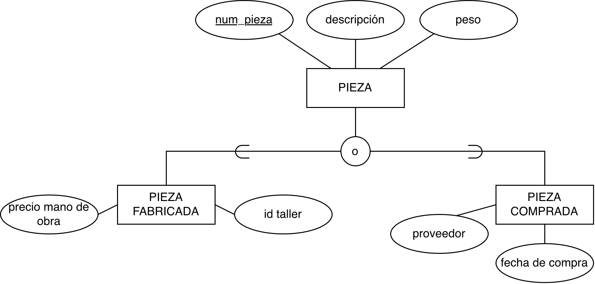
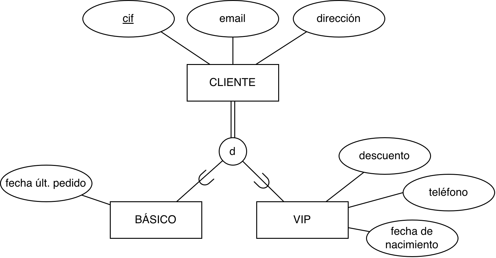
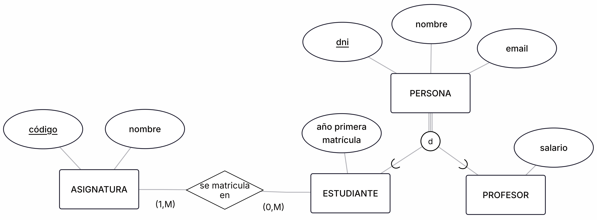

<!-- _class: titlepage -->

# Modelo Entidad-Relación extendido

## Bases de datos

### Departamento de Sistemas Informáticos

#### E.T.S.I. de Sistemas Informáticos

##### Universidad Politécnica de Madrid

---

# Motivación

El modelo Entidad-Relación extendido surge como una evolución del modelo ER clásico para:

- Representar características más complejas de los sistemas reales
- Proporcionar mayor poder expresivo en el modelado
- Facilitar la transición hacia esquemas relacionales
- Incorporar conceptos de orientación a objetos

---

# Elementos del EER

El modelo EER incorpora nuevos elementos al modelo ER canónico:

1. **Generalización/Especialización**
1. **Herencia de atributos y relaciones**
1. **Restricciones de cobertura y disjunción**

**Nota**: hay algunos elementos adicionales que no se usarán en la asignatura.

---

# Generalización y Especialización

- **Generalización**: Proceso de combinar entidades de menor nivel en una entidad de mayor nivel
- **Especialización**: Proceso de definir subconjuntos de una entidad que comparten características comunes

---

# Restricciones en la jerarquía: Disjunción (d)

- Una entidad puede pertenecer a **una sola** subclase
- Se representa con una **d** en la especialización

---

# Restricciones en la jerarquía: Superposición (o)

- Una entidad puede pertenecer a **múltiples** subclases simultáneamente
- No se marca o se representa con una **o**

---

# Restricciones de cobertura: cobertura total

**Todas** las entidades de la superclase deben pertenecer a, al menos, una subclase. Se identifica con una línea doble.

La alternativa es cobertura parcial, indicada por línea simple.

---

# Herencia de Atributos y Relaciones

- Las subclases **heredan** todos los atributos y relaciones de la superclase
- La superclase debe tener una clave que heredan sus subclases
- Pueden añadir **nuevos atributos** propios
- Pueden definir **nuevas relaciones** específicas
- La herencia es **transitiva**: se propaga a través de múltiples niveles de jerarquía
- Los elementos heredados están disponibles automáticamente en todas las subclases sin duplicación
- Las restricciones definidas en la superclase se aplican transitivamente a sus especializaciones
- Permite modelar relaciones "es-un" manteniendo la coherencia semántica del modelo

---

# Ventajas e inconvenientes del Modelo EER

Ventajas:

- **Mayor expresividad**: Modela conceptos más complejos
- **Reutilización**: Evita duplicación de atributos y relaciones
- **Claridad semántica**: Representa mejor la realidad del dominio
- **Flexibilidad**: Permite diferentes estrategias de implementación
- **Mantenimiento**: Cambios en superclases se propagan automáticamente

Inconvenientes:

- **Complejidad**: Mayor dificultad de comprensión inicial
- **Rendimiento**: Consultas pueden ser más complejas
- **Implementación**: Requiere soporte del SGBD o conversión cuidadosa
- **Normalización**: Puede requerir ajustes en el proceso de normalización

---

# Ejemplo con relaciones

> Tenemos que almacenar información de las personas de la universidad (dni, nombre, email). Las personas serán profesores o estudiantes. Estos últimos pueden matricularse en varias asignaturas.

---

# Licencia<!--_class: license -->

Esta obra está licenciada bajo una licencia [Creative Commons Atribución-NoComercial-CompartirIgual 4.0 Internacional](https://creativecommons.org/licenses/by-nc-sa/4.0/).

Puede encontrar su código en el siguiente enlace: <https://github.com/bbddetsisi/material-docente>