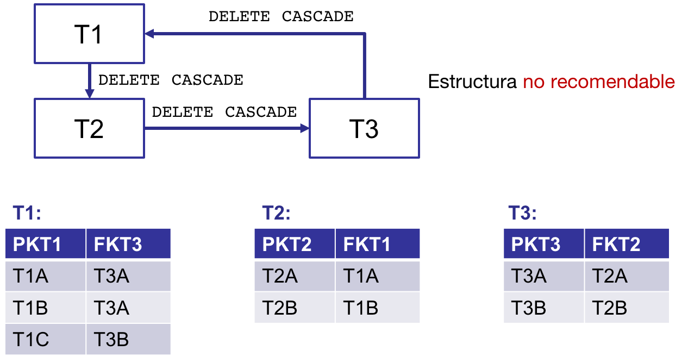
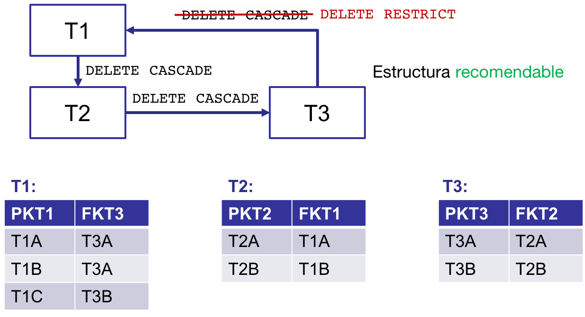
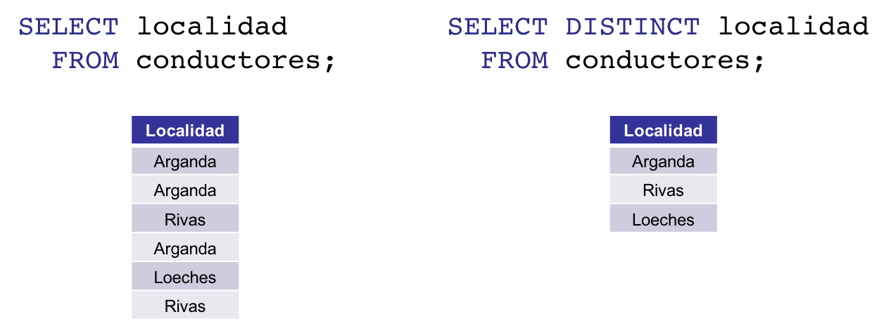
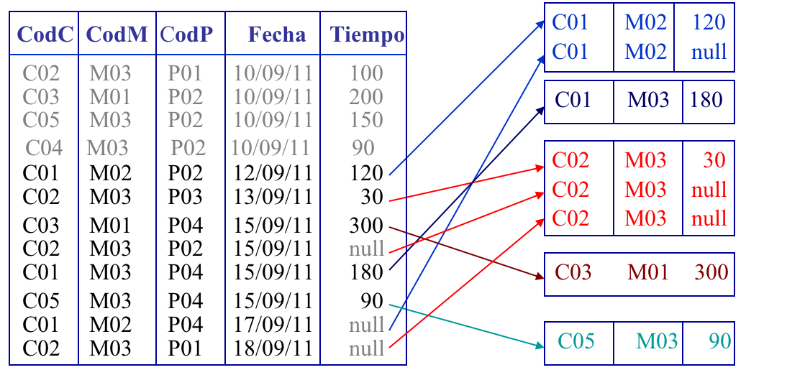
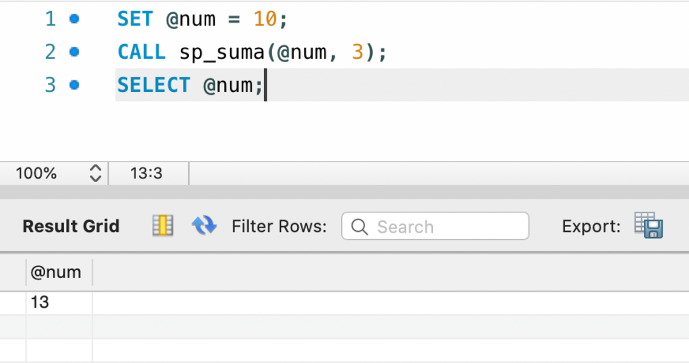
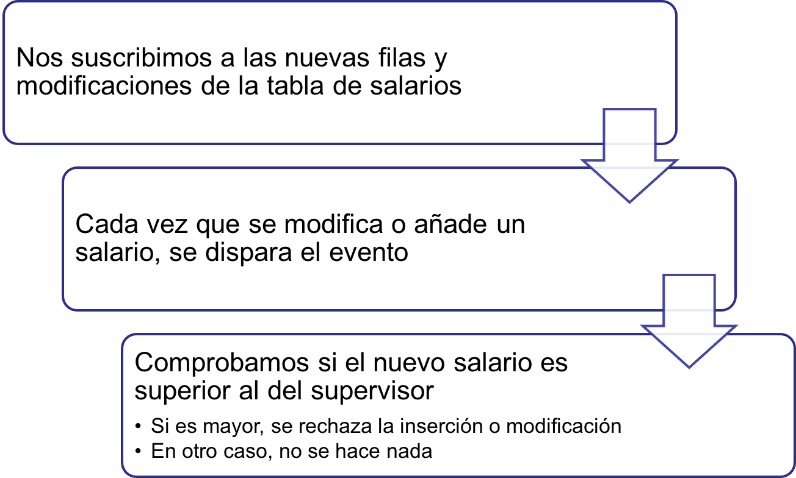
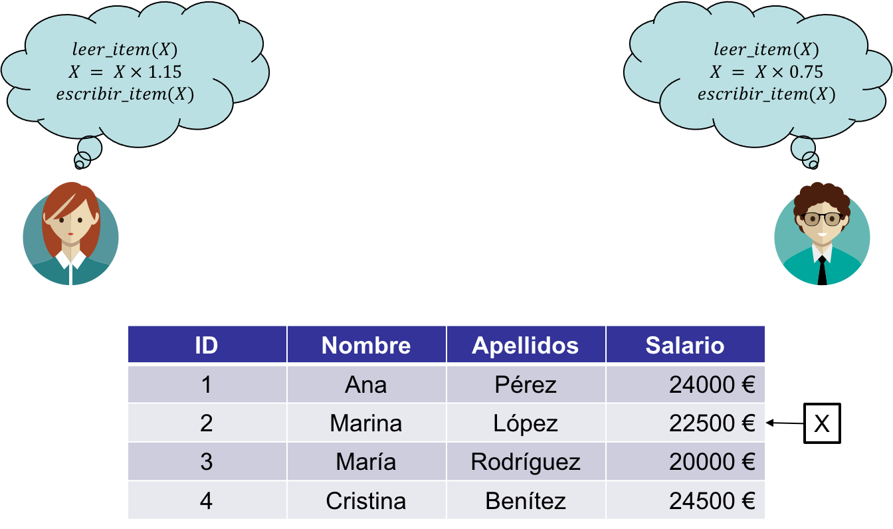
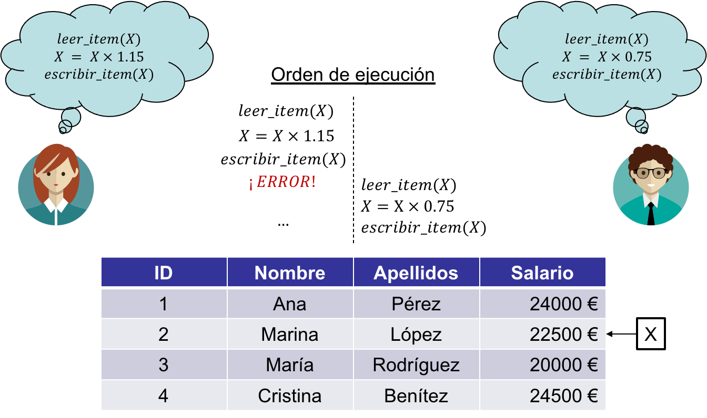

<!-- _class: titlepage -->

# El lenguaje SQL

## Bases de datos

### Departamento de Sistemas Informáticos

#### E.T.S.I. de Sistemas Informáticos

##### Universidad Politénica de Madrid

[](https://creativecommons.org/licenses/by-nc-sa/4.0/)


---

# Por qué necesitamos SQL


---

# SQL: _Structured Query Language_

- Lenguaje de consulta estructurado para bases de datos relacionales
- Es mucho más que un lenguaje de consulta, puesto que permite además funciones de definición y control de datos
- La estandarización ha sido crucial para su difusión
- Prácticamente la mayoría de los sistemas relacionales soportan las bases de SQL estándar y suelen incluir aportaciones propias
- Utilizado masivamente en la industria

---

# Evolución de SQL

| Año  | Nombre   | Comentarios                                           |
|------|----------|-------------------------------------------------------|
| 1986 | SQL-86   | Primera versión hecha por ANSI                        |
| 1989 | SQL-89   | Revisión menor                                        |
| 1992 | SQL-92   | Revisión mayor                                        |
| 1999 | SQL:1999 | Expresiones regulares, consultas recursivas, triggers |
| 2003 | SQL:2003 | XML básico, sequence, autoincrement                   |
| 2005 | SQL:2005 | XML avanzado                                          |
| 2008 | SQL:2008 | `ORDER BY`, `TRUNCATE`                                |
| 2011 | SQL:2011 | Datos temporales, `FETCH`                             |
| 2016 | SQL:2016 | Patrones y JSON                                       |

---

# Soporte CRUD

- ~~C~~reate:
  - Creación de tablas (`CREATE TABLE`)
  - Inserción de datos (`INSERT INTO`)
- ~~R~~ead:
  - Lectura de datos (`SELECT`)
- ~~U~~pdate:
  - Actualización de tablas (`ALTER TABLE`)
  - Actualización de datos (`UPDATE`)
- ~~D~~elete:
  - Borrado de tablas (`DROP`)
  - Borrado de datos (`TRUNCATE` y `DELETE`)

---

# Características de SQL

- Lenguaje de **definición** de datos (*DDL*):
  - Permite diseñar, definir, modificar y borrar las estructuras de almacenamiento de datos.
- Lenguaje de **manipulación** de datos (*DML*):
  - Permite insertar, manipular, modificar y borrar datos
- Lenguaje de **consulta** de datos (*DQL*):
  - Permite recuperar datos
- Lenguaje de control de **transacciones** (*TCL*):
  - Permite controlar el acceso concurrente a la base de datos mediante transacciones
- Lenguaje de **control** de datos (*DCL*):
  - Permite controlar y gestionar los permisos de la base de datos

---

# Sentencias SQL (I)

- Las sentencias SQL están formadas por:
  - Palabras reservadas
  - Palabras definidas por el usuario (nombres de tablas, atributos, etc).
- Características de las sentencias:
  - _Case insensitive_: es indiferente escribir las palabras en mayúsculas o minúsculas
  - Cada cláusula o palabra puede aparecer en líneas diferentes
  - Se puede utilizar la indentación que se quiera
  - Una sentencia o comando SQL finaliza con la aparición del símbolo `;`, aunque es opcional si el comando es único

---

# Sentencias SQL (y II)

Explicaremos las sentencias SQL mediante notación BNF:

- Palabras en mayúsculas representan palabras reservadas
- Palabras en minúsculas representan palabras definidas por el usuario
- El símbolo `|` indica una elección entre alternativas
- Las llaves `{}` representan elementos requeridos
- Los corchetes `[]` representan elementos opcionales
- Los `...` indican repetición opcional (0 ó más)

---

<!--_class: section-->
# LENGUAJE DE DEFINICIÓN DE DATOS

---

# Schemas (I)

En *MySQL* un schema en una agrupación de lógica de tablas que constituyen un modelo datos:


---

# Schemas (y II)

Sintaxis:

```ebnf
CREATE {DATABASE | SCHEMA} [IF NOT EXISTS] nombre_del_schema
 [ [DEFAULT] CHARACTER SET [=] charset_name
 | [DEFAULT] COLLATE [=] collation_name
 | DEFAULT ENCRYPTION [=] {'Y' | ‘N’}];

```

Ejemplo de uso:

```SQL
CREATE SCHEMA etsisi
  DEFAULT CHARACTER SET utf8
  COLLATE utf8_spanish2_ci;
```

Más información sobre `COLLATE`: [documentación](https://dev.mysql.com/doc/refman/8.0/en/charset.html)

---

# Creación de tablas

```SQL
CREATE TABLE [schema.]nombre_tabla (
  atributo_1 tipo_1 [UNIQUE] [NOT NULL],
  atributo_2 tipo_2 [UNIQUE] [NOT NULL],
  …
  atributo_n tipo_n [UNIQUE] [NOT NULL]
);
```

Modificadores de columna:

- `UNIQUE`: No se permiten valores duplicados.
- `NOT NULL`: No se permiten valores nulos.

---

# Tipos de datos en SQL

| Familia    | Tipos                      |
|------------|----------------------------|
| Numéricos  | `INTEGER`, `DECIMAL`       |
| Texto      | `VARCHAR(size)`, `TEXT`    |
| Enumerados | `ENUM('val1', ..., 'valn')`|
| Fecha      | `DATETIME`, `TIMESTAMP`    |

Más tipos en <https://dev.mysql.com/doc/refman/8.0/en/data-types.html>

---

# Creación de tablas: ejemplo

| ~~ID~~ | NOMBRE | APELLIDOS    | DNI        | FECHA DE NACIMIENTO |
|--------|--------|--------------|------------|---------------------|
| 3      | Juan   | Gómez Pérez  | 00000000-T | 3 de mayo de 1983   |
| 67     | Lucía  | Álvarez León | 99999999-R | 7 de julio de 1995  |

```SQL
CREATE TABLE corporacion.personas (
  id        INTEGER     UNIQUE NOT NULL,
  nombre    VARCHAR(30) NOT NULL,
  apellidos VARCHAR(60) NOT NULL,
  dni       VARCHAR(10) UNIQUE NOT NULL,
  fecha_nac DATETIME
);
```

---

# Claves primarias

Toda definición de una tabla debe indicar una clave primaria

- Debe referenciar a uno o más atributos que identifiquen unívocamente cada fila
- El/los atributo/s deben declararse de la forma habitual

```SQL
CREATE TABLE [schema.]nombre_tabla (
  ...
  PRIMARY KEY (atributo_1[, …, atributo_n])
);
```

---

# Claves primarias: ejemplo

| ~~ID~~ | NOMBRE | APELLIDOS    | DNI        | FECHA DE NACIMIENTO |
|--------|--------|--------------|------------|---------------------|
| 3      | Juan   | Gómez Pérez  | 00000000-T | 3 de mayo de 1983   |
| 67     | Lucía  | Álvarez León | 99999999-R | 7 de julio de 1995  |

```SQL
CREATE TABLE corporacion.personas (
  id        INTEGER,
  nombre    VARCHAR(30) NOT NULL,
  apellidos VARCHAR(60) NOT NULL,
  dni       VARCHAR(10) UNIQUE NOT NULL,
  fecha_nac DATETIME,
  PRIMARY KEY (id)
);
```

---

# Modificación de tablas

Añadir un nuevo atributo:

```SQL
ALTER TABLE [schema.]nombre_tabla
ADD definición_de_atributo;
```

Modificar un atributo:

```SQL
ALTER TABLE [schema.]nombre_tabla
MODIFY definición_de_atributo;
```

Eliminar un atributo:

```SQL
ALTER TABLE [schema.]nombre_tabla
DROP nombre_de_atributo;
```

---

# Eliminación de tablas

Vaciar una tabla (eliminar todas sus filas pero mantener la estructura):

```SQL
TRUNCATE TABLE [schema.]nombre_tabla;
```

Eliminar una tabla (todas sus filas **y también la estructura**):

```SQL
DROP TABLE [schema.]nombre_tabla;
```

---

<!--_class: section-->
# LENGUAJE DE MANIPULACIÓN DE DATOS
## (Parte 1)

---

# Inserción de datos (I)

- Los datos deben añadirse fila a fila.
- Los datos añadidos deben cumplir las restricciones de la tabla:
  - La clave debe ser única.
  - No existirán valores nulos si se ha definido el atributo como `NOT NULL`.
  - Los tipos de datos deben coincidir.
  - No se admiten repeticiones si se ha definido el atributo como `UNIQUE`.

---

# Inserción de datos (y II)

Inserción de una fila de datos:

```SQL
INSERT INTO [schema.]tabla (atributo_1, …, atributo_n)
  VALUES (valor_1, …, valor_n);
```

La lista de atributos es opcional. En ese caso, se asume el orden definido en el `CREATE TABLE`:

```SQL
INSERT INTO [schema.]tabla
  VALUES (valor_1, …, valor_n);
```

**Solo podrán omitirse columnas que no hayan sido definidas como** `NOT NULL`.

---

# Inserción de datos: ejemplos (I)

| ~~ID~~ | NOMBRE        | APELLIDOS        | DNI        | FECHA_NAC              |
|--------|---------------|---------------|------------|------------------------|
| 3      | Juan          | Gómez          | 00000000-T | 3 de mayo de 1983      |
| 67     | Lucía         | Duque          | 99999999-R | 7 de julio de 1995     |
| 101    | Diana         | Álvarez        | 12345678-Z | 9 de diciembre de 2000 |

```SQL
INSERT INTO personas (id, nombre, apellidos, dni, fecha_nac)
  VALUES (3, "Juan", "Gómez", "00000000-T", "1983-05-03");

INSERT INTO personas
  VALUES (67, "Lucía", "Duque", "99999999-R", "1995-07-07");

INSERT INTO personas (nombre,  apellidos, fecha_nac, dni, id)
  VALUES ("Diana",  "Álvarez", "2000-12-09", "12345678-Z", 101);
```

---

# Inserción de datos: ejemplos (y II)

Es posible insertar varias filas con una única sentencia `INSERT INTO`

| ~~ID~~ | NOMBRE        | APELLIDOS        | DNI        | FECHA_NAC              |
|--------|---------------|---------------|------------|------------------------|
| 3      | Juan          | Gómez          | 00000000-T | 3 de mayo de 1983      |
| 67     | Lucía         | Duque          | 99999999-R | 7 de julio de 1995     |
| 101    | Diana         | Álvarez        | 12345678-Z | 9 de diciembre de 2000 |

```SQL
INSERT INTO personas VALUES
  (3,   "Juan",  "Gómez",   "00000000-T", "1983-05-03"),
  (67,  "Lucía", "Duque",   "99999999-R", "1995-07-07"),
  (101, "Diana", "Álvarez", "12345678-Z", "2000-12-09");
```

---

# Valores por defecto

Es posible definir valores por defecto a los atributos.

- Se definen en la sentencia CREATE TABLE:
- Si no se especifica el valor al realizar el `INSERT INTO`, se pone el valor por defecto.

```SQL
CREATE TABLE [schema.]tabla (
  …
  atributo tipo [UNIQUE] [NOT NULL] [DEFAULT valor],
  …
);
```

---

# Generación automática de claves

- Es posible generar claves únicas de forma automática
- Se debe definir un atributo numérico como `AUTO_INCREMENT`
- El atributo tomará un valor incremental cada vez que se inserte una nueva fila.
  - No debe especificarse su valor cuando se realiza el `INSERT INTO`

```SQL
CREATE TABLE personas (
  id        INTEGER AUTO_INCREMENT,
  nombre    VARCHAR(30) NOT NULL,
  apellidos VARCHAR(60) NOT NULL,
  fecha_nac DATETIME,
  PRIMARY KEY (id)
);

INSERT INTO personas (nombre, apellidos, fecha_nac)
  VALUES ("Juan", "Gómez", "1983-05-03");
```

---

# Modificación de filas

```SQL
UPDATE [schema.]tabla
  SET atributo = {expresion|selectSQL|NULL|DEFAULT} [,...]
  [WHERE condición]
```

- `tabla` puede ser una tabla base o una vista actualizable
- El valor que se asigne a un atributo puede ser una expresión, el resultado de una subconsulta (que deberá ir entre paréntesis), el valor `NULL` o el valor por defecto del atributo.
- La modificación afectará a todas las filas que cumplan la condición. Si no se indica, afecta a todas la filas.

---

# Modificación de filas: ejemplo

<cite>Incrementar un 15% el valor de la categoría de los conductores de Rivas</cite>

```SQL
UPDATE conductores
  SET categoria = categoría * 1.15
  WHERE localidad = 'Rivas';
```

<cite>Establecer la categoría por defecto a todos los conductores de Loeches</cite>

```SQL
UPDATE conductores
  SET categoria = DEFAULT
  WHERE localidad = 'Loeches';
```

---

<style scoped>
  li {font-size: 0.9rem;}
</style>

# Eliminación de filas

```SQL
DELETE FROM [schema.]tabla
  [WHERE condición]
```

- No se pueden eliminar partes de una fila
- Si no aparece la cláusula `WHERE` se vacía la tabla (se eliminan todas la filas)
- El borrado de una fila puede provocar el borrado de filas de otras tablas si no se han establecido políticas adecuadas de **integridad referencia**.

<cite>Eliminar todos los proyectos realizados al cliente Felipe Sol</cite>

```SQL
DELETE FROM proyectos
  WHERE cliente = 'Felipe Sol';
```

---

# ¿Qué es la integridad referencial?

Restricciones referenciales de acuerdo con un conjunto predefinido de reglas para `INSERT`, `UPDATE` Y `DELETE` que gobiernan las operaciones de inserción, borrado, actualización y carga sobre tablas relacionadas mediante claves primarias y claves ajenas

- Se encarga de conservar y garantizar automáticamente la integridad de todos los datos almacenados

---

# Integridad referencial: ejemplo

Supongamos que tenemos las siguientes tablas:

<div class="columns">
<div class="column">

`EMPLEADOS`

| ~~ID_E~~ | NOMBRE   | APELLIDOS    | ID_D |
|----------|----------|--------------|------|
| 11       | Fernando | Ruiz Pérez   | 2    |
| 67       | Raúl     | Gómez García | 4    |

</div>
<div class="column">

`DEPARTAMENTOS`

| ~~ID_D~~ | NOMBRE               |
|----------|----------------------|
| 2        | I+D+i                |
| 4        | Dirección y gobierno |

</div>
</div>

¿Puedo borrar el departamento 2 sin que afecte a Fernando? ¿Puedo actualizar el departamento 4 sin que afecte a Raúl?

---

# Restricción referencia

Para mantener la **integridad referencial** debemos añadir **restricciones referenciales** cuando definimos las tablas

- Una restricción referencial permite “vincular” la clave foránea de una tabla con la clave primaria de otra tabla (o la misma)
- Se deben definir las opciones de integridad referencial:
  - Política de actualización.
  - Política de borrado.

---

# Restricción referencial en SQL


---

# Reglas de integridad referencial

- `ON DELETE` $\rightarrow$ ¿qué sucede con la clave foránea al eliminar la clave primaria?
- `ON UPDATE` $\rightarrow$ ¿qué sucede con la clave foránea al actualizar la clave primaria?
- Cuatro opciones:
  - `RESTRICT` (o `NO ACTION`)<sup>1</sup>: impide la propagación de la operación. **Opción por defecto**.
  - `SET NULL`: se pone a `NULL` la clave ajena, siempre que sea posible.
  - `CASCADE`: se propaga la operación.
  - `SET DEFAULT`<sup>2</sup>: se pone al valor por defecto la clave ajena, si es posible.

> <sup>1</sup> La diferencia entre ambas es que `RESTRICT` realiza las comprobaciones inmediatamente, mientras que `NO ACTION` las aplaza. En el caso concreto de MySQL, como no implementa comprobaciones diferidas, no hay diferencia entre ambas.
> <sup>2</sup> Esta opción es ignorada por MySQL.
---

# Restricción referencial: ejemplo

```SQL
CREATE TABLE departamentos (
  id_d      INTEGER AUTO_INCREMENT,
  nombre    VARCHAR(60) NOT NULL,
  PRIMARY KEY (id_d)
);

CREATE TABLE empleados (
  id_e       INTEGER AUTO_INCREMENT,
  nombre     VARCHAR(60) NOT NULL,
  apellidos  VARCHAR(60) NOT NULL,
  id_d       INTEGER     NOT NULL,
  PRIMARY KEY (id_e),
  CONSTRAINT
    FOREIGN KEY (id_d)
    REFERENCES departamentos (id_d)
    ON DELETE NO ACTION
    ON UPDATE CASCADE
);
```

---

# Estructura referencial

Conjunto de tablas y restricciones entre ellas de modo que cada tabla del conjunto es padre o dependiente de otra u otras del mismo conjunto

- Gráficamente se indica una flecha desde la clave foránea a la clave primaria.

Existen tres tipos de estructuras:

- Lineal.
- Cíclica.
- Cíclica-autoreferencial.

---

# Estructura lineal (I)


---

# Estructura lineal (y II)


---

# Estructura cíclica (I)


---

# Estructura cíclica (II)



Eliminamos de T1 la fila con clave T1A. ¿Qué sucede?

---

# Estructura cíclica (y III)



Eliminamos de T1 la fila con clave T1A. ¿Qué sucede?

---

# Estructura cíclica autoreferencial


---

<!-- _class: section -->
# LENGUAJE DE CONSULTA DE DATOS

---

# Consultas con SQL (I)

La sintaxis para realizar consultas con SQL es la siguiente:

```SQL
SELECT [DISTINCT | ALL] {*|expresión [[AS] alias] [,...]}
  FROM tabla [[AS] alias] [,...]
  [WHERE condición]
  [GROUP BY lista_de_atributos
  [HAVING condición_de_grupo]]
  [ORDER BY lista_de_atributos [ASC|DESC]];
```

---

# Consultas con SQL (y II)

- `SELECT`: indica la información que se desea obtener
- `FROM`: especifica la tabla (o tablas) en las que se encuentra los atributos implicados en la consulta
- `WHERE`: define la condición de búsqueda
- `GROUP BY`: permite agrupar los resultados
- `HAVING`: especifica condiciones de grupo (sólo se se emplea `GROUP BY`)
- `ORDER BY`: ordena los resultados

---

# Operadores

SQL define los siguientes operadores para expresar condiciones de fila (`WHERE`) o grupo (`HAVING`).

- De comparación: `<`, `<=`, `>`, `>=`, `<>`, `=`
- Lógicos: `AND`, `OR`, `NOT`
- De rango: `BETWEEN ... AND ...`
- De cadenas: `LIKE`
- De conjuntos: `IN`
- `IS NULL`
- Cuantificadores: `ANY`, `SOME`, `ALL`
- Existenciales: `EXISTS`

---

# Base de datos de ejemplo


---

# Recuperación simple

<cite>Obtener todos los datos de todos los proyectos</cite>

```SQL
SELECT codP, descripcion, localidad, cliente, telefono
  FROM proyectos;
SELECT * -- equivale a todas las columnas de la tabla
  FROM proyectos;
```

<cite>Obtener los códigos de máquina `CodM` para todas las máquinas
utilizadas</cite>

```SQL
-- Necesitamos poner DISTINCT para no devolver
-- códigos repetidos
SELECT DISTINCT codM
  FROM trabajos;
```

---

# Cláusula `DISTINCT`

Elimina los valores duplicados del resultado. Por ejemplo, para la consulta *Obtener las localidades de los conductores*



---
<style scoped>
  td {font-size: 0.6rem}
  thead {font-size: 0.7rem}
  s {text-decoration: underline; background-color: transparent}
</style>

# Cláusula `WHERE` (I)

La cláusula `WHERE` contiene una condición simple o compuesta para *filtrar* filas.

<cite>Obtener los códigos de los conductores de Arganda</cite>

```SQL
SELECT codC
  FROM conductores
  WHERE localidad = 'Arganda';
```

| CodC |
|------|
| C01  |
| C02  |
| C04  |

---

# Cláusula `WHERE` (y II)

<cite>Obtener los códigos de los conductores de Arganda que tengan categoría inferior a 18</cite>

```SQL
SELECT codC
  FROM conductores
  WHERE localidad = 'Arganda'
    AND categoria < 18;
```

| CodC |
|------|
| C02  |

---

# Operador `BETWEEN`

- Establece una comparación en un rango.
- Se utiliza con valores numéricos o de fecha.
- También se puede utilizar `NOT BETWEEN`.

<cite>Obtener el nombre de las máquinas cuyo precio por hora esté comprendido entre 70 y 90 euros</cite>

```SQL
SELECT nombre, precioHora
  FROM maquinas
  WHERE precioHora BETWEEN 70 AND 90;
  ```

| Nombre     | PrecioHora |
|------------|------------|
| Excavadora | 90         |
| Volquete   | 70         |

---

# Operador `LIKE`

Establece una comparación entre cadenas de caracteres con la inclusión de comodines:

- `%`: secuencia de cero o más caracteres.
- `_`: sustituye a un único carácter.

<cite>Obtener los conductores que se apellidan 'Pérez'</cite>

```SQL
SELECT nombre
  FROM conductores
  WHERE nombre LIKE '%Pérez%';
```

| Nombre       |
|--------------|
| Juan Pérez   |
| Carmen Pérez |

---

# Operador `IN` (I)

Comprueba la pertenencia de un valor a un conjunto dado.

<cite>Obtener el nombre de los conductores que residan en Arganda o Rivas</cite>

```SQL
SELECT nombre FROM conductores WHERE localidad IN ('Arganda', 'Rivas');
```

| Nombre       |
|--------------|
| José Sánchez |
| Manuel Díaz  |
| Juan Pérez   |
| Luis Ortiz   |
| Carmen Pérez |

---

# Operador `IN` (y II)

También se puede utilizar con el modificador `NOT`.

<cite>Obtener el nombre de los conductores que no sean de Arganda</cite>

```SQL
SELECT nombre FROM conductores WHERE localidad NOT IN ('Arganda');
```

| Nombre        |
|---------------|
| Juan Pérez    |
| Carmen Pérez  |
| Javier Martín |

---

# Operador `IS NULL`

Comprueba si un valor es nulo ( no nulo con `IS NOT NULL`)

- No se puede conseguir con los operadores de igualdad `=` o diferencia `<>`.

<cite>Obtener los partes de trabajo que no figuren con el tiempo empleado</cite>

```SQL
SELECT codC, codM, codP, fecha FROM trabajos WHERE tiempo IS NULL;
```

| CodC | CodM | CodP | Fecha    |
|------|------|------|----------|
| C02  | M03  | P02  | 15/09/11 |
| C01  | M02  | P04  | 17/09/11 |
| C02  | M03  | P01  | 18/09/11 |

---

# Operadores `ALL` y `ANY`

Permiten comparar valores con respecto de un conjunto

- El segundo operando **debe** ser una subconsulta.
- Van acompañados de un operador de comparación (`>`, `>=`, `<`, `<=`, `=`, `<>`):
- Comprueba que la condición se cumple para todos (`ALL`) o al menos para uno (`ANY`)
- `ANY` implica que la condición se cumpla respecto de, al menos, un elemento del conjunto.

<cite>Obtener proyectos que no sean ninguna de las localidades de aquellos conductores con categoría superior a 17:

```SQL
SELECT descripcion, localidad FROM proyectos
WHERE localidad <> ALL (SELECT localidad FROM conductores
                        WHERE categoria > 17);
```

| Descripción | Localidad |
|-------------|-----------|
| Techado     | Loeches   |

---

# Operador `EXISTS`

Indica la existencia o no de un conjunto

- El operando suele ser una subconsulta
- Devuelve `TRUE` o `FALSE` dependiendo si la subconsulta devuelve resultado o no, respectivamente

<cite>Obtener nombres de las máquinas que se han utilizado en el proyecto P03</cite>

```SQL
SELECT nombre FROM maquinas
WHERE EXISTS (SELECT * FROM trabajos
              WHERE trabajos.codM = maquinas.codM
              AND codP = 'P03');
```

---

# Operadores `UNION`, `MINUS` e `INTERSECT`

Unión, diferencia e intersección respectivamente entre conjuntos de resultados

- Los conjuntos deben ser **unión-compatibles** (en esencia, mismas columnas de datos compatibles)

```SQL
SelectSQL {UNION | MINUS | INTERSECT} [ALL] SelectSQL
```

La opción `ALL` **no** elimina duplicados

---

# Operador `UNION` (I)

Las consultas a unir tienen que estar definidas sobre los mismos dominios.

<cite>Obtener los códigos de aquellos conductores que residan en Rivas o tengan categoría inferior a 18</cite>

```SQL
SELECT codC
  FROM conductores
  WHERE localidad = 'Rivas'

UNION

SELECT codC
  FROM conductores
  WHERE categoria < 18;
```

---
<style scoped>
  pre {font-size: 0.7rem}
</style>

# Operador `UNION` (y II)

Pueden concatenarse varios `UNION`.

<cite>Obtener los códigos de aquellos conductores que residan en Rivas o tengan categoría inferior a 18 o hayan manejado la máquina M01</cite>

```SQL
SELECT codC
  FROM conductores
  WHERE localidad = 'Rivas'
UNION ALL
SELECT codC
  FROM conductores
  WHERE categoria < 18
UNION ALL
SELECT codC
  FROM trabajos
  WHERE codM = 'M01';
```

---

# Operador `MINUS` o `EXCEPT`

Elimina las filas del primer operando que se encuentren en el segundo

- **MySQL usa EXCEPT**.

<cite>Obtener los códigos de aquellos conductores que tengan categoría inferior a 18 y no hayan trabajado con la máquina M03</cite>

```SQL
SELECT codC
  FROM conductores
  WHERE categoria < 18
EXCEPT
SELECT codC
  FROM trabajos
  WHERE codM = 'M03';
```

---

# Operador `INTERSECT`

Obtiene las filas comunes al resultado de dos subconsultas.

<cite>Obtener los códigos de los conductores que hayan utilizado las máquinas M01 y M03</cite>

```SQL
SELECT codC
  FROM trabajos
  WHERE codM = 'M01'
INTERSECT
SELECT codC
  FROM trabajos
  WHERE codM = 'M03';
```

---

# Funciones agregadas

Cinco funciones que permiten combinar los resultados de varias filas

- `COUNT`: cuenta el número de filas considerando valores duplicados y nulos
- `AVG`: media aritmética de un atributo o expresión numérica
- `SUM`: suma de atributos o expresiones numéricas
- `MAX`: valor máximo de una atributo
- `MIN`: valor mínimo de un atributo

---

# Funciones agregadas: ejemplos (I)

<cite>Obtener el número total de proyectos en los se está trabajando</cite>

```SQL
SELECT COUNT(*) FROM trabajos;  -- Devuelve 12
```

<cite>Obtener el número total de máquinas que se han utilizado en `'P02'`</cite>

```SQL
SELECT COUNT(DISTINCT codM) FROM trabajos WHERE codP = 'P02'; -- Devuelve 3
```

<cite>Obtener el precio medio por hora de las máquinas</cite>

```SQL
SELECT AVG(precioHora) FROM maquinas;  -- Devuelve 84
```

---

# Funciones agregadas: ejemplos (y II)

<cite>Obtener el máximo para el nombre y el precioHora de las máquinas</cite>

```SQL
SELECT MAX(nombre), MAX(precioHora) FROM maquinas;  -- Devuelve (Volquete, 10)
```

<cite>Obtener la máxima fecha, el mínimo tiempo y la suma y media del tiempo de la tabla trabajos</cite>

```SQL
SELECT MAX(fecha), MIN(tiempo), SUM(tiempo), AVG(tiempo)
FROM trabajos;  -- Devuelve (18/09/11, 20, 1260, 140)
```

<cite>Contar el número de filas de la tabla trabajos, número de valores de la columna tiempo y número de valores distintos de dicha columna</cite>

```SQL
SELECT COUNT(*), COUNT(tiempo), COUNT(DISTINCT tiempo)
FROM trabajos;-- Devuelve (12, 9, 8)
```

---

# Cláusula `GROUP BY` (I)

Agrupa los resultados en base a una **clave**, devolviendo una única fila por grupo

- Todo atributo que aparezca en el `SELECT` debe aparecer en el `GROUP BY`
- Suele combinarse con funciones agregadas

<cite>Obtener por cada conductor que haya trabajado, el código de éste y la cantidad total de tiempo empleado</cite>

```SQL
SELECT codC, SUM(tiempo)
  FROM trabajos
  GROUP BY codC;
```

---

# Cláusula `GROUP BY` (y II)


---

# Cláusula `HAVING` (I)

Condición aplicada a los grupos generados por la cláusula `GROUP BY`

<cite>Obtener para los conductores que figuren con más de un trabajo realizado, la suma de tiempos trabajados</cite>

```SQL
SELECT codC, SUM(tiempo)
  FROM trabajos
  GROUP BY codC
  HAVING COUNT(*) > 1;
```

| CodC | SUM(Tiempo) |
|------|-------------|
| C01  | 300         |
| C02  | 130         |
| C03  | 5500        |
| C05  | 240         |

---

# Cláusula `HAVING` (II)

<cite>Obtener para los conductores que hayan utilizado la misma máquina más de una vez entre el 12/09/02 y el 18/09/02, el código de conductor, el código de máquina y el tiempo total empleado</cite>

```SQL
SELECT codC, codM, SUM(tiempo) FROM trabajos
WHERE fecha BETWEEN '12/09/11' AND '18/09/11'
GROUP BY codC, codM HAVING COUNT(*) > 1;
```

| CodC | CodM | SUM(Tiempo) |
|------|------|-------------|
| C01  | M02  | 120         |
| C02  | M03  | 30          |

---

# Cláusula `HAVING` (y III)



---

# Cláusula `ORDER BY` (I)

- Permite ordenar los resultados de una consulta en función de uno o varios campos.
- Los atributos de ordenación deben aparecer en el `SELECT`.
- Se puede ordenar en sentido inverso mediante el modificador `DESC`.

Sintaxis:

```SQL
ORDER BY atributo_1 [DESC] [,...]
```

---

# Cláusula `ORDER BY` (y II)

<cite>Obtener los partes de trabajo correspondientes al proyecto P04 ordenados ascendentemente por conductor y máquina</cite>

```SQL
SELECT CodC, CodM, CodP FROM trabajos
WHERE codP = 'P04' ORDER BY codC, codM;
```

| CodC | CodM | CodP |
|------|------|------|
| C01  | M02  | P04  |
| C01  | M03  | P04  |
| C03  | M01  | P04  |
| C05  | M03  | P04  |

---

# Alias de columnas

Es posible modificar el nombre de una columna como resultado de una consulta

- Permite distinguir entre dos columnas con el mismo nombre
- Los alias pueden ir entre comillas \` para definir alias que contengan caracteres especiales

Sintaxis:

```SQL
SELECT atributo_1 [[AS] alias_1] [,...]
```

---

# Alias de columnas: ejemplo

<cite>Obtener el código (como 'cod conductor') y el nombre de aquellos conductores de Rivas</cite>

```SQL
SELECT codC AS `cod conductor`, nombre
  FROM conductores
  WHERE localidad = 'Rivas';
```

| cod conductor | nombre       |
|---------------|--------------|
| C03           | Juan Pérez   |
| C06           | Carmen Pérez |

---

# Alias de tablas

Es posible modificar el nombre de una tabla para su uso dentro de una consulta

- Permite hacer más legibles consultas complicadas

Sintaxis:

```SQL
...
FROM tabla_1 [[AS] alias_1] [,...]
...
```

---

# Expresiones en la cláusula `SELECT`

Se permite añadir expresiones en las que aparezcan atributos y/o constantes y operadores aritméticos

- Deben definirse junto a los atributos a devolver por el `SELECT`

```SQL
SELECT nombre, 'coste final:' AS texto, (precioHora*1.15) AS nuevoPrecio
FROM maquinas WHERE precioHora < 110;
```

| nombre      | texto        | nuevoPrecio |
|-------------|--------------|-------------|
| Excavadora  | coste final: | 103,50      |
| Hormigonera | coste final: | 79,35       |
| Volquete    | coste final: | 80,50       |

---

# Consultas con más de una tabla

Se permite seleccionar dos tablas para obtener información común

- Suele realizarse mediante la Unión Natural o Join:
  - Subconjunto del producto cartesiano de dos tablas en las que se seleccionan las filas con el mismo valor de los atributos comunes
- Debe existir al menos un atributo común entre las tablas participantes
  - Habitualmente se emparejan las claves primarias con las claves foráneas

---

# Consultas con más de una tabla: ejemplos

<cite>Obtener nombres de conductores que han utilizado la máquina
`'M02'`</cite>

```SQL
-- Consulta anidada:
SELECT nombre FROM conductores
WHERE codC IN (SELECT codC FROM trabajos WHERE codM = 'M02');
```

```SQL
-- Join implícito:
SELECT nombre FROM conductores, trabajos
WHERE conductores.codC = trabajos.codC
  AND codM = 'M02';
```

```SQL
-- Join explícito:
SELECT nombre FROM conductores INNER JOIN trabajos
                ON conductores.codC = trabajos.codC
WHERE codM = 'M02';
```

---

# Consultas anidadas

Las consultas anidadas establecen una comparación entre dos operandos

- Operador `IN`.
- Operador `ANY`.
- Operador `ALL`.
- Operador de comparación (`<`, `<=`, `>`, `>=`, `=`, `<>`).
- Operador `EXISTS`.

---

# Consultas anidadas: ejemplos (I)

Operador `IN`

<cite>Obtener la descripción y cliente de aquellos proyectos en los que hayan trabajado máquinas con un precio hora superior a 75 conducidas por conductores de Rivas</cite>

```SQL
SELECT descripcion, cliente FROM proyectos
WHERE codP IN (SELECT codP FROM trabajos
               WHERE codM IN (SELECT codM FROM maquinas
                              WHERE precioHora > 75)
                 AND codC IN (SELECT codC FROM conductores
                              WHERE localidad = ‘Rivas’));  
```

---

# Consultas anidadas: ejemplos (II)

Operador `ANY`

<cite>Obtener los trabajadores con categoría inferior a la de algún trabajador de Arganda</cite>

```SQL
SELECT nombre FROM conductores
WHERE categoria < ANY (SELECT categoria FROM conductores
                       WHERE localidad = 'Arganda');
```

---

# Consultas anidadas: ejemplos (III)

Operador `ALL`

<cite>Obtener conductores que no ha participado en el proyecto `'P01'`</cite>

```SQL
SELECT nombre FROM conductores
WHERE codC <> ALL (SELECT codC FROM trabajos
                   WHERE codP = 'P01');
```

---

# Consultas anidadas: ejemplos (IV)

Operador de comparación

<cite>Obtener el conductor de Arganda que tenga la categoría más alta de entre los que sean de Arganda</cite>

```SQL
SELECT nombre FROM conductores
WHERE categoria = (SELECT MAX(categoria) FROM conductores
                   WHERE localidad = 'Arganda')
  AND localidad = 'Arganda';
```

---

# Consultas anidadas: ejemplos (y V)

Operador `EXISTS`

<cite>Encontrar todos los conductores que no tengan un homónimo en la misma localidad</cite>

```SQL
SELECT * FROM conductores C1
WHERE NOT EXISTS (SELECT * FROM conductores C2
                   WHERE C1.nombre = C2.nombre
                     AND C1.localidad = C2.localidad
                     AND C1.codC <> C2.codC);
```

---

# Consultas

El alcance (scope) de las «variables» de una subconsulta se limita a la subconsulta y sus descendientes

```SQL
SELECT * FROM conductores
WHERE codC IN (SELECT codC
               FROM trabajos T1
               WHERE codM = 'M02')
   OR codC IN (SELECT codC
               FROM trabajos T2
               WHERE T2.fecha = T1.fecha);
```

La consulta **es incorrecta**, porque T1 no es visible desde la segunda subconsulta.

---

# Join implícito

Se debe poner una condición de unión en el `WHERE` por cada atributo común entre las tablas relacionadas que figuren en la cláusula `FROM`

<cite>Obtener para cada máquina utilizada de precio hora superior a 80, el nombre del conductor, la descripción del proyecto y el nombre de la máquina</cite>

```SQL
SELECT c.nombre AS cond, descripcion, m.nombre AS maq
FROM conductores c, trabajos t, proyectos p, maquinas m
WHERE c.codC = t.codC
  AND t.codP = p.codP
  AND t.codM = m.codM
  AND precioHora > 80;
```

---

# Cláusula `JOIN` (explícito)

```SQL
FROM tabla_1 [tipo_join] JOIN tabla_2 ON condicion_join
```

- `INNER`: Unión natural (por defecto). Sólo se tienen en cuenta filas con igualdad en los atributos comunes
- `LEFT [OUTER]`: Se tienen en cuenta todas las filas de la tabla del primer operando (izquierda)
- `RIGHT [OUTER]`: Se tienen en cuenta todas las filas de la tabla del segundo operando (derecha)
- `FULL [OUTER]`: Se tienen en cuenta todas las filas de ambas tablas

Condición:

```SQL
tabla_1.atributo_común = tabla_2.atributo_comun
```

---

# Cláusula `INNER JOIN`

<cite>Obtener el nombre del conductor y tiempo empleado para aquellos trabajos realizados el 10/09/11</cite>

```SQL
SELECT nombre, tiempo FROM conductores INNER JOIN trabajos
                        ON conductores.codC = trabajos.codC
WHERE fecha = '10/09/11';
```

| Nombre        | tiempo |
|---------------|--------|
| Lidia García  | 100    |
| Juan Pérez    | 200    |
| Luisa Ortiz   | 90     |
| Javier Martín | 150    |

---

# Cláusula `NATURAL JOIN`

Si los atributos comunes tienen el mismo nombre (y dominio), puede emplearse `NATURAL JOIN` en lugar de `INNER JOIN` y no poner la cláusula `ON`

<cite>Obtener el nombre del conductor y tiempo empleado para aquellos trabajos realizados el 10/09/11</cite>

```SQL
SELECT nombre, tiempo
FROM conductores NATURAL JOIN trabajos
WHERE fecha = '10/09/11';
```

**CUIDADO**: unirá todas las columnas comunes que dispongan del mismo nombre y dominio, sin importar si estas representan la misma información

---

# `INNER JOIN` vs `LEFT`, `RIGHT` y `FULL` (I)

`INNER JOIN`:

```SQL
SELECT nombre, codM, codP, tiempo FROM conductores
INNER JOIN trabajos
      ON conductores.codC = trabajos.codC
WHERE localidad = 'Rivas';
```

| nombre       | codM | codP | tiempo |
|--------------|------|------|--------|
| Lidia García | P02  | M01  | 200    |
| Lidia García | P04  | M01  | 300    |

---

# `INNER JOIN` vs `LEFT`, `RIGHT` y `FULL` (II)

`LEFT JOIN`:

```SQL
SELECT nombre, codM, codP, tiempo
FROM conductores LEFT JOIN trabajos
       ON conductores.codC = trabajos.codC
WHERE localidad = 'Rivas';
```

| nombre       | codM   | codP   | tiempo |
|--------------|--------|--------|--------|
| Juan Pérez   | P02    | M01    | 200    |
| Juan Pérez   | P04    | M01    | 300    |
| Carmen Pérez | `NULL` | `NULL` | `NULL` |

---

# `INNER JOIN` vs `LEFT`, `RIGHT` y `FULL` (III)

`RIGHT JOIN`:

```SQL
SELECT nombre, codM, codP, tiempo
FROM trabajos RIGHT JOIN conductores
       ON conductores.codC = trabajos.codC
WHERE localidad = 'Rivas';
```

| nombre       | codM   | codP   | tiempo |
|--------------|--------|--------|--------|
| Juan Pérez   | P02    | M01    | 200    |
| Juan Pérez   | P04    | M01    | 300    |
| Carmen Pérez | `NULL` | `NULL` | `NULL` |

---

# `INNER JOIN` vs `LEFT`, `RIGHT` y `FULL` (y IV)

<div class="columns">
  <div class="column">

`FULL JOIN`:

```SQL
SELECT nombre, codM, descripcion, tiempo
FROM conductores c
FULL JOIN trabajos t ON c.codC = t.codC
FULL JOIN proyectos p ON t.codP = p.codP
WHERE c.localidad = 'Rivas'
   OR p.localidad = 'Rivas';
```

</div>
<div class="column">

| nombre        | codM   | codP       | tiempo |
|---------------|--------|------------|--------|
| José Sánchez  | M02    | Solado     | 120    |
| Manuel Díaz   | M03    | Solado     | `NULL` |
| Juan Pérez    | M01    | Solado     | 200    |
| Juan Pérez    | M01    | Techado    | 300    |
| Luis Ortiz    | M03    | Solado     | 90     |
| Javier Martín | M03    | Solado     | 150    |
| Carmen Pérez  | `NULL` | `NULL`     | `NULL` |
| `NULL`        | `NULL` | Buhardilla | `NULL` |

</div>
</div>

---

# Vistas

Tabla virtual cuyo contenido está definido por una consulta

- Suelen emplearse para simplificar y personalizar una base de datos

```SQL
CREATE VIEW [schema.]nombre_vista [nombre_columna [,…]]
  AS select_sql
  [WITH CHECK OPTIONS]
```

Si no se definen los nombres de las columnas se emplean los definidos en el `SELECT SQL`

- `WITH CHECK OPTIONS` fuerza a que toda las instrucción de modificación de datos que se ejecuten en la vista sigan los criterios establecidos en el `SELECT SQL`.

---

# ¿Es posible acelerar la ejecución de las consultas?

Si, mediante el uso de **índices**. Estos índices permiten que una consulta recupere eficientemente los datos de una base de datos.

- Los índices están relacionados con tablas específicas y constan de una o más claves
- Una tabla puede tener más de un índice construido a partir de ella
- Las claves se basan en las columnas de las tablas
- Sin un índice, MySQL debe comenzar con la primera fila y luego leer toda la tabla para encontrar las filas relevantes

---

# Usos de los índices

MySQL usa los índices para:

- Encontrar las filas que cumplen la condición de un `WHERE` de manera rápida
- Obtener filas de otras tablas cuando se hacen `JOIN` entre ellas
- Encontrar máximos y mínimos mediante las funciones `MAX()` y `MIN()`
- Para establecer ordenaciones en los resultados de una consulta

---

# Creando índices (I)

Una posibilidad es definir el índice en el mismo momento que se crea la tabla para la cual se define:

```SQL
CREATE TABLE test (
    id INTEGER,
    col1 VARCHAR(10),
    INDEX(col1(5)) -- 5 primeros caracteres
);
```

---

# Creando índices (y II)

Otra opción es definir el índice de manera explícita mediante una consulta DDL:

```SQL
CREATE [UNIQUE] INDEX index_name
    [index_type]
    ON tbl_name (key_part,...)
  key_part: col_name [(length)]
  index_type:
    USING {BTREE | HASH}
```

---

# Índices automatizados

**InnoDB**, el motor de MySQL, crea automáticamente índices en las siguientes situaciones:

- Las claves primarias de las tablas tienen asociadas un índice de manera automática, para que buscar valores duplicados sea eficiente
- De la misma forma, las claves ajenas también tienen definidas automáticamente un índice para comprobar eficientemente si el valor de la columna referenciada existe

---

<!-- _class: section -->
# LENGUAJE DE MANIPULACIÓN DE DATOS
## (Parte 2)

---

# Procedimientos, funciones y triggers

Como complemento a las sentencias `INSERT`, `UPDATE` y `DELETE`, y para solventar las limitaciones de estas, dentro del lenguaje SQL también podemos encontrar:

- **Procedimientos almacenados**: ejecutan tareas complejas con múltiples sentencias SQL. Reutilizables y mejoran el rendimiento.

- **Funciones**: devuelven un valor y se usan en consultas. Ideales para cálculos reutilizables.

- **Triggers**: se activan automáticamente tras `INSERT`, `UPDATE` o `DELETE`. Usados para  validación de datos.


---

# Procedimiento almacenado

Subrutina que se almacena en una base de datos

- Similar a un subprograma en cualquier otro lenguaje de programación.
- Cuenta con un **nombre**, una **lista de parámetros** y **sentencias SQL**
- Ventajas:
  - **Rápidos**: El SGBD puede aprovechar hasta la caché y además posibilita evitar tráfico de red.
  - **Portables**: Son fácilmente migrables entre servidores.
  - **Fuentes disponibles**: Accesible desde la propia base de datos.

---

# Creación de un procedimiento

```SQL
CREATE PROCEDURE nombre_procedimiento ([param [,...]])
BEGIN
  cuerpo_procedimiento
END
```

Los parámetros `param`` tienen la siguiente sintaxis:

```SQL
[ IN | OUT | INOUT ] nombre_parametro tipo_parametro
```

El cuerpo estará formado por **sentencias SQL válidas**.

---

# Procedimientos: ejemplo (I)

```SQL
DELIMITER $$
CREATE PROCEDURE sp_conductores ()
BEGIN
    SELECT * FROM conductores;
END$$
DELIMITER ;
```

**Importante**: Cambiar el delimitador de fin de línea por defecto de SQL

- Así se evita que el `;` dentro del procedimiento se interprete como
  fin del mismo
- Para ello usamos el operador `DELIMITER`.

---

# Procedimientos: ejemplo (y II)


---

# Parámetros del procedimiento

Los parámetros de un procedimiento pueden ser de tres tipos

- `IN` (por defecto): El procedimiento puede modificar el valor, pero la modificación no es visible para el invocador cuando el procedimiento acaba
- `OUT`: Su valor inicial es NULL dentro del procedimiento, y su valor es visible para el invocador cuando el procedimiento acaba
- `INOUT`: El parámetro se inicializa en la llamada, puede ser modificado por el procedimiento, y cualquier cambio hecho por el procedimiento es visible tras la ejecución

---

# Ejemplo: parámetro de entrada (I)

```SQL
DELIMITER $$
CREATE PROCEDURE sp_trabajos (IN conductor VARCHAR(3))
BEGIN
    SELECT *
    FROM trabajos
    WHERE codC = conductor;
END$$
DELIMITER ;

CALL sp_trabajos('C03');
```

---

# Ejemplo: parámetro de entrada (y II)


---

# Ejemplo: parámetro de salida (I)

```SQL
DELIMITER $$
CREATE PROCEDURE sp_cuenta (IN conductor VARCHAR(3),
                            OUT num_trabajos INTEGER)
BEGIN
    SELECT count(*) INTO num_trabajos
    FROM trabajos
    WHERE codC = conductor;
END$$
DELIMITER ;

CALL sp_cuenta('C03', @cuenta);

SELECT @cuenta;
```

---

# Ejemplo: parámetro de salida (y II)


---

# Ejemplo: parámetro de entrada/salida (I)

```SQL
DELIMITER $$
CREATE PROCEDURE sp_suma (INOUT inicial INTEGER,
                          IN cantidad INTEGER)
BEGIN
    SET inicial = inicial + cantidad;
END$$
DELIMITER ;

SET @num = 10;
CALL sp_suma(@num, 3);
SELECT @num;
```

---

# Ejemplo: parámetro de entrada/salida (y II)



---

# Variables y variables de usuario

Ya hemos visto cómo se declaran variables de usuario: anteponiendo una `@` delante del nombre:

```SQL
SET @miVar = 10; -- Asignar valor
SELECT @miVar;   -- Consultar valor
```

Se pueden declarar variables locales en los procedimientos usando `DECLARE`:

```SQL
DECLARE nombre_variable [,...] tipo [DEFAULT valor]
```

---

# Ejemplo: variables locales

```SQL
DELIMITER $$
CREATE PROCEDURE sp_division ()
BEGIN
    DECLARE num_maquinas INTEGER;
    SELECT COUNT(codM) INTO num_maquinas
    FROM maquinas;

    SELECT codP
    FROM trabajos
    GROUP BY codP
    HAVING COUNT(distinct codM) = num_maquinas;
END$$
DELIMITER ;
```

Si hay **varias consultas** en el cuerpo de un procedimiento, se devuelve **el último resultado**.

---

# Sentencias de control de flujo

SQL soporta varias sentencias para controlar el flujo de ejecución de los procedimientos:

- `IF`
- `CASE`
- `ITERATE`
- `LEAVE`
- `LOOP`
- `WHILE`
- `REPEAT`

---

# Sentencia `IF`

Evalúa condición y ejecuta las sentencias correspondientes:

```SQL
IF condicion THEN sentencias
[[ELSEIF condicion THEN sentencias] ...]
[ELSE sentencias]  
END IF
```

Se pueden encadenar condiciones con `ELSEIF`.

---

# Sentencia `CASE` (I)

Evalúa la expresión y ejecuta las sentencias acorde al resultado obtenido:

```SQL
CASE variable_a_evaluar
WHEN valor1 THEN sentencias
[...]
WHEN valorN THEN sentencias
[ELSE sentencias]
END CASE
```

---

# Sentencia `CASE` (y II)

Alternativa: Comprueba condiciones en lugar de valores:

```SQL
CASE
WHEN condicion THEN sentencias
[...]
[ELSE sentencias]
END CASE
```

Una vez encuentra una verdadera, ejecuta las sentencias y sale del `CASE`.

- En caso contrario se ejecuta el fragmento del `ELSE`.

---

# Bucle `LOOP`

```SQL
etiqueta_inicio_loop: LOOP
sentencias
IF condicion THEN
  LEAVE etiqueta_inicio_loop;
END IF;
END LOOP;
[etiqueta_fin_loop]
```

Se ejecutan las sentencias **hasta abandonar el bucle con `LEAVE`**.

---

# Ejemplo: bucle `LOOP`

```SQL
DELIMITER $$
CREATE PROCEDURE my_proc_LOOP (IN num INTEGER)
BEGIN
    DECLARE x INT;
    SET x = 0;
    loop_label: LOOP
        INSERT INTO number VALUES (rand());
        SET x = x + 1;
        IF x >= num THEN
            LEAVE loop_label;
        END IF;
    END LOOP;
END$$
DELIMITER ;
```

---

# Bucle `REPEAT`

```SQL
[etiqueta_inicio:]REPEAT
    sentencias
UNTIL condicion
END REPEAT
[etiqueta_fin]
```

Las sentencias se repiten hasta que la condición se cumpla.

- Ambas etiquetas son opcionales en este tipo de bucle.

---

# Ejemplo: bucle `REPEAT`

```SQL
DELIMITER $$
CREATE PROCEDURE my_proc_REPEAT (IN n INTEGER)
BEGIN
    DECLARE sum INT DEFAULT 0;
    DECLARE x INT DEFAULT 1;  
    REPEAT
        IF mod(x, 2) = 0 THEN
            SET sum = sum + x;
        END IF;
        SET x = x + 1;
    UNTIL x > n
    END REPEAT;
END $$
DELIMITER ;
```

---

# Bucle `WHILE`

```SQL
[etiqueta_inicio:]WHILE condicion DO
    sentencias
END WHILE
[etiqueta_fin]
```

Se ejecutan las instrucciones mientras se cumple la condición.

- Similar al `REPEAT` pero con la condición de parada invertida.

---

# Ejemplo: bucle `WHILE`

```SQL
DELIMITER $$
CREATE PROCEDURE my_proc_WHILE (IN n INTEGER)
BEGIN
    DECLARE sum INT DEFAULT 0;
    DECLARE x INT DEFAULT 1; 
    WHILE x <= n DO
        IF mod(x, 2) <> 0 THEN
            SET sum = sum + x;
        END IF;
        SET x = x + 1;
    END WHILE;
END$$
DELIMITER ;
```

---

# Cursor

Los cursores son unas estructuras de control para recorrer secuencialmente los resultados de una consulta. En otras palabras, es un iterador sobre las filas resultantes de una consulta.

Se suelen utilizar en subrutinas almacenadas en la base de datos, como procedimientos y funciones.

---

# Operaciones con cursores

```SQL
CREATE PROCEDURE curdemo()
BEGIN
  DECLARE done INT DEFAULT FALSE;
  DECLARE b, c INT;
  DECLARE cur CURSOR FOR SELECT id, data FROM t1; -- Creación
  DECLARE CONTINUE HANDLER FOR NOT FOUND SET done = TRUE;
   OPEN cur; -- Apertura
   read_loop: LOOP
    FETCH cur INTO b, c; -- Uso
    IF done THEN
      LEAVE read_loop;
    END IF;
    -- Añadir aquí la lógica de uso del cursor
  END LOOP;
  CLOSE cur; -- Cierre
END;
```

---

# Cursores: detalles importantes

El número (y tipos) de variables donde almacenar el resultado de `FETCH` se corresponde con el número (tipo) de columnas devueltas por la consulta que alimenta el cursor:

```SQL
DECLARE cur CURSOR FOR SELECT id,data FROM t1;
FETCH cur INTO b, c;
```

Hay que declarar un manejador especial para cuando se alcance el final del cursor en un `FETCH`:

```SQL
DECLARE CONTINUE HANDLER FOR NOT FOUND sentencias;
```

**No olvidar**: Los cursores **se abren antes de su uso** y **se cierran al acabar**.

---

# Funciones almacenadas

Al igual que con los procedimientos, MySQL admite funciones almacenadas.

- Son subrutinas que se almacenan en la base de datos pero que devuelven un valor cuando son ejecutadas.
- Por ello, se pueden usar como expresiones en cualquier consulta, condición, etc.

---

# Sintaxis de creación de funciones

```SQL
DELIMITER $$
CREATE FUNCTION function_name(
    param1,
    param2, …
)
RETURNS datatype
DETERMINISTIC
BEGIN
    statements;
    RETURN (value);
END $$
DELIMITER ;
```

Es necesario especificar `DETERMINISTIC` (determinista) para que el optimizador del SGBD haga su trabajo correctamente

---

# Ejemplo: función (I)

```SQL
DELIMITER $$
CREATE FUNCTION sf_masiva(cantidad DECIMAL)
RETURNS DECIMAL
DETERMINISTIC
BEGIN
    DECLARE cmasiva DECIMAL;
    SET cmasiva = cantidad * 1.21;
    RETURN (cmasiva);
END$$
DELIMITER ;
```

---

# Ejemplo: función (y II)


---

# Triggers

En ocasiones es necesario comprobar una serie de restricciones en los datos de manera periódica

- Una posible solución es realizar una comprobación _activa_, consultando periódicamente a la base de datos
- Otra solución más eficiente pasaría por utilizar un sistema basado en eventos y realizar la comprobación cuando se dispare

---

# ¿Qué eventos suceden en una BBDD?

Durante el uso de una BBDD, pueden ocurrir diferentes eventos que requieran volver a comprobar las restricciones de las que hablábamos

- Se insertan nuevas filas en una tabla
- Se modifica el valor de algún atributo de una o varias filas
- Se eliminan filas de alguna tabla

---

# Caso de estudio

Una empresa quiere garantizar que un empleado nunca gane más dinero que su supervisor

Se plantea programar una consulta que obtenga los salarios de empleados y supervisores directos

¿Se te ocurre una manera mejor?

---

# Modelo basado en eventos



---

# Composición de un Trigger


---

# SQL Trigger

```SQL
DELIMITER //
CREATE TRIGGER upd_check BEFORE UPDATE ON account
FOR EACH ROW
BEGIN
    IF NEW.amount < 0 THEN
        SET NEW.amount = 0;
    ELSEIF NEW.amount > 100 THEN
        SET NEW.amount = 100;
    END IF;
END//
DELIMITER ;
```

---

# Eventos `BEFORE`y `AFTER`

Los eventos `BEFORE` se ejecutan antes de que se lleve a cabo el evento en cuestión:

- `BEFORE INSERT`
- `BEFORE UPDATE`
- `BEFORE DELETE`

Los eventos `AFTER` se ejecutan una vez se ha producido el evento:

- `AFTER INSERT`
- `AFTER UPDATE`
- `AFTER DELETE`

---

# Variables `NEW` y `OLD` (I)

Una característica interesante de los triggers son las variables `NEW` y `OLD`

- `NEW.columna` es el nuevo valor que se le va a asignar a la columna en cuestión (para eventos `UPDATE` e `INSERT`)
- `OLD.columna` es el valor que tenía la columna en cuestión que se modifica (para eventos `UPDATE` y `DELETE`)

---

# Variables `NEW` y `OLD` (y II)

```SQL
DELIMITER //
CREATE TRIGGER t1 BEFORE UPDATE ON account
FOR EACH ROW
BEGIN
    IF NEW.amount < 0 THEN
        SET NEW.amount = 0;
    ELSEIF NEW.amount > 100 THEN
        SET NEW.amount = 100;
    END IF;
END//
DELIMITER ;
```

- Se pueden modificar las variables `NEW` para cambiar los valores a insertar/modificar en base a unas condiciones
- Las variables `OLD` solo se pueden leer

---

# Orden de ejecución de los Triggers

- Se pueden definir varios triggers sobre el mismo evento y objeto.
- Es posible especificar el orden de ejecución en el momento de creación del trigger

```SQL
CREATE TRIGGER ins_transaction BEFORE INSERT ON account
FOR EACH ROW PRECEDES ins_sum
...

CREATE TRIGGER ins_ttt BEFORE INSERT ON account
FOR EACH ROW FOLLOWS ins_transaction
...
```

---

# Algunos ejemplos (I)

Forzar el cumplimiento de una determinada restricción:

```SQL
DELIMITER $$
CREATE TRIGGER no_futuro
BEFORE INSERT ON alumno
FOR EACH ROW
BEGIN
  IF NEW.fecha_nac > CURRENT_DATE()
  THEN
   SIGNAL SQLSTATE '02000'
   SET MESSAGE_TEXT = 'Error: no aceptamos alumnos del futuro';
  END IF;
END$$
DELIMITER ;
```

Presta atención a la forma de lanzar una excepción en MYSQL

---

# Algunos ejemplos (II)

Corregir valores inusuales o fuera de rango en consultas de inserción y/o modificación:

```SQL
DELIMITER $$
CREATE TRIGGER trigg1
BEFORE UPDATE ON usuario
FOR EACH ROW
BEGIN
  IF NEW.edad < 0 THEN
   SET NEW.edad = 0;
  END IF;
END$$
DELIMITER ;
```

---

# Algunos ejemplos (y III)

Llevar un registro de los elementos que se borran en la base de datos:

```SQL
DELIMITER $$
CREATE TRIGGER trigg1
AFTER DELETE ON tabla
FOR EACH ROW
BEGIN
  INSERT INTO deletelog (usuario, idborrado, fecha)
  VALUES (USER(), OLD.id, NOW());
END$$
DELIMITER ;
```

---

<!-- _class: section -->
# LENGUAJE DE CONTROL DE TRANSACCIONES

---

# El problema (I)

Tendemos a pensar que los SGBD son aplicaciones monousuario

- Pero una de sus principales ventajas es el **acceso concurrente a los datos**


---

# El problema (y II)

Para entender el problema que motiva el uso de transacciones, vamos a realizar varias suposiciones:

- Una **base de datos** se representa básicamente como una colección de elementos de datos con nombres:

$$\{A,B,X,Y,\ldots\}$$

- Se definen dos operaciones:
  - $\mathtt{leer\_item}(X)$: Lee un elemento de la base de datos llamado $X$ en una variable $X$ del programa
  - $\mathtt{escribir\_item}(X)$: Escribe el valor de la variable de programa $X$ en el elemento de la base de datos llamado $X$

---

# Problema de la actualización perdida (I)



---

# Problema de la actualización perdida (II)


---

# Problema de la actualización perdida (y III)


El elemento X tiene un valor incorrecto porque su actualización se pierde (se sobrescribe)

---

# Problema de la lectura sucia (I)


---

# Problema de la lectura sucia (y II)



Se ha leído un valor de X que no es el correcto, pues se debería haber restaurado tras el error

---

# Problema del resumen incorrecto (I)


---

# Problema del resumen incorrecto (y II)


Se ha leído un valor inconsistente de $Y$, ya que la lectura se ha adelantado a la actualización de su valor

---

# Cómo evitar los errores anteriores (I)

Se podrían agrupar varias instrucciones de lecturas y escrituras de forma que se ejecuten de forma ~~atómica~~


---

# Cómo evitar los errores anteriores (II)

La ejecución de un conjunto de operaciones debe dejar la base de datos en un estado ~~consistente~~


---

# Cómo evitar los errores anteriores (III)

Las instrucciones agrupadas deberían ejecutarse de manera ~~aislada~~, de forma que dos conjuntos de instrucciones que no dependan entre sí, se ejecutarían simultáneamente:


---

# Cómo evitar los errores anteriores (y IV)

Los cambios realizados por las operaciones deben ser ~~duraderos~~, de forma que no les afecten los fallos:


---

# Propiedades deseables: ACID

Deben cumplirse en un SGBD para evitar los errores relacionados con el acceso concurrente a los datos

- **~~A~~tomicity**: Instrucciones se ejecutan de manera autónoma
- **~~C~~onsistency**: Los cambios deben dejar la base de datos en un estado consistente
- **~~I~~solation**: Las instrucciones se ejecutan de manera aislada, sin interdependencias
- **~~D~~urability**: Todo cambio debe ser durable en el tiempo y tolerante a fallos

---

# ¿Qué es una transacción?

- Es una agrupación de operaciones sobre una base de datos que se ejecutan de forma **atómica**, **aislada**, mantienen la **consistencia** de la base de datos y los cambios realizados son **duraderos**
- En otras palabras, cumple con las propiedades ACID descritas anteriormente
- El lenguaje SQL nos permite agrupar consultas como transacciones, además de ejecutarlas, confirmarlas y deshacerlas en caso de error

---

# Estados de una transacción


Imagen extraída de “*Fundamentals of Database Systems*”, Elmasri, Navathe.

---

# SQL para transacciones (I)

Empezar una transacción:

```SQL
START TRANSACTION [opción1, opción2, ...]
-- Alternativa
BEGIN [WORK]
```

Las opciones que se pueden establecer para la transacción:

```SQL
WITH CONSISTENT SNAPSHOT -- Lecturas consistentes
READ WRITE -- Transacción de lectura/escritura
READ ONLY -- Prohíbe operaciones de escritura
```

---

# SQL para transacciones (y II)

Confirmar los cambios de una transacción

```SQL
COMMIT [WORK] [AND [NO] CHAIN] [[NO] RELEASE]
```

- `CHAIN`: Abre una nueva transacción inmediatamente a continuación de que se complete ésta.
- `RELEASE`: Desconecta el cliente tan pronto se ejecuta la transacción.

Deshacer los cambios de una transacción:

```SQL
ROLLBACK [WORK] [AND [NO] CHAIN] [[NO] RELEASE]
```

---

# Ejemplos de transacciones

Lectura de un valor y, a continuación, escritura del valor leído:

```SQL
START TRANSACTION;
SELECT @A:=SUM(salary) FROM table1 WHERE type=1;
UPDATE table2 SET summary=@A WHERE type=1;
COMMIT;
```

Transferencia de dinero entre cuentas bancarias:

```SQL
START TRANSACTION;
UPDATE sb_accounts
SET balance = balance - 1000
WHERE account_no = 932656;
UPDATE ca_accounts
SET balance = balance + 1000
WHERE account_no = 933456 ;
COMMIT;
```

---

# Confirmación automática

En MySQL, las transacciones se confirman de forma automática

- Esto es, cada consulta ejecutada se convierte en una transacción y se confirma automáticamente
- Se puede activar/desactivar este comportamiento con la siguiente consulta

```SQL
SET autocommit = {0 | 1}
```

---

# Control de la concurrencia

Los SGBD ejecutan transacciones de manera concurrente.

- Esto da lugar a los problemas asociados a la concurrencia.
- Una forma de solucionar dichos problemas es mediante el uso de bloqueos:
  - Bloqueos de lectura y escritura.
  - Bloqueo en dos fases.
  - Bloqueo optimista y pesimista.

---

# Bloqueos para lectura y escritura

Se gestionan mediante tres operaciones

- $\mathtt{read\_lock}(X)$
  - Los bloqueos para lectura se pueden simultanear
- $\mathtt{write\_lock}(X)$
  - El bloqueo para escritura es restrictivo
- $\mathtt{unlock}(X)$
  - El desbloqueo de un objeto depende del tipo de bloqueo que tiene

---

# Bloqueo para lectura


---

# Bloqueo para escritura


- Si el objeto está desbloqueado, se bloquea el mismo para escritura
- Si el objeto está bloqueado, se espera a que quede libre antes de bloquearlo para escritura

---

# Desbloqueo


- Si el bloqueo era por **lectura**, se decrementa en 1 el número de lecturas
- Si el número de lecturas **llega a 0**, se establece que el objeto queda desbloqueado y se notifica a los bloqueos que esperan
- Si el bloqueo era por **escritura**, se desbloquea el objeto y se notifica a los bloqueos que estaban esperando

---

# Bloqueo en dos fases

Para garantizar la ejecución en serie de las transacciones se realiza un
**bloqueo en dos fases**:

- *Fase de crecimiento*: se realizan todos los bloqueos de los objetos que se vayan a utilizar en la transacción
- *Fase de liberación*: se liberan aquellos bloqueos solicitados durante la fase anterior.

---

# Bloqueo pesimista y optimista

Bloqueo pesimista:

- Transacciones completamente separadas
- Serializable (nivel de aislamiento)
- Problema: Interbloqueo (prevención por grafos)

Bloqueo optimista:

- Asume que no habrá errores
- Cuando se modifican los datos, se vuelven a leer y si hay modificaciones se produce un error
- El programa debe solucionarlo

---

# Niveles de aislamiento

```SQL
SET [{GLOBAL | SESSION}] TRANSACTION {ISOLATION LEVEL nivel | {READ WRITE | READ ONLY}}
```

Parámetros:

- `GLOBAL|SESSION`: Se aplica a todas las sesiones o a la actual, respectivamente

Niveles:

- `REPEATABLE READ` (**por defecto**): Dentro de una misma transacción las lecturas se realizan sobre el conjunto inicial de datos (no bloquea)
- `READ COMMITTED`: Cada lectura establece su propio conjunto de datos incluso dentro de la misma transacción (no bloquea)
- `READ UNCOMMITTED`: Permite _lecturas sucias_
- `SERIALIZABLE`: Bloqueo compartido solo para lectura con otras sesiones


---

# Estas diapositivas está basadas en el siguiente material

- Pedro Pablo Alarcón (2012), *Lenguaje SQL*. Aplicación de la Gestión de Información, Departamento de OEI, Escuela Universitaria de Informática, Universidad Politécnica de Madrid
- Eugenio Santos (2006), *Integridad Referencial*. Aplicación de la Gestión de Información, Departamento de OEI, Escuela Universitaria de Informática, Universidad Politécnica de Madrid

---

# Licencia<!--_class: license -->

Esta obra está licenciada bajo una licencia [Creative Commons Atribución-NoComercial-CompartirIgual 4.0 Internacional](https://creativecommons.org/licenses/by-nc-sa/4.0/).

Puede encontrar su código en el siguiente enlace: <https://github.com/bbddetsisi/material-docente>
