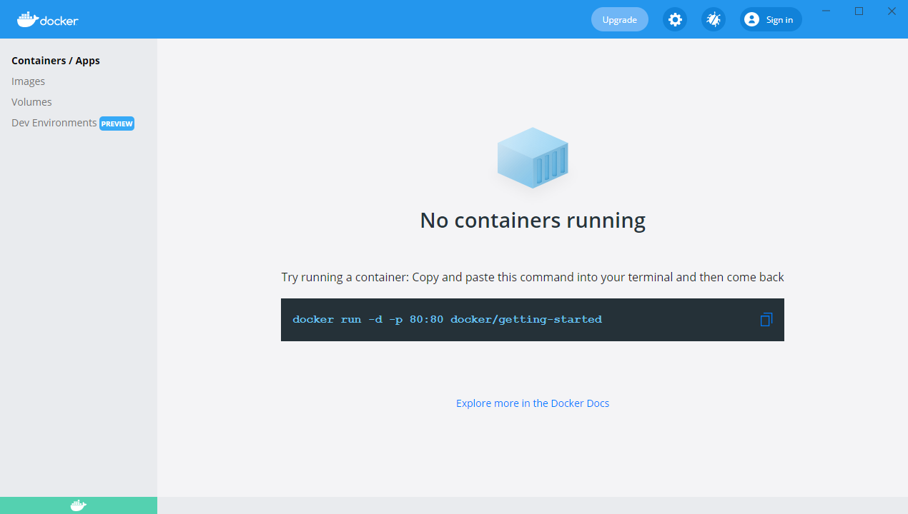
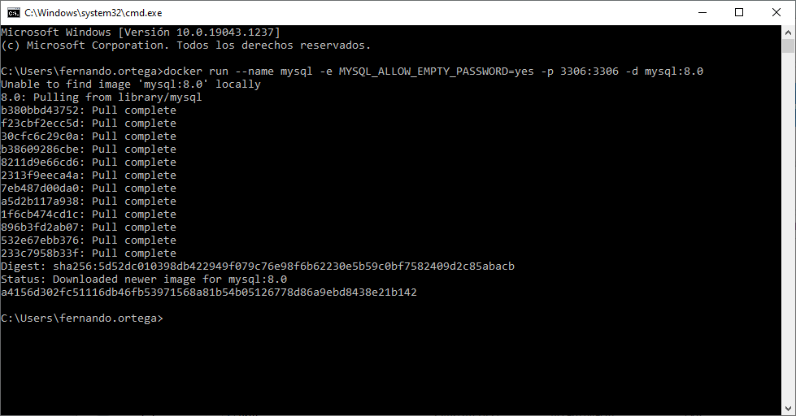
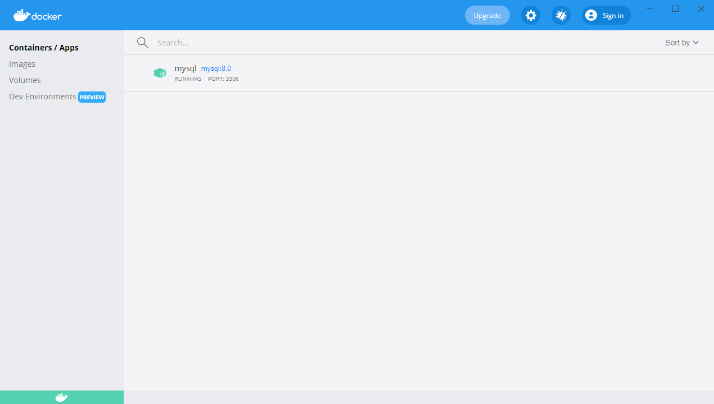
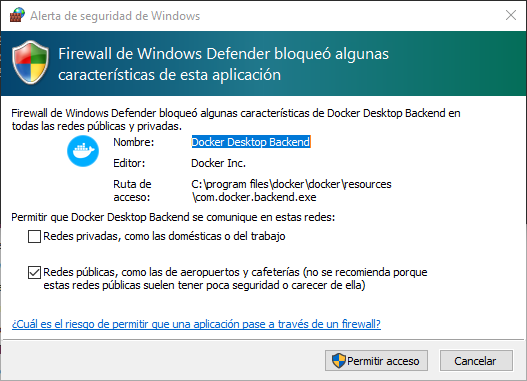
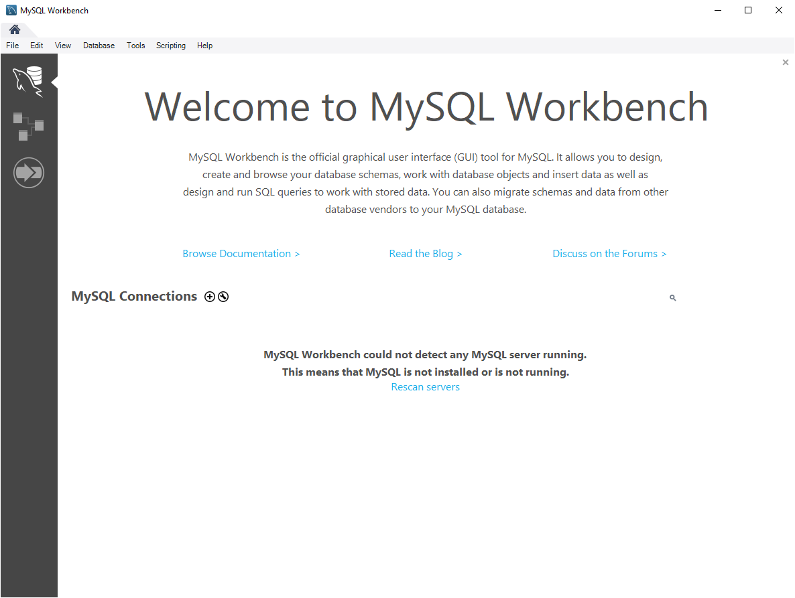
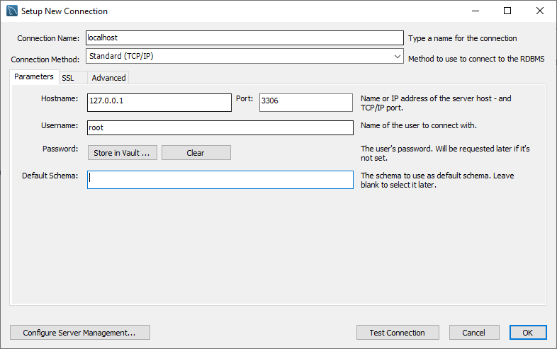
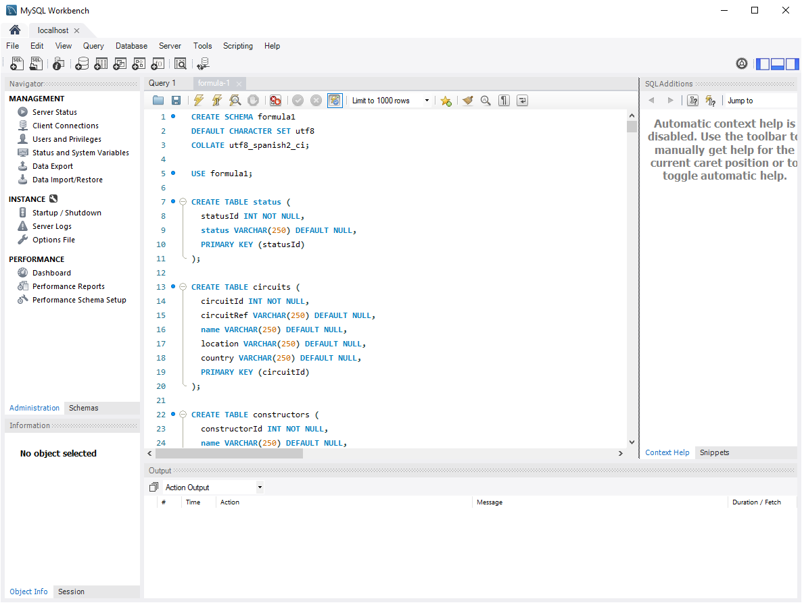
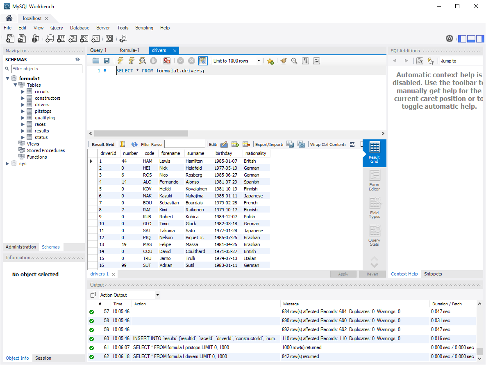

<!--
_header: ''
_footer: <br>Esta obra está bajo una [licencia de Creative Commons Reconocimiento-NoComercial-CompartirIgual 4.0 Internacional](http://creativecommons.org/licenses/by-nc-sa/4.0/). Icono diseñado por Flaticon
-->
<style>
img[alt~="center"] {
  display: block;
  margin: 0 auto;
}
img {
  background-color: transparent!important;
}
li {
  text-align: justify;
}
</style>


# TRABAJANDO CON MySQL

Configuración del entorno

---

## Arrancando el servidor de MySQL

Lo primero que debes hacer es arrancar el servidor de `MySQL`.

Existen múltiples formas de hacerlo y nosotros nos hemos decantado por arrancarlo mediante `Docker`:

> [https://www.docker.com/](https://www.docker.com/)

`Docker` es un servicio de virtualización que permite desplegar de forma aplicaciones (o servicios) dentro de contenedores software. 

---

## Arrancando el servidor de MySQL

Antes de arrancar MySQL debes ejecutar `Docker`. Sigue estos pasos:

1. Abre la carpeta **ETSISI-X64** de tu escritorio.
2. Abre la carpeta **Parar-Arrancar Servicios**.
3. Ejecuta **Arrancar Docker.bat**.

Con esto preparamos nuestro equipo del CIC para que sea capaz de lanzar el servicio de `Docker`.

Si instalas `Docker` en tu ordenador, estos pasos no serán necesarios, ya que por defecto `Docker` se inicia al arrancar el sistema.

---

## Arrancando el servidor de MySQL

Ahora vamos a ejecutar el programa `Docker Desktop` que dispone tanto del servicio de `Docker` para gestionar los contenedores y como de una interfaz gráfica que nos facilita la gestión de estos.

Busca la aplicación `Docker Desktop` en el menú de inicio y ejecútala.

---

## Arrancando el servidor de MySQL

Cuando la aplicación arranque, deberíamos ver su interfaz:



---

## Arrancando el servidor de MySQL

Con `Docker` funcionando, vamos a lanzar el servidor de `MySQL`:

1. Abre un terminal
    1. Abre el menú de inicio
    2. Escribe "*Ejecutar*" y abre el programa
    3. Escribe "*cmd*" y lanza el comando para que se abra un terminal
2. En el terminal, escribe el siguiente comando:

```
docker run --name mysql -e MYSQL_ALLOW_EMPTY_PASSWORD=yes -p 3306:3306 -d mysql:8.0
```

---

## Arrancando el servidor de MySQL

- `docker run` indica a `Docker` que ejecute un comando
- `--name mysql` pone nombre al contenedor que vamos a ejecutar
- `-e MYSQL_ALLOW_EMPTY_PASSWORD=yes` permite acceder a la base de datos sin contraseña. **Esto nunca debe hacerse en entornos de producción**.
- `-p 3306:3306` expone el puerto `3306` del contenedor para que sea accesible desde el exterior.
- `-d` arranca el contenedor como un demonio (servicio).
- `mysql:8.0` indica que se use el servidor `MySQL` en su versión `8.0.x`.

---

## Arrancando el servidor de MySQL

Cuando ejecutemos el comando deberíamos ver lo siguiente:



---

## Arrancando el servidor de MySQL

Y `Docker Desktop` debería estar en el siguiente estado:



---

<style scoped>
p { font-size: 0.8rem }
</style>

## Arrancando el servidor de MySQL

Cuando se lanza el servidor de `MySQL` puede aparecer una advertencia del *firewall* para permitir conexión desde el exterior. Al no tener permisos de administrador, diremos que **Cancelar** y solo podremos trabajar en local.



---

## Ejecutando MySQL Workbench

Con el servidor de `MySQL` ejecutándose, vamos a abrir el cliente de `MySQL Workbench`:

1. Abre la carpeta **ETSISI-X64** de tu escritorio.
2. Ejecuta la aplicación **MySQLWorkbench**.

---

## Ejecutando MySQL Workbench



---

<style scoped>
p { font-size: 0.8rem }
li { font-size: 0.8rem }
</style>

## Ejecutando MySQL Workbench

Vamos a crear una nueva conexión para que `MySQL Workbench` se conecte a nuestro servidor de `MySQL`.

1. Pulsa el icono **+** que hay junto a *MySQL Connections*.
2. Rellena los campos de acuerdo con la siguiente imagen y pulsa **Ok**.



---

## Cargando la base de datos de Formula 1

Para finalizar, vamos a cargar la base de datos de Formula 1 que usaremos en los ejercicios prácticos.

1. Pulsa **File**.
2. Pulsa **Open SQL Script**.
3. Abre el fichero **formula1.sql** que encontrarás en Moodle.

---

## Cargando la base de datos de Formula 1

Ahora pulsa el icono del rayo.



---

## Cargando la base de datos de Formula 1

La base de datos se habrá cargado y podremos trabajar con ella.



---

# Licencia<!--_class: license -->

Esta obra está licenciada bajo una licencia [Creative Commons Atribución-NoComercial-CompartirIgual 4.0 Internacional](https://creativecommons.org/licenses/by-nc-sa/4.0/).

Puede encontrar su código en el siguiente enlace: <https://github.com/bbddetsisi/material-docente>
