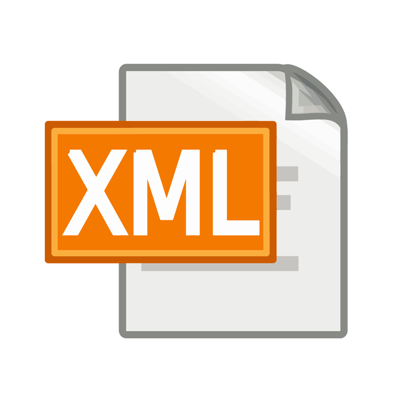

<!-- _class: titlepage -->

# Almacenamiento de información basada en ficheros

## Bases de datos

### Departamento de Sistemas Informáticos

#### E.T.S.I. de Sistemas Informáticos

##### Universidad Politénica de Madrid

[](https://creativecommons.org/licenses/by-nc-sa/4.0/)


---

# Estructura de la información (I)

La información almacenada en una base de datos relacional se considera **datos estructurados**

- Se representan en un formato estricto
- Todas las filas de una tabla tienen el mismo formato
- Se conoce a priori el número y formato de atributos de una tabla

Hay aplicaciones en las que estas condiciones son demasiado estrictas

---

# Estructura de la información (y II)

Una estructura menos restrictiva serían los **datos semi-estructurados**

- La información del esquema está mezclada con los valores de los atributos
- Cada objeto de datos puede tener diferentes atributos que no se conocen a priori
- Se les conoce como datos auto-descriptivos

---

# Datos semi-estructurados

<div class="columns">
<div class="column">

Una posible representación para los datos semi-estructurados sería un grafo dirigido

- Los nodos representan los objetos de datos
- Los arcos representan las relaciones entre los objetos

</div>
<div class="column">


</div>
</div>

---


# _Comma-Separated Values_ (CSV)<!--_class: section-->

---

# Formato

Almacenan **información estructurada** en ficheros de texto plano

<hr />

<div class="columns">
<div class="column">

- Fila $\rightarrow$ Registro de información
  - La primera puede ser cabecera
- Cada elemento está separado por un caracter
  - Más común `,` pero puede variar (e.g. `;`)
- Cada elemento se puede delimitar
  - Generalmente con comillas dobles (`"`)

</div>
<div class="column">

```csv
Email,Id,First name,Last name
laura@ex.com,20,Laura,Grey
craig@ex.com,40,Craig,Johnson
mary@ex.com,93,Mary,Jenkins
jamie@ex.com,50,Jamie,Smith
virginia@ex.com,20,Virginia,Williams
paul@ex.com,20,Paul,Johnson
livi@ex.com,20,Livi,Smith
```

</div>
</div>

El orden de dichos elementos se mantiene a lo largo del fichero

---

# Ventajas e inconvenientes

<div class="columns">
<div class="column">

## Ventajas

1. Información estructurada $\rightarrow$ Lectura y escritura es rápida y sencilla
2. No añade información superflua a los datos (salvo separador y delimitador)
3. Fácil de entender, editar y generar
4. Se considera formato estándar<sup>1</sup>
5. Fácil interoperatividad con otras aplicaciones

</div>
<div class="column">

## Inconvenientes

1. Información estructurada $\rightarrow$ Todos registro tienen que tener el mismo número de campos
2. Solo permite tipos de datos simples
3. El separador no debe aparecer en los datos
4. Caracteres de escape para texto con símbolos especiales
5. No hay un estándar para comentarios

</div>
</div>

> <sup>1</sup> RFC4180 (<https://www.rfc-editor.org/rfc/rfc4180.html>)
---

# Casos de uso

El formato **CSV** se utiliza principalmente en las siguientes situaciones

- Almacén de datos de procesos temporales (p.e. sensores, logs del sistema), ya que es fácil escribir al final de los ficheros
- Análisis de datos, donde se realizan operaciones sobre el conjunto de datos completo
- Integración de sistemas y aplicaciones (bases de datos, hojas de cálculo)

---



# _eXtensible Markup Language_ (XML)<!--_class: section-->

---

# Orígenes de XML

Viene del _Standard Generalized Markup Language_ (SGML)

- Definido como estándar en 1986<sup>2</sup>
- _Metalenguaje_ para mantener documentación estructurada en formato electrónico
  - HTML y XML son lenguajes derivados (aplicaciones) de SGML
- Muy potente y versátil pero complejo de utilizar

**XML** viene de _eXtensible Markup Language_.

- Recomendación del W3C (_World Wide Web Consortium_) desde 1998 (v1.0)
- Estándar de facto para definir, crear, validar, compartir y publicar documentos con información, mediante marcas con significado
- Puede representar tanto datos estructurados como semi-estructurados

> <sup>2</sup> ISO 8879:1986
> (<https://www.iso.org/es/contents/data/standard/02/85/28557.html>)
---

# El modelo de datos jerárquico de XML

El objeto básico de **XML** es el **documento**, y se construye a partir de

- **Elementos**: Nodos que contienen información
- **Atributos**: Metadatos que describen los elementos

**¡OJO!** El concepto de _atributo_ en **XML** no se corresponde al de las bases de datos visto hasta ahora. En **XML** los _atributos_ **añaden** información a los _elementos_

---

# Elementos

Se identifican por su **etiqueta de inicio** y su **etiqueta final** (con `/` al comienzo)

- El nombre de la etiqueta inicial y final se incluye entre los caracteres `<`y `>`.

```xml
<etiqueta>Elemento 1</etiqueta>
<cosa>Otro elemento</cosa>
```

Podemos distinguir dos tipos de **elementos**:

<div class="columns">
<div class="column">

**Simple**: Solo contiene valores

```xml
<simple>50.3</simple>
<simple>Hola Mundo</simple>
```

</div>
<div class="column">

**Compuesto**: Contiene otros elementos

```xml
<empleado>
    <nombre>Pepe</nombre>
    <edad>47</edad>
</empleado>
```

</div>
</div>

---

# Los documentos XML son árboles

Los **elementos** de un documento **XML** se organizan en una estructura de **árbol**

<div class="columns">
<div class="column">


</div>
<div class="column">

```xml
<asignatura>
    <nombre>Bases de datos</nombre>
    <grupo>
        <turno>Mañana</turno>
        <id>GM27</id>
        <alumno>
            <nombre>Pepe Pérez</nombre>
            <id>bz01</id>
            <email>ppp@upm.es</email>
        </alumno>
        ...
    </grupo>
    ...
</asignatura>
```

</div>
</div>

---

# Atributos

Se usan para describir propiedades de los elementos a los que se añaden

```xml
<persona rol="jefe" departamento="ventas">
    <dni>12345678X</dni>
    <email>aaa@xyz.com</email>
    ...
</persona>
```

Se incluyen en la etiqueta inicial a continuación del nombre de la misma

- Es posible añadir tantos atributos como se deseen a un mismo elemento.
- El formato es `nombre-atributo="valor"`.

---

# XML vs. HTML

- Extensibilidad (etiquetas)
  - HTML: las etiquetas y atributos están prefijados
  - XML: etiquetas y atributos **extensibles**
- Estructura
  - HTML se centra en presentación y es poco estructurado
  - XML se centra en datos y es fuertemente estructurado
- Validación
  - HTML no comprueba tipo ni fin de las etiquetas
  - XML requiere que el documento esté bien formado

---

# Puntos fuertes de XML

- **Metalenguaje**: Permite definir lenguajes para representar información
- **Simplicidad**: Facilidad de procesar por software y de entender por personas
  - Utilizable con cualquier lenguaje o alfabeto (representa el estándar Unicode)
  - Sensible a mayúsculas y minúsculas
  - Gramática de obligado cumplimiento
- **Auto-descriptivo**: Datos como texto, metadatos como etiquetas y atributos
- Separa:
  - Estructura (metadatos): DTD, Xml-Schema
  - Contenido (datos): documento xml
  - Apariencia (presentación): XSL, CSS
- Estándar para intercambio de datos en la Web y aplicaciones en general
- Poderosas técnicas para búsqueda de información: Xpath y XQuery
- APIs en programación: DOM y SAX

---

# Documentos XML bien formados

Se considera que un documento **XML** está bien formado si:

1. Tiene un **único** elemento raíz
2. Los elementos tienen una etiqueta final
3. Las etiquetas son _case sensitive_
4. Los elementos están anidados correctamente
5. Los valores de los atributos están entre comillas dobles `""`

---

# Un documento XML bien formado

```xml
<?xml version="1.0" ?><!-- Nodo descriptivo -->
<w3resource>
    <design>
        <language>html</language>
        <language>xhtml</language>
        <language>css</language>
        <language>svg</language>
        <language>xml</language>
    </design>
    <programming>
        <language>php</language>
        <language>mysql</language>
    </programming>
</w3resource>
```

---

# Documentos XML válidos

Además de estar bien formados, podemos comprobar la **validez** de un documento con respecto a un esquema determinado

<cite>Se dice que un documento XML es válido con respecto a un esquema si tanto su estructura como sus elementos cumplen con la especificación de dicho esquema</cite>

Para especificar esquemas se usa:

- _Document Type Definition_ (DTD)
- _XML Schema_ (XSD)

---

# _Document Type Definition_

Conjunto de reglas a cumplir por un documento **XML** para considerarse **válido**

- Puede incrustarse en el propio documento **XML** o almacenarse externamente
- Si se almacena externamente, hay que referenciarlo desde el documento a validar

Ejemplo de regla:

```xml
<!ELEMENT grupo (turno id alumno+)>
```

Podemos usar caracteres especiales en las reglas de una DTD:

- `+`: **Uno o más** elementos de ese tipo dentro del elemento padre
- `*`: **Cero o más** elementos de ese tipo dentro del elemento padre
- `?`: **Cero o una** ocurrencias de elementos de ese tipo dentro del padre
- `|`: Junto con los paréntesis, opcionalidad de elementos permitidos (_OR_)

---

# Document Type Definition (III)

**DTD** te permite el uso de palabras reservadas para definir los elementos:

- `#PCDATA`: indica que el elemento será un nodo hoja, pues requiere que tenga un valor
- `EMPTY`: indica que el elemento no tiene ningún contenido
- `ALL`: sin restricción sobre los sub-elementos de un elemento. Cualquier elemento incluso los no mencionados en la DTD pueden ser sub-elementos

---

# Un ejemplo de DTD

```xml
<!DOCTYPE banco [
    <!ELEMENT banco ((cuenta | cliente | impositor)+)>
    <!ELEMENT cuenta (número-cuenta nombre-sucursal saldo)>
    <!ELEMENT cliente (nombre-cliente calle-cliente ciudad-cliente)>
    <!ELEMENT impositor (nombre-cliente número-cuenta)>
    <!ELEMENT número-cuenta (#PCDATA)>
    <!ELEMENT nombre-sucursal (#PCDATA)>
    <!ELEMENT saldo (#PCDATA)>
    <!ELEMENT nombre-cliente (#PCDATA)>
    <!ELEMENT calle-cliente (#PCDATA)>
    <!ELEMENT ciudad-cliente (#PCDATA)>
]>
```

---

```xml
<banco>
    <cuenta>
        <número-cuenta>C-401</número-cuenta>
        <nombre-sucursal> Centro </nombre-sucursal>
        <saldo> 500 </saldo>
    </cuenta>
    <cuenta>
        <número-cuenta>C-402</número-cuenta>
        <nombre-sucursal> Navacerrada </nombre-sucursal>
        <saldo> 900 </saldo>
    </cuenta>
    <cliente>
        <nombre-cliente>Pedro</nombre-cliente>
        <calle-cliente>Arenal</calle-cliente>
        <ciudad-cliente>Toledo</ciudad-cliente>
    </cliente>
    <impositor>
        <nombre-cliente>Pedro</nombre-cliente>
        <número-cuenta>C-401</número-cuenta>
    </cliente>
</banco>
```

---

# DTD: Atributos (I)

Para definir los atributos de cierto elemento

```xml
<!ATTLIST element name type enum default mods>
```

Siendo:

- `element`: nombre del elemento cuyo atributo se quiere definir
- `name`: nombre del atributo
- `type`: tipo del atributo
  - `CDATA`: caracteres
  - `ID`: identificador único para el elemento (solo uno por elemento)
  - `IDREFS`: referencia al ID de otro elemento

---

# DTD: Atributos (y II)

Para definir los atributos de cierto elemento:

```xml
<!ATTLIST element name type enum default mods>
```

- `enum`: (opcional) enumera los posibles valores que puede tomar el atributo (ej: `(a|b|c)`)
- `default`: (opcional) valor por defecto del atributo
- `mods`: (opcional) modificadores que aplican al atributo
  - `#REQUIRED`: es obligatorio definir el atributo para el elemento
  - `#FIXED valor`: el atributo siempre será `valor`

---

# Un ejemplo de DTD para atributos

```xml
<!DOCTYPE banco-2 [
    <!ELEMENT cuenta (nombre-sucursal saldo)>
    <!ATTLIST cuenta
                número-cuenta ID #REQUIRED
                titulares IDREFS #REQUIRED>

    <!ELEMENT cliente (nombre-cliente ciudad)>
    <!ATTLIST cliente
                id-cliente ID #REQUIRED
                cuentas IDREFS #REQUIRED>
    ...
]>
```

---

```xml
<banco-2>
    <cuenta número-cuenta="C-401" titulares="C100 C102">
        <nombre-sucursal> Centro </nombre-sucursal>
        <saldo> 500 </saldo>
    </cuenta>
    <cuenta número_cuenta="C-402" titulares="C102 C101">
        <nombre-sucursal> Navacerrada </nombre-sucursal>
        <saldo> 900 </saldo>
    </cuenta>
    <cliente id-cliente="C100" cuentas="C-401">
        <nombre-cliente> Pedro </nombre-cliente>
        <calle-cliente> Arenal </calle-cliente>
        <ciudad-cliente> Toledo </ciudad-cliente>
    </cliente>
    <cliente id-cliente="C101" cuentas="C-402">
        <nombre-cliente> Ana </nombre-cliente>
        <calle-cliente> Mayor </calle-cliente>
        <ciudad-cliente> Málaga </ciudad-cliente>
    </cliente>
    ...
</banco-2>
```

---

# Limitaciones de la DTD

**DTD** como mecanismo de definición de esquema tiene las siguientes limitaciones:

- No se puede declarar el **tipo de cada elemento** y de cada atributo de texto
  - El elemento `saldo` no se puede restringir para que sea un número positivo
- No hay forma de especificar el **tipo de elemento** al que se debería **referir** un atributo `IDREF`
  - No se evita, por ejemplo, que el atributo `titulares` de un elemento `cuenta` se refiera a otros números de cuentas (aunque no tenga sentido)

---

# _XML Schema_ (XSD)

- Surge como un intento para mejorar las deficiencias de las DTDs
- Define varios tipos predefinidos: string, integer, decimal, date y boolean
- Permite tipos definidos por el usuario
- Se especifica en **XML**
- El esquema se encierra en un elemento global

```xsd
<xsd:schema xmlns:xsd="http://www.w3.org/2001/XMLSchema">
    ...
</xsd:schema>
```

---

# Un ejemplo de XML Schema

```xml
<?xml version="1.0" encoding="iso-8859-1"?>
<xsd:schema xmlns:xsd="http://www.w3.org/2001/XMLSchema">
<xsd:element name="Empleado">
    <xsd:complexType>
        <xsd:all>
            <xsd:element name="Nombre" type="xsd:string"/>
            <xsd:element name="Sueldo" type="xsd:integer"/>
            <xsd:element name="Categoria" type="xsd:string"/>
        </xsd:all>
        <xsd:attribute name="CodE" type="xsd:string"/>
    </xsd:complexType>
</xsd:element>
</xsd:schema>
```

---

# XPath<!--_class: section-->

---

# El lenguaje XPath

Es un lenguaje de consulta sobre documentos **XML**:

- Basa su funcionamiento en expresiones de ruta
- Estas expresiones representan una navegación por los nodos del árbol del documento XML
- Visto de otra forma, representan la ruta a un determinado punto del documento
- Una expresión **XPath** devuelve una colección de elementos que cumplen el patrón de la consulta (expresión)

```xpath
/elem1/elem2/elemento
```

---

# Consultando rutas a elementos

Podemos acceder a los elementos que hay en la ruta del documento:

```xpath
/banco/cliente/nombre-cliente
```

La consulta devolvería

```xml
<nombre-cliente>Pedro</nombre-cliente>
<nombre-cliente>Ana</nombre-cliente>
```

Podemos aplicar la función `text()` para quitar etiquetas y quedarnos solo con los valores:

```xpath
/banco/cliente/nombre-cliente/text()
```

---

# XPath: más opciones de consulta (I)

Es posible consultar los atributos de un elemento utilizando el prefijo `@`:

```xpath
/banco/cuenta/@numero-cuenta
```

Incluso podemos indicar en la expresión algún predicado de selección:

```xpath
/banco/cuenta[saldo > 600]/@numero-cuenta
```

que devolvería los números de cuenta con un saldo superior a 600

---

# XPath: más opciones de consulta (II)

También podemos usar funciones proporcionadas por XPath:

```xpath
/banco/cuenta[count(./cliente)>2]
```

devuelve las cuentas con más de dos clientes

Podemos buscar también por nodos enlazados por ID:

```xpath
/banco/cuenta/id(@titulares)
```

devuelve todos los clientes referenciados desde el atributo titulares de los elementos "cuenta"

---

# XPath: más opciones de consulta (III)

El operador `|` permite unir resultados de expresiones:

```xpath
/banco/cuenta/id(@titulares) | /banco/préstamo/id(@prestatario)
```

Otra opción interesante es usar `//` que realiza la búsqueda a cualquier nivel del documento:

```xpath
//curso
```

devolvería **todos** los elementos `curso` con independencia de su ubicación en el documento.

---

# XPath: más opciones de consulta (y IV)

Otros operadores de búsqueda interesantes:

| Operador                | Descripción                              |
| :---------------------: | :--------------------------------------- |
| `.` / `..`              | Nodo actual / Padre del nodo actual      |
| `/centro/curso[1]`      | Primer elemento `curso` hijo de `centro` |
| `/centro/curso[last()]` | Último elemento `curso` hijo de `centro` |
| `*`                     | Cualquier nodo elemento                  |

---

# XQuery<!--_class: section-->

---

# XQuery: introducción

- Lenguaje de consulta para documentos XML
- Es una recomendación del W3C
- Integrado con XPath
- Mantiene cierta analogía con SQL
- La entrada y la salida de una consulta XQuery corresponde a un documento o fragmento de documento XML

---

# FLWOR: for, let, where, order by, return

- **FOR**: similar al `FROM` de SQL. Asigna resultados de consultas _XPath_ a variables. Si pones varias variables, se realiza el producto cartesiano
- **LET**: asigna resultados parciales a variables temporales
- **WHERE**: aplica filtrados a las tuplas resultantes del `FOR`
- **ORDER BY**: permite la ordenación de las salidas
- **RETURN**: establece la forma en la que se devuelven los resultados

---

# XQuery: documento de ejemplo

```xml
<?xml version="1.0" encoding="UTF-8"?>
<!DOCTYPE libros SYSTEM "libros.dtd">
<libros>
     <libro id="1">
          <titulo>El Secreto</titulo>
          <autor>Rhonda Byrne</autor>
          <año>2007</año>
          <precio>22.50</precio>
     </libro>
     <libro id="2">
          <titulo>Indignaos</titulo>
          <autor>Stephane Hessel</autor>
          <autor>José Luis Sampedro</autor>
          <año>2011</año>
          <precio>15</precio>
     </libro>
</libros>
```

---

# XQuery: Ejemplo (I)

<cite>Obtener el titulo de los libros con valor 2 en el identificador</cite>

```xquery
for $b in doc("libros.xml")//libro
where $b/@id = 2
return $b/titulo
```

- Indicamos el documento XML mediante: `doc("libros.xml")`
- La doble barra `//` indica la parte del árbol xml a considerar
- Como id es un atributo y no un elemento se antepone `@`

---

# XQuery: Ejemplo (y II)

<cite>Titulo de los libros con precio superior a 20€ ordenados por autor</cite>

```xquery
for $x in /libros/libro
let $tit :=$x/titulo/text()
where $x/precio>20
order by $x/autor
return <titulo-libro>{$tit}</titulo-libro>
```

- El uso de llaves `{}` permite ser tratado como expresiones a evaluar
- Si no aparecieran, se trataría como una cadena `$tit`

---

# XQuery: Uniones naturales

En **XQuery** podemos realizar uniones naturales al igual que con _SQL_:

```xpath
for   $a in /banco/cuenta,
      $c in /banco/cliente,
      $i in /banco/impositor
let   $ccc :=$a/número-cuenta/text()
where $a/número-cuenta=$i/número-cuenta and
      $c/nombre-cliente=$i/nombre-cliente
return <cuenta-cliente>{$ccc}</cuenta-cliente>
```

que devolvería los códigos de cuenta de la unión natural entre cuentas, clientes e impositores

---

# XQuery: Consultas anidadas

También nos permite anidar sub-consultas entre llaves `{}`:

```xquery
for $c in /banco/cliente
return <cliente>
        {$c/*}
        {for $i in /banco/impositor[nombre-cliente = $c/nombre-cliente],
             $a in /banco/cuenta[número-cuenta=$i/número-cuenta]
         return $a}
       </cliente>
```

Ya que, como hemos dicho antes, cualquier cosa que pongamos entre llaves se va a evaluar.

---

# XQuery: Ordenación de resultados

Para ordenar los resultados según el valor de un elemento hay que especificarlo en la parte `order by` de la consulta **XQuery**:

```xquery
for $c in /banco/cliente
order by $c/nombre-cliente descending
return <cliente>{$c/*}</cliente>
```

Esta consulta nos devolvería los sub-elementos incluidos en cada `cliente`, pero ordenados de manera descendente según el nombre de los mismos

---

# XQuery: Funciones de ayuda

| Tipo | Funciones |
| :- | :- |
| Numéricas | `floor(), ceiling(), round()` |
| De cadena | `concat(), string(),upper-case(), ...` |
| Genéricas | `distinct-values(), empty(), exists()` |
| De conjunto | `union (\|), intersect, except` |
| Agregadas | `count(), sum(), avg(), min(), max()` |
| De contexto | `position(), text(), last()` |

---

# XQuery: Sentencias condicionales

Podemos usar sentencias condicionales en **XQuery**, muy similares a las de otros lenguajes de programación:

```xquery
for $lib in doc("libros.xml")//libro
return
    <libro>
        {$lib/titulo}
        {$lib/autor}
        { if (count($lib/autor) > 1
          then <autor>et al.</autor>
          else ()}
    </libro>
```

**¡OJO!** La cláusula `else` es **obligatoria** en **XQuery**.

---

# XQuery: Cuantificadores

En principio las consultas devuelven aquellos nodos que cumplen las condiciones. Podemos usar cuantificadores para restringir qué nodos se devuelven:

- `some`: recupera aquellas tuplas en las que algún nodo cumpla la condición
- `every`: tuplas para las que todos sus nodos cumplen la condición

```xquery
for $lib in //libro
where some $a in  $lib/autor satisfies ($a/first = “Jose")
return $lib/titulo
```

---


# _JavaScript Object Notation_ (JSON)<!--_class: section-->

---

# Definición

- Formato de datos semi-estructurados
- Es una representación textual de objetos de datos
- Permite el intercambio sencillo de información entre servicios
- Representa objetos usando pares atributo-valor
- Formato para SGBD no relacionales (NoSQL) como _MongoDB_
- Su sintaxis es un subconjunto de JavaScript

---

# Ventajas (I)

Una de las principales ventajas es que es auto-descriptivo y fácil de entender:

```json
{
    "employees":[
        { "firstName":"John", "lastName":"Doe" },
        { "firstName":"Anna", "lastName":"Smith" },
        { "firstName":"Peter", "lastName":"Jones" }
    ]
}
```

Se pueden observar los pares de clave-valor en el documento.

---

# Ventajas (y II)

Es más compacto que **XML** ya que no hay etiquetas. Por ejemplo, el JSON anterior en XML sería:

```xml
<employees>
  <employee>
    <firstName>John</firstName> <lastName>Doe</lastName>
  </employee>
  <employee>
    <firstName>Anna</firstName> <lastName>Smith</lastName>
  </employee>
  <employee>
    <firstName>Peter</firstName> <lastName>Jones</lastName>
  </employee>
</employees>
```

---

# JSON: estructuras básicas (I)

Objeto

- Colección de datos expresados como pares nombre-valor
- Van encerrados entre llaves
- El par nombre/valor se separa por `:`
- Los datos o pares están separados por comas

Lista de valores

- Llamada array en los lenguajes de programación
- Se encierra con corchetes `[]` y los valores se separan por comas `,`

---

# JSON: estructuras básicas (II)

```json
{
    "nombre" : "Pepe" ,
    "apellidos" : "Pérez Pérez" ,
    "estudios" : [ "Grado", "Máster" ] ,
    "edad" : 25 ,
    "teléfonos" : [
        {
            "tipo" : "casa" ,
            "numero" : "222111111"
        } ,
        {
            "tipo" : "móvil" ,
            "numero" : "111111111"
        }
    ]
}
```

---

# Documentos embebidos/integrados

- Los datos relacionados se almacenan en una sola estructura de documento
- Recuperación  y manipulación datos relacionados con una sola operación (un solo documento)

```json
{
    "_id": "emple2",
    "nombre": "Pepe Pérez",
    "contacto": { "telefono": "999999999",
                  "email": "pepe.perez@json.kon"} ,
    "coche": { "matricula": "EEE 0010",
               "marca": "Toyota"}
}
```

---

# Documentos referenciados

Se les llama modelos normalizados

- Los datos se almacenan con más de un documento y se referencian entre sí
- Requieren más accesos al servidor pero permite evitar duplicación de datos

Documento **empleado**:

```json
{
    "_id": "E001",
    "nombre": "Pepe Pérez",
    "categoria": "Programador"
}
```

---

Documento **contacto** referencia a **empleado**:

```json
{
    "_id": "CT004" ,
    "empleado_id": "E001",
    "telefono": "999999999",
    "email": "pepe.perez@json.kon"
}
```

Documento **coche** referencia a **empleado**:

```json
{
    "_id": "CC407",
    "empleado_id": "E001",
    "matricula": "XYZ 0010",
    "marca": "Toyota"
}
```

---

# Relaciones 1:1 (embebido)

```json
{
    "_id": "E005",
    "nombre": "Boni Ficado",
    "coche": {
        "matricula": "JXR 5367",
        "marca": "Toyota",
        "modelo": "MA"
    }
}
```

Añadimos uno de los extremos de la relación (coche) como documento del otro extremo (empleado)

---

# Relaciones 1:1 (normalizado)

```json
{
    "_id": "E005",
    "nombre": "Boni Ficado",
}

{
    "emple_id": "E005",
    "matricula": "JXR 5367",
    "marca": "Toyota",
    "modelo": "MA"
}
```

Vinculamos un extremo (coche) con el otro (empleado).

---

# Relaciones 1:N (embebido)

```json
{
    "_id": "D001",
    "nombreDepartamento": "Ventas",
    "empleados": [
        {"nombre": "Pepe", "apellidos": "Pérez"}
        {"nombre": "Luis", "apellidos": "López"}
    ]
}
```

Añadimos una lista de objetos a la parte 1 de la relación (departamento), y añadimos los documentos de la parte N (empleados)

---

# Relaciones 1:N (normalizado)

```json
{
    "_id": "D001",
    "nombreDepartamento": "Ventas"
}
{
    "idDepartamento": "D001",
    "nombre": "Pepe",
    "apellidos": "Pérez"
}
{
    "idDepartamento": "D001",
    "nombre": "Luis",
    "apellidos": "López"
}
```

Se disocian departamento y empleados en varios documentos, y se vinculan los últimos con los primeros

---

# Relaciones N:M (I)

Dos documentos, cada uno de ellos incluyendo un array de referencias al otro:

```json
"empleados": [
{
    "codE": "E001",
    "nombre": "Santiago",
    "departamentos": ["D001", "D002"]
}, ...
```

```json
"departamentos": [
{
    "dodD": "D001",
    "descripcion": "Servicios Centrales",
    "empleados": ["E001", "E002", "E003"]
}, ...
```

---

# Relaciones N:M (II)

Tres documentos, uno para cada Entidad relacionada y otro para reflejar referencias entre los dos anteriores:

```json
"empleados": [
{
    "codE": "E001",
    "nombre": "Santiago",
}, ... ]

"departamentos": [
{
    "codD": "D001",
    "descripcion": "Servicios Centrales",
}, ... ]

"trabaja": [{"codE": "E001", "codD": "D001"},
            {"codE": "E001", "codD": "D002"}, ... ]
```

---

# Recomendaciones de diseño (I)

Recomendable **diseño normalizado (referenciado)**:

- Relaciones complejas entre documentos de diferentes colecciones
- Si se realizan actualizaciones frecuentemente sobre los documentos
- Cuando la duplicación de datos no aporta ventajas suficientes que compensen el aumento de espacio en disco utilizado para ello
- El modelo de datos se rige por una jerarquía compleja
- Realizar varias consultas para obtener los datos no tiene un coste importante

---

# Recomendaciones de diseño (II)

Recomendable diseño embebido:

- Sin jerarquía compleja ni relaciones con otras colecciones de documentos
- Se quieren obtener los datos con las mínimas peticiones al servidor
- En el modelo de datos se tienen relaciones 1:N, donde el lado N siempre será consumidos en el contexto del elemento principal
- Optimizar la lectura de los datos, por encima de la escritura o actualización
- Actualizaciones atómicas a nivel de documento

---

# Licencia<!--_class: license -->

Esta obra está licenciada bajo una licencia [Creative Commons Atribución-NoComercial-CompartirIgual 4.0 Internacional](https://creativecommons.org/licenses/by-nc-sa/4.0/).

Puede encontrar su código en el siguiente enlace: <https://github.com/bbddetsisi/material-docente>
