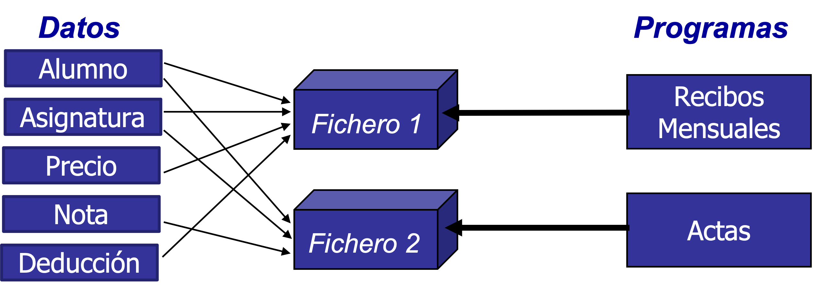
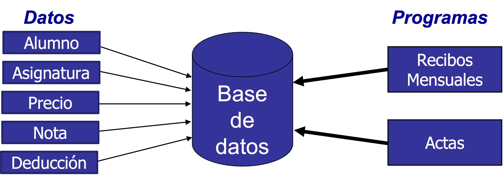
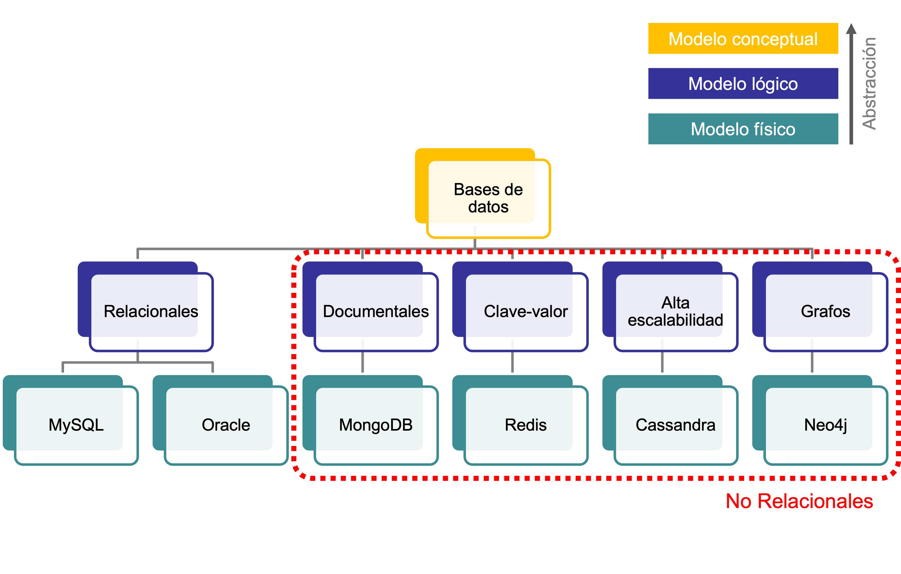
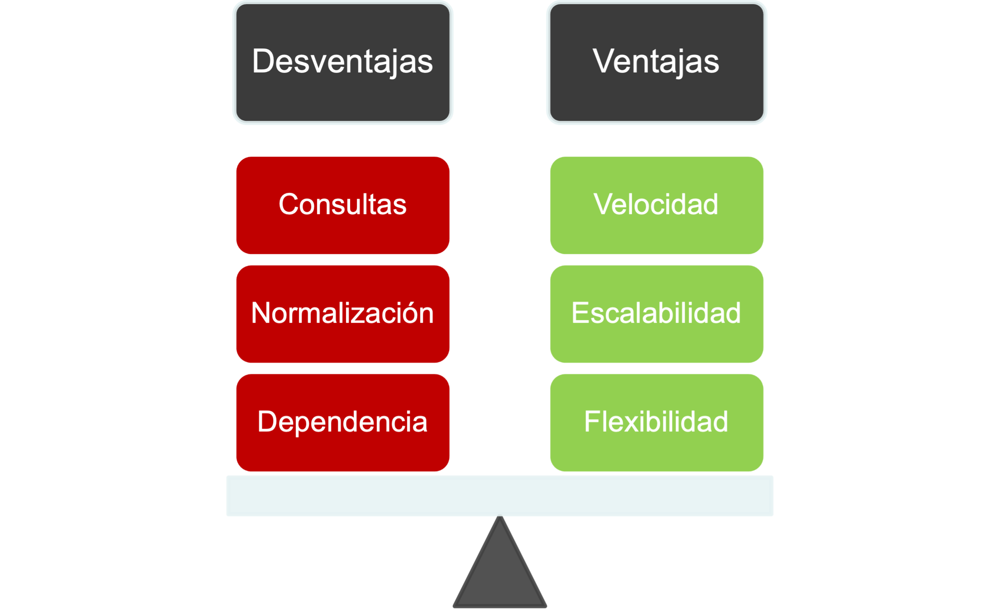
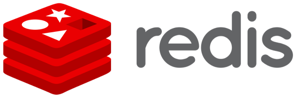
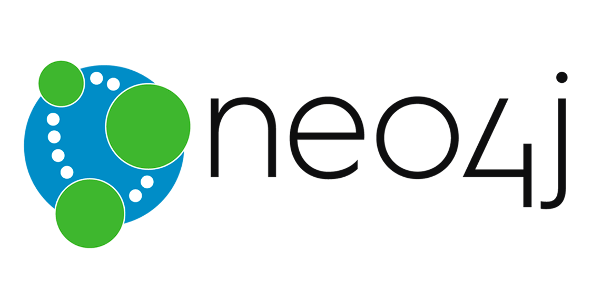
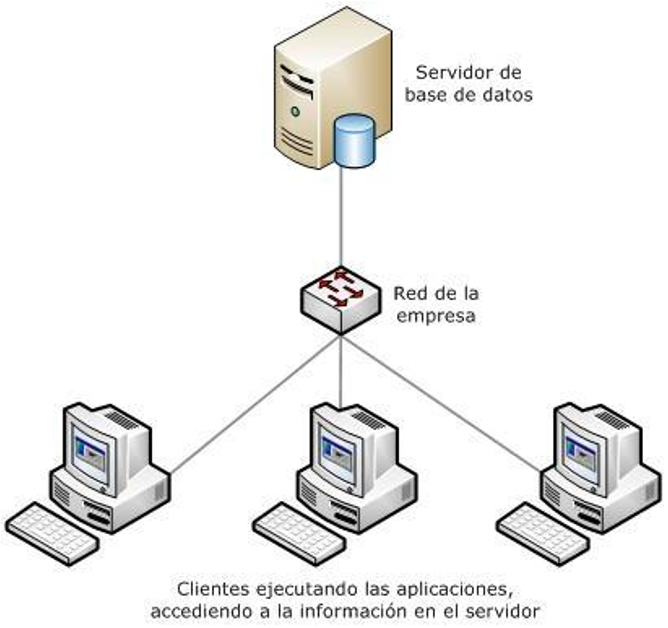

<!-- _class: titlepage -->

# Introducción a las bases de datos

## Bases de datos

### Departamento de Sistemas Informáticos

#### E.T.S.I. de Sistemas Informáticos

##### Universidad Politénica de Madrid

[](https://creativecommons.org/licenses/by-nc-sa/4.0/)


---

<!-- _class: section -->

## INTRODUCCIÓN A LAS BASES DE DATOS

---

# ¿Qué son los datos? (I)

Corresponden a **hechos** o **realidades** del mundo real.

- A partir de ellos, intentamos reconstruir la información del mundo real
- Se «almacenan» usando un método de comunicación (ej.: figuras o lenguajes) en un medio semipermanente de "registrarlos" (ej.: piedras o papel)

**Generalmente** dato e interpretación van juntos en los lenguajes naturales:

- Mide 175 cm. (dato: 175, significado: altura en centímetros)

**A veces**, los datos son separados de su interpretación

- 10:30 (dato: 10:30, significado: hora y minutos)

---

# ¿Qué son los datos? (y II)

Los ordenadores han incrementado la **separación entre dato y significado**:

- No se prestan para manipular en lenguaje natural
- El coste de almacenamiento es muy elevado

La interpretación de los datos es inherente a los programas que los utilizan:

- Dato: valores almacenados
- Información: significado de los datos

---

# Almacenamiento de datos

Existen dos aproximaciones para el almacenamiento de los datos utilizados por un programa informático:

- Sistemas basados en ficheros
- Bases de datos

---

# Sistemas basados en ficheros



Cada programa utiliza sus propios datos:

- **Dependencia** física entre programas y datos
- **Ocupación inútil** de memoria
- Aparición de **inconsistencias** y **duplicidad** de información

---

# Sistemas basados en bases de datos



Cuando se utilizan bases de datos los programas "*comparten*" los datos

- Las bases de datos se definen y manipulan mediante un **Sistema de Gestión de Bases de Datos** (SGBD)

---

<!-- _class: section -->

## DEFINIENDO BASES DE DATOS

---

<!-- _class: cite -->

<div class="cite-author" data-text="Definición de base de datos"-->

«Conjunto de información (datos) **homogénea** de una organización, **almacenada** en un ordenador, y que permite realizar **consultas** y **actualizaciones** (inserciones, modificaciones y/o borrados)»

</div>

---

<!-- _class: cite -->

<div class="cite-author" data-text="Definición alternativa de base de datos">

«Conjunto **exhaustivo**, con redundancia controlada de **datos estructurados**, fiables y homogéneos, organizados con **independencia** de su utilización y de su implementación en máquina, accesibles en tiempo útil, **compartibles** por usuarios concurrentes que tienen necesidades de información diferentes y no predecibles en el tiempo»

</div>

---

<!-- _class: section -->

# MODELOS DE DATOS

---

# ¿Qué es un modelo de datos?

Describen las propiedades de la información almacenada en una base de datos:

- Estructuras de datos
- Restricciones
- Dependencias
- Dominios

Son **fundamentales** para introducir la **abstracción** en una base de datos

---

# Tipos de modelos de datos

Modelos de datos **conceptuales**

- Describen las estructuras de datos y las relaciones de integridad
- Utilizados en la etapa de análisis

Modelos de datos **lógicos**

- Orientados a las operaciones
- Dependientes del tipo de base de datos utilizada

Modelos de datos **físicos**

- Estructuras de datos de bajo nivel usadas para almacenar información
- Dependientes del SGBD


---

# Modelo conceptual

Identifica las **entidades** que se van a almacenar en las base de datos:

- Ejemplo: alumnos, asignaturas, departamentos...

Modela las **relaciones** existentes entre las entidades:

- Ejemplo: los alumnos se matriculan de asignaturas.

Son **cercanos al mundo real**.

- Ayudan a comunicarse con los clientes de las empresa de desarrollo.

---

# Modelo lógico

Incluyen las **relaciones** y **atributos** del modelo conceptual

La **normalización** se produce en este nivel:

- Claves primarias
  - Ejemplo: los alumnos son identificados de forma unívoca por su número de matricula
- Claves foráneas
  - Ejemplo: el alumno con número de matrícula aa0000 fue calificado con un 10 en la asignatura de bases de datos
- Normalización
  - Evita la duplicidad de la información

Son **cercanos a la base de datos**

---

# Modelo físico

Definen cómo debe almacenarse la información en un dispositivo físico

- Altamente dependientes del SGBD y de la versión del mismo
- Cercanos al Sistema Operativo
- Facilitan la rápida recuperación y manipulación de los datos almacenados

---

<!-- _class: section -->

# TIPOS DE BASES DE DATOS

---



---

# Bases de datos relacionales

El tipo más usado, que cumplen con el modelo relacional:

- Datos organizados en relaciones (tablas)
  - Se pueden "unir" para recuperar información
- Uso de claves primarias y foráneas
- Integridad de los datos (de entidad y referencial)
  - Normalización: RConjunto de reglas para minimizar redundancia y mejorar la integridad de los datos
- Operaciones basadas en el álgebra relacional

Utilizan el lenguaje SQL<sup>1</sup> para consultar y manipular datos

> <sup>1</sup> [*Structured Query Language*](https://es.wikipedia.org/wiki/SQL)


---

# Bases de datos no relacionales

**No** cumplen el modelo relacional:

- De «*reciente*» aparición
  - Si la década de los 2000 es reciente...
- También llamadas `NoSQL`

Se especializan en resolver un problema concreto:

- Escalabilidad, rendimiento, flexibilidad...

Se ven en otras asignaturas.



---

# Bases de datos documentales (NoSQL)

La información es almacenada en documentos

- Los documentos contienen información **semi-estructurada**
- Escalabilidad vertical (máquina más potente) y horizontal (más máquinas)
- Muy eficientes para la manipulación de datos

Aconsejan duplicar información:

- Mejora el rendimiento de las consultas

Lenguaje de consultas **muy limitado**


---

# Bases de datos clave-valor (NoSQL)

Almacena toda la información en pares `<clave, valor>`

- La clave es única, y el valor puede ser cualquier objeto.
- Ejemplo:
  - Clave: `aa0000`
  - Valor: `nombre="Juan"; apellidos="García Torres"`

Ventajas:

- Altamente divisibles
- Escalabilidad horizontal
- Suelen almacenarse en memoria



---

# Bases de datos de alta escalabilidad (NoSQL)

Bases de datos distribuidas:

- Masivamente escalables (escalabilidad lineal)

Orientadas a columnas:

- Optimizadas para la completa recuperación de datos de columnas de datos (analítica de datos)
- Pensadas para pocas escrituras y muchas lecturas


---

<style scoped>
li { font-size: 0.9rem; }
p { font-size: 0.9rem; }
section {padding-right: 24px;}
</style>

# Bases de datos orientadas a grafos (NoSQL)

Representan la información mediante un grafo:

- Nodos: entidades
- Aristas: relaciones

**Completamente** normalizadas:

- No duplican información

Son muy versátiles, pero:

- Utilizan un lenguaje de consultas complejo
- Son computacionalmente costosas



---

<!-- _class: section -->

## ARQUITECTURA CLIENTE-SERVIDOR

---

# Arquitectura cliente-servidor

Las bases de datos funcionan bajo una arquitectura cliente-servidor:

- La base de datos es el servidor
- Las aplicaciones que se conectan a la base de datos son los clientes

Esta arquitectura permite compartir los datos entre diferentes aplicaciones:

- Un solo servidor
- Múltiples clientes

---

# Infraestructura física

Habitualmente, la base de datos (servidor) y la aplicación (cliente) se separan en diferentes máquinas físicas.

Existe un protocolo de comunicación entre el cliente y el servidor

- ¿Cómo se realizan las peticiones?
- ¿Cómo se responde?



---

# Lo bueno y lo malo

<div class="columns">
<div class="column">

## Ventajas

- Se centraliza el acceso a datos evitando inconsistencias
- Facilita la escalabilidad
  - Se puede aumentar la capacidad de clientes y servidores por separado
- Mejora el mantenimiento del sistema
  - El mantenimiento de la base de datos depende exclusivamente de la propia base de datos
- Facilita el desarrollo de aplicaciones al abstraerse de la gestión de los datos.

</div>
<div class="column">

## Desventajas

- Se puede congestionar el acceso a los datos si el ratio cliente/servidor no es adecuado
- No hay robustez frente a caídas o ataques al servidor
  - Este riesgo se minimiza si se replica el servidor
- Existe dependencia de la conexión a la base de datos para el funcionamiento de la aplicación

</div>

---

# Conexión con la base de datos

La conexión se realiza a partir de un URL (*Universal Resource Location*)

```bash
jdbc:mysql://mydb.com:3306/dbname
```

Prácticamente todo lenguaje de programación dispone de bibliotecas para conectarse a bases de datos:

- Java: JDBC
- Python: SQLAlchemy
- C#: ADO.NET
- ...

Más adelante en la asignatura trabajaremos la conexión desde aplicaciones

---

# Licencia<!--_class: license -->

Esta obra está licenciada bajo una licencia [Creative Commons Atribución-NoComercial-CompartirIgual 4.0 Internacional](https://creativecommons.org/licenses/by-nc-sa/4.0/).

Puede encontrar su código en el siguiente enlace: <https://github.com/bbddetsisi/material-docente>
