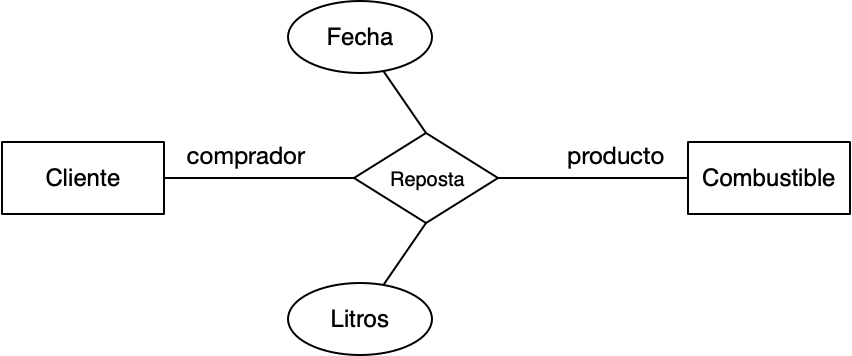
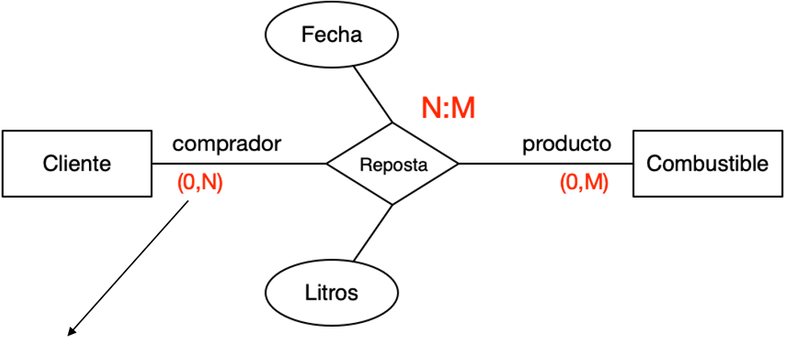
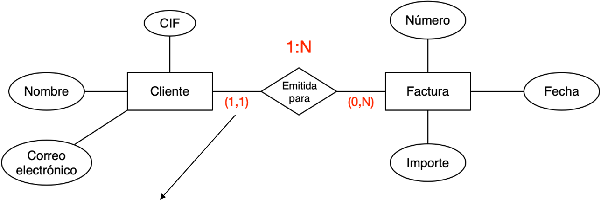
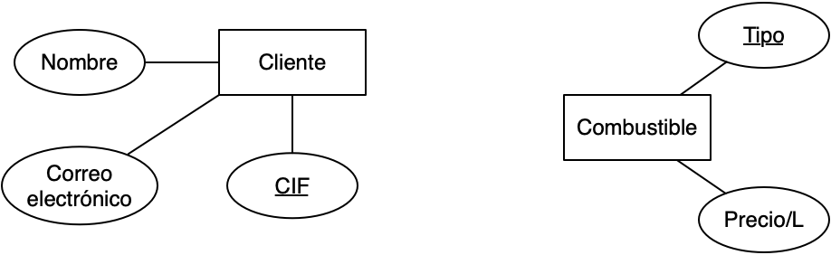
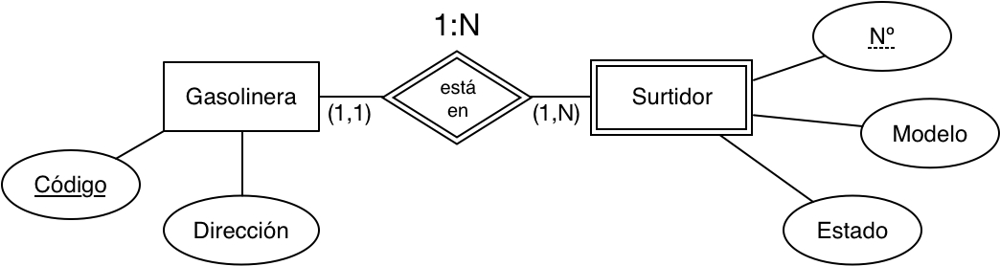
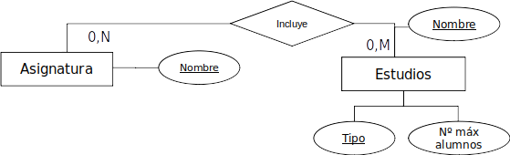
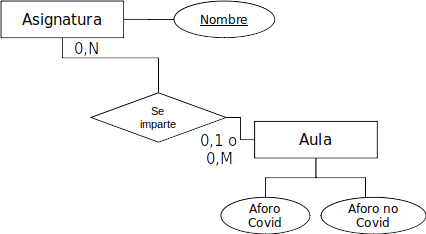
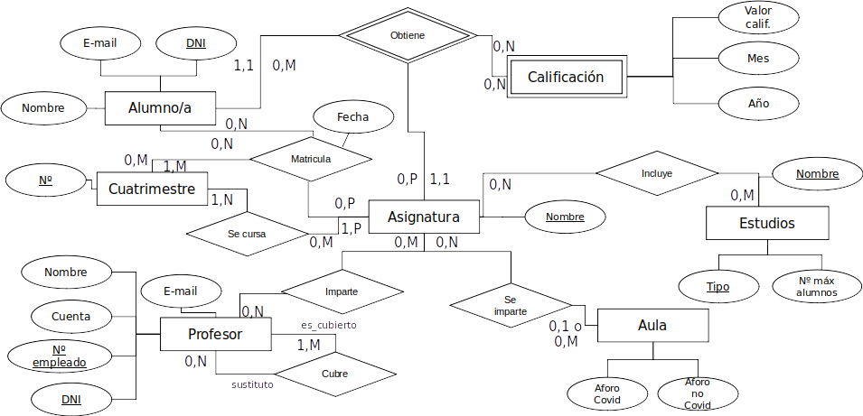

<!-- _class: titlepage -->

# Modelado conceltual de datos

## Bases de datos

### Departamento de Sistemas Informáticos

#### E.T.S.I. de Sistemas Informáticos

##### Universidad Politénica de Madrid

---

<!-- _class: section -->

# EL MODELO ENTIDAD-RELACIÓN

---

# Modelado conceptual: ¿Por qué?

El ser humano suele tener problemas para transmitir información concreta

- El lenguaje natural suele ser ambiguo y lleno de inexactitudes
- Además los clientes tienden a proporcionar información superflua cuando se pregunta por requisitos

Nuestra mente funciona mejor cuando trabaja con abstracciones:

- Diagramas
- Esquemas

---

# ¿Cuál prefieres? (I)

> Pues como le iba diciendo, necesito que me construya una aplicación para gestionar mi gasolinera low-cost. Ya sabe, la gente echa diésel o gasolina y luego me pagan. Algunos me piden factura, y resoplan cuando les pido los datos de la empresa, sobre todo aquellos que son clientes fijos. ¡Se me olvidaba! Tengo que llevar un registro de los litros que se gastan en cada repostaje, además de cuándo se realizó.

Requisitos de datos:

- Facturas que se emiten a clientes
- Litros de combustible repostado y fecha
- Guardar la información de los clientes
- Tipos de combustible
  
---

# ¿Cuál prefieres? (y II)

> Pues como le iba diciendo, necesito que me construya una aplicación para gestionar mi gasolinera low-cost. Ya sabe, la gente echa diésel o gasolina y luego me pagan. Algunos me piden factura, y resoplan cuando les pido los datos de la empresa, sobre todo aquellos que son clientes fijos. ¡Se me olvidaba! Tengo que llevar un registro de los litros que se gastan en cada repostaje, además de cuándo se realizó.

Requisitos de datos:

- ~~Facturas~~ que se emiten a ~~clientes~~
- Litros de ~~combustible~~ repostado y fecha
- Guardar la información de los ~~clientes~~
- Tipos de ~~combustible~~
  
**¿Qué tienen en común facturas, clientes, combustibles?**

---

# Entidad (I)

~~Factura~~, ~~cliente~~ y ~~combustible~~ son objetos o cosas del mundo real que tienen existencia por sí mismas

---

# Entidad (II)

Las entidades agrupan una serie de ocurrencias de objetos/cosas en una base de datos

- Clientes de la gasolinera (ocurrencias):
  - Pepe Pérez, con CIF 12345678X y correo electrónico pepito.palotes@gmail.com
  - Transportes La Bomba S.L., con CIF B87654321 y correo electrónico info@labomba.es
  - ...

---

# Entidad (y III)

Las entidades agrupan una serie de ocurrencias de objetos/cosas en una base de datos

- Clientes de la gasolinera (ocurrencias):
  - ~~Pepe Pérez~~, con CIF ~~12345678X~~ y correo electrónico ~~pepito.palotes@gmail.com~~
  - ~~Transportes La Bomba S.L.~~, con CIF ~~B87654321~~ y correo electrónico ~~info@labomba.es~~
  - ...

¿Qué tienen en común los fragmentos subrayados?

---

# Atributos

El ~~nombre~~, ~~CIF~~ y ~~correo electrónico~~ de los clientes definen las propiedades de la entidad `Cliente`

---

# Dominios

Cada atributo tiene un conjunto de valores permitidos:

- **CIF**: cadenas de 8 dígitos y una letra, donde la letra y los dígitos están relacionados por una función matemática.
- **Nombre**: cadenas de caracteres
- **Correo electrónico**: direcciones de correo válidas, de la forma usuario@dominio

Es **obligatorio** definir el dominio de todos los atributos

---

Entonces... ¿la base de datos para la gasolinera queda definida por estas **entidades** y sus **atributos**?

---

# Relaciones (I)

Las _facturas_ **se emiten** para _clientes_

---

# Relaciones (II)

Los _clientes_ **repostan** _combustible_.

---

# Relaciones (III)

Las relaciones representan asociaciones entre ocurrencias de entidades

- Pueden tener atributos propios:

---

# Relaciones (IV)

Es importante definir el **rol** que las entidades juegan en las relaciones:

---

# Relaciones (y V)

El **grado** de una relación nos indica el número de entidades implicadas en ella.

---

# Relaciones reflexivas

Una relación reflexiva relaciona **ocurrencias de la misma entidad**

- En este caso, **es obligatorio** especificar el rol de la entidad en ambos sentidos de la relación.

---

# Cardinalidad

Número de ocurrencias de entidad que se pueden asociar como máximo/mínimo a otra a través de una relación

- Mediante cardinalidades máximas y mínimas se pueden representar restricciones del cliente al modelo de datos
- Valores posibles:
  - Máximo: 1, N
  - Mínimo: 0, 1

---

# Cardinalidad mínima y máxima

Veamos, paso a paso, cómo se calculan las cardinalidades de la relación `Reposta`.

---

# Cardinalidad mínima y máxima (I)

Para una ocurrencia de combustible:

- ¿Cuántos clientes como mínimo repostarán? Ninguno, puede que una ocurrencia de combustible nunca sea repostada por algún cliente $\rightarrow$ cardinalidad   mínima 0
- ¿Cuántos clientes como máximo lo repostarán? Más de uno $\rightarrow$ cardinalidad N

**Opciones posibles**: cardinalidad mínima (0, 1), cardinalidad máxima (1, N)

---

# Cardinalidad mínima y máxima (II)

Para una ocurrencia de cliente:

- ¿Cuántos combustibles repostará como mínimo? Ninguno, puede que el cliente se registre y no vuelva nunca $\rightarrow$ cardinalidad mínima 0
- ¿Cuántos combustibles repostará como máximo? Más de uno, puede que el cliente tenga varios vehículos $\rightarrow$ cardinalidad M (para diferenciarlo de la N)

**Opciones posibles**: cardinalidad mínima (0, 1), cardinalidad máxima (1, N)

---

# Cardinalidad mínima y máxima (III)

Veamos cómo se calculan las cardinalidades de la relación <i>Emitida para</i>

---

# Cardinalidad mínima y máxima (IV)

Para una ocurrencia de factura:

- ¿Para cuántos clientes se emitirá como mínimo? Las facturas tienen que emitirse obligatoriamente para un cliente $\rightarrow$ cardinalidad mínima 1
- ¿Para cuantos clientes se emitirá como máximo? No tiene sentido que una factura se emita a más de un cliente (de hecho es ilegal) $\rightarrow$ cardinalidad máxima 1

**Opciones posibles**: cardinalidad mínima (0, 1), cardinalidad máxima (1, N)

---

# Cardinalidad mínima y máxima (y V)

Para una ocurrencia de cliente:

- ¿Cuántas facturas se le emitirán como mínimo? En un momento dado, puede ocurrir que no se haya facturado todavía al cliente $\rightarrow$ cardinalidad mínima 0
- ¿Cuántas facturas se le emitirán como máximo? Podemos emitir multitud de facturas a un cliente $\rightarrow$ cardinalidad máxima N

**Opciones posibles**: cardinalidad mínima (0, 1), cardinalidad máxima (1, N)

---

# Cardinalidad en relaciones $n$-arias

En el caso de las relaciones $n$-arias, la cardinalidad hay que definirla entre pares de entidades relacionadas

- Por ejemplo, en una ternaria:

---

# Clave de entidad

Atributo o conjunto de atributos que **identifican unívocamente** cada ocurrencia de una entidad

- Si una entidad no tiene clave, se le considera **entidad débil** y que tiene dependencia de **Identificación**.
- Se subraya el nombre de los atributos que formen parte de la clave

---

# Entidad débil

Una entidad débil es aquella cuya existencia está supeditada a la existencia de otra entidad

- Dos tipos:
  - Entidad débil con relación de identificación
  - Entidad débil con relación de existencia
- La representación en el modelo ER tanto de la entidad débil como de la relación con la entidad fuerte es la siguiente:

---

# Entidad débil (identificación)

La entidad débil no tiene clave

- Necesita de la clave de otra entidad con la que se relaciona:

Dos surtidores de la base de datos pueden tener el mismo número si están en gasolineras distintas

- El surtidor **adquiere** la clave de `Gasolinera`
- En algunas notaciones, el atributo discriminador se indica con subrayado discontinuo, como es el caso del número de surtidor

---

# Entidad débil (existencia)

La existencia de una ocurrencia está condicionada a la existencia de otra ocurrencia

Aunque `Factura` tenga clave, si se da de baja un cliente hay que dar de baja todas sus facturas

---

# El modelo Entidad-Relación (ER)

Modelo de datos conceptual que representa un esquema de bases de datos

- Formulado por P.P-S. Chen en 1976
- Descripción sencilla y global de una BBDD
- Se construye a partir de los requisitos de datos

**Estándar más utilizado** para el modelado conceptual

---

# El modelo Entidad-Relación (ER)

---

# Notación alternativa: Martin (I)

1. Las cardinalidades mínima y máxima se representan en la línea de la relación
2. No existe rombo $\rightarrow$ Las entidades se relacionan directamente
   - Se puede indicar el nombre de la relación en la línea

---

# Notación alternativa: Martin (II)

Reglas de transformación de Chen a Martin (relaciones):

se transforma en

---

# Notación alternativa: Martin (III)

Reglas de transformación de Chen a Martin (relación N:M):

se transforma en

---

# Notación alternativa: Martin ( y IV)

Reglas de transformación de Chen a Martin (entidad débil):

`Empleado` es entidad débil, por eso la línea de la relación ahora es continua

---

# Conclusiones

¿Por qué?

- Necesitamos especificar las restricciones de una forma clara, concisa, fácilmente entendible y sin ambigüedades

¿Cómo?

- Utilizando un modelo formal para el diseño conceptual de la base de datos

¿Qué?

- Modelo Entidad-Relación

---

<!-- _class: section -->
# EJEMPLOS

---

# Foro

Un conocido foro de coches nos ha encargado el diseño conceptual de su BBDD:

- El foro se compone de hilos, que tendrán un título, un número identificador, una categoría y será necesario saber la fecha en la que se creó y el usuario que lo hizo
- Los usuarios del foro se identifican por su nombre de usuario. Es necesario almacenar su correo electrónico y ciudad donde vive
- Los usuarios añaden respuestas a un hilo, que constan de un mensaje y, opcionalmente, una URL de imagen. Para ordenar las respuestas, hay que conocer la fecha y hora en la que se realizó, así como su posición relativa en el hilo
- En una respuesta se puede citar el texto de otra, situación que conviene registrar en la base de datos

---

# Foro (solución)

---

# Base de datos de películas

- Las películas se identifican por su título y año de lanzamiento. Además, tienen una duración (en minutos), una productora, al menos un director y también al menos un actor y un género
- Los actores se identifican por su nombre y fecha de nacimiento. Actúan en al menos una película, donde interpretan un personaje
- Los directores se identifican también por nombre y fecha de nacimiento. Además de dirigir, pueden también actuar en películas
- Las productoras se identifican por su nombre y dirección. Producen al menos una película

---

# Películas (solución)

---

<!-- _class: section -->
# EJEMPLO PASO A PASO

## «La ETSISI»

---

# La ETSISI

En la ETSISI nos han pedido que diseñemos el diagrama entidad relación para posteriormente crear una base de datos de la información relativa a los alumnos

---

# Nuestro modelo

En la ETSISI se imparten estudios de grado o de máster. Hay que guardar su nombre, máximo de alumnos y asignaturas que incluyen, que se pueden compartir entre títulos. Hay que indicar en qué aula concreta se imparte cada asignatura y su aforo, según haya o no que mantener distancia de seguridad o no.

Hay también alumnos identificados por Nombre, DNI y E-mail. Se matriculan en una fecha, asignatura y cuatrimestre concretos (una asignatura se puede impartir en varios cuatrimestres). También se lleva un registro de las calificaciones obtenidas por cada alumno en las convocatorias de cada asignatura (mes y año).

Por último, hay que registrar profesores y las asignaturas que imparten. Un profesor tiene los mismos datos que un alumno más número de cuenta y número de empleado. Además, para facilitar que se cubran posibles bajas, para cada profesor hay que indicar aquellos que pueden cubrirle.

---

# ¿Qué entidades observamos?

En la ETSISI se imparten ~~estudios~~ de grado o de máster. Hay que guardar su nombre, máximo de alumnos y ~~asignaturas~~ que incluyen, que se pueden compartir entre ~~títulos~~. Hay que indicar en qué aula concreta se imparte cada asignatura y su aforo, según haya o no que mantener distancia de seguridad o no.

Hay también  ~~alumnos~~ identificados por Nombre, DNI y E-mail. Se matriculan en una fecha, asignatura y ~~cuatrimestre~~ concretos (una asignatura se puede impartir en varios cuatrimestres). También se lleva un registro de las ~~calificaciones~~ obtenidas por cada alumno en las convocatorias de cada asignatura (mes y año).

Por último, hay que registrar ~~profesores~~ y las asignaturas que imparten. Un profesor tiene los mismos datos que un alumno más número de cuenta y número de empleado. Además, para facilitar que se cubran posibles bajas, para cada profesor hay que indicar aquellos que pueden cubrirle.

---

# ¿Qué entidades observamos? Solución

`Calificación` es una entidad débil, ya que no tiene clave propia y depende de estudiantes y asignaturas

---

# ¿Qué atributos observamos?

En la ETSISI se imparten estudios ~~de grado o de máster~~. Hay que guardar su ~~nombre~~, ~~máximo de alumnos~~ y asignaturas que incluyen, que se pueden compartir entre títulos. Hay que indicar en qué aula concreta se imparte cada asignatura y su ~~aforo, según haya o no que mantener distancia de seguridad o no~~.

Hay también alumnos identificados por ~~Nombre~~, ~~DNI~~ y ~~E-mail~~. Se matriculan en una fecha, asignatura y cuatrimestre concretos (una asignatura se puede impartir en varios cuatrimestres). También se lleva un registro de las calificaciones obtenidas por cada alumno en las convocatorias de cada asignatura (~~mes y año~~).

Por último, hay que registrar profesores y las asignaturas que imparten. Un profesor tiene los mismos datos que un alumno más ~~número de cuenta~~ y ~~número de empleado~~. Además, para facilitar que se cubran posibles bajas, para cada profesor hay que indicar aquellos que pueden cubrirle.

---

# ¿Qué atributos observamos? Solución

¿Dónde metemos `Fecha` de matriculación? No existe la entidad `Matrícula`...

---

# ¿Qué relaciones observamos?

En la ETSISI se imparten estudios de grado o de máster. Hay que guardar su nombre, máximo de alumnos y ~~asignaturas que incluyen~~, que se pueden compartir entre títulos. Hay que indicar ~~en qué aula concreta se imparte cada asignatura~~ y su aforo, según haya o no que mantener distancia de seguridad o no.

Hay también alumnos identificados por Nombre, DNI y E-mail. ~~Se matriculan en una fecha, asignatura y cuatrimestre concretos~~ (una asignatura se puede impartir en varios cuatrimestres). También se lleva un ~~registro de las calificaciones obtenidas por cada alumno en las convocatorias de cada asignatura~~ (mes y año).

Por último, hay que registrar profesores y las ~~asignaturas que imparten~~. Un profesor tiene los mismos datos que un alumno más número de cuenta y número de empleado. Además, para facilitar que se cubran posibles bajas, para cada profesor hay que indicar ~~aquellos que pueden cubrirle~~.

---

# ¿Qué relaciones observamos? Solución (I)

Las asignaturas que incluyen los estudios

- Recordemos que las asignaturas se pueden compartir entre títulos

---

# ¿Qué relaciones observamos? Solución (II)

En qué aula concreta se imparte cada asignatura

---

# ¿Qué relaciones observamos? Solución (III)

Los alumnos se matriculan en una asignatura y cuatrimestre concretos

---

# ¿Qué relaciones observamos? Solución (IV)

Una asignatura puede impartirse en varios cuatrimestres

---

# ¿Qué relaciones observamos? Solución (V)

Calificaciones obtenidas por cada alumno en las convocatorias de exámenes de cada asignatura

---

# ¿Qué relaciones observamos? Solución (VI)

Profesores y las asignaturas que imparten

---

# ¿Qué relaciones observamos? Solución (y VII)

Para cada profesor hay que indicar aquellos que pueden cubrirle

---

## Diagrama completo

---

# Licencia<!--_class: license -->

Esta obra está licenciada bajo una licencia [Creative Commons Atribución-NoComercial-CompartirIgual 4.0 Internacional](https://creativecommons.org/licenses/by-nc-sa/4.0/).

Puede encontrar su código en el siguiente enlace: <https://github.com/etsisi/Aprendizaje-profundo>
