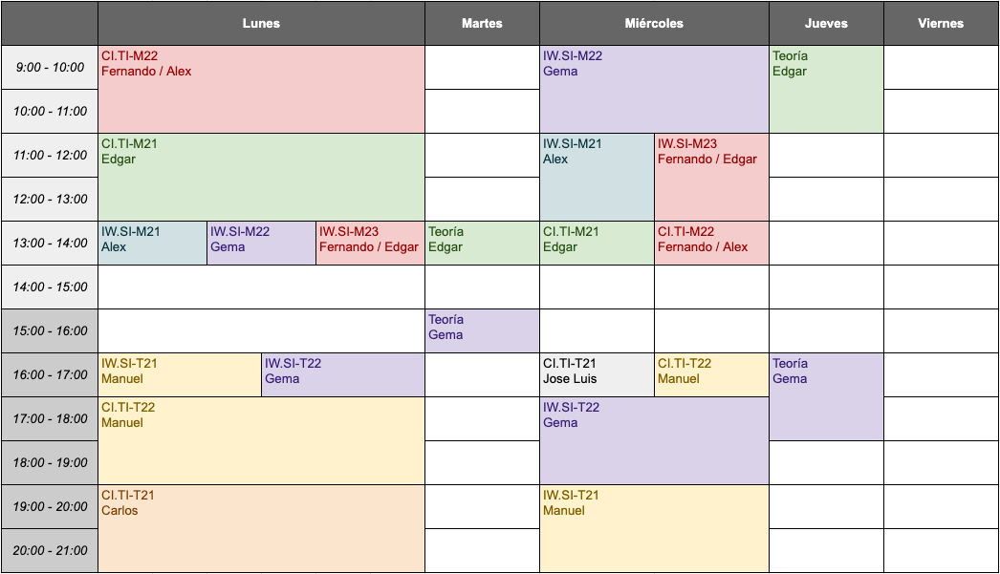

<!--
_header: ''
_footer:  Esta obra está bajo una [licencia de Creative Commons Reconocimiento-NoComercial-CompartirIgual 4.0 Internacional](http://creativecommons.org/licenses/by-nc-sa/4.0/). Icono diseñado por Flaticon
-->

# BASES DE DATOS

Curso 2021-2022

---

## Descripción de la asignatura

En esta asignatura el alumno aprenderá los conceptos fundamentales, tanto teóricos como prácticos, necesarios para conocer el funcionamiento de las bases de datos. Para ello, se abordará la problemática del almacenamiento de los datos mediante diferentes niveles de abstracción: conceptual, lógico y físico.

Durante la asignatura el alumno estudiará las técnicas estandarizadas para trabajar en cada uno de estos niveles de abstracción. Del mismo modo se mostrará al alumno la metodología que permite la transición entre los diferentes niveles de abstracción.

La asignatura ha sido diseñada con un elevado contenido práctico, de tal manera que los alumnos puedan aplicar los contenidos teóricos aprendidos en clase en entornos reales de trabajo con herramientas ampliamente utilizadas en el sector productivo.

---

## Profesorado

- Gema Bello. gema.borgaz@upm.es. *Despacho 1224*.
- Manuel Bollaín. manuel.bollain@upm.es. *Despacho 6108*.
- Carlos Camacho. carlos.camacho@upm.es. *Despacho 4104*.
- Alejandro Martín. alejandro.martin@upm.es. *Despacho 1215*.
- Fernando Ortega (**Coordinador**). fernando.ortega@upm.es. *Despacho 1109*.
- José Luis Sánchez. joseluis.sanchez@upm.es. *Despacho 1116*.
- Edgar Talavera. e.talavera@upm.es. *Despacho 1222*.

---

## Conocimientos previos recomendados

- Fundamentos de programación
- Estructuras de datos

---

## Competencias

**CC12** | Conocimiento y aplicación de las características, funcionalidades y estructura de las bases de datos, que permitan su adecuado uso, y el diseño y el análisis e implementación de aplicaciones basadas en ellos.

**CC13** | Conocimiento y aplicación de las herramientas necesarias para el almacenamiento, procesamiento y acceso a los Sistemas de información, incluidos los basados en web.

**CC7** | Conocimiento, diseño y utilización de forma eficiente los tipos y estructuras de datos más adecuados a la resolución de un problema.

**CT1** | Análisis y síntesis: Descomponer la información en unidades más pequeñas separando los componentes fundamentales de los no relevantes e identificando las relaciones existentes entre ellos. Síntesis: Combinar información para construir un todo a partir de las entidades previamente analizadas.

---

## Resultados de aprendizaje

Conoce la estructura y utilización de ficheros índices para manejar ficheros de datos.

Lee un texto un artículo científico de cierta complejidad, o maneja diferentes fuentes de información relativo a un tema no impartido previamente en clase, y distingue los conceptos principales de los secundarios, explica la relación entre dichos conceptos y sintetiza las ideas principales seleccionando la información relevante, realizando un resumen, mapa conceptual o esquema de mayor complejidad.

Conoce y utiliza correctamente las estructuras y tipos de ficheros de datos que conforman un sistema de información.

Conoce los fundamentos de los lenguajes de acceso a bases de datos relaciones y expresa consultas complejas mediante los mismos.

Conoce los fundamentos teóricos del proceso concurrente de transacciones en bases de datos así como la aplicación de los mismos mediante las opciones que brindan los lenguajes de consulta a bases de datos relacionales.

Conoce las bases teóricas del modelado conceptual de datos y realiza el análisis de los requisitos de datos de un dominio concreto y el diseño del modelo conceptual de datos correspondiente.

Identifica las estructuras y problemas derivados de la integridad referencial en bases de datos.

---

## Temario

1. Introducción
2. Modelado de datos
3. Modelo relacional
4. El lenguaje SQL
5. Gestión de bases de datos
6. Programación contra bases de datos
7. Almacenamiento de información basada en ficheros

---

## Horario

---

## Evaluación continua

Cuestionarios telemáticos en moodle (20%)
- Los viernes al finalizar cada tema
- Sin nota mínima
- Se realizan fuera del aula

Prácticas (40%)
- En grupos
- Evaluación mediante hitos con calificación APTO / NO APTO
- Evaluación en el aula

Examen final (40%)
- Nota mínima de 4
- Todo el temario
- Viernes 21 de enero de 2022 a las 15:00

---

## Evaluación solo prueba final

Prueba escrita el **viernes 21 de enero de 2022 a las 15:00** incluyendo preguntas teórico-prácticas de todo el temario de la asignatura.

Es obligatorio alcanzar una nota mínima de 5 puntos sobre 10.

Los alumnos que deseen acogerse a la modalidad de evaluación solo prueba final deberán **comunicarlo al coordinador** de la asignatura mediante correo electrónico antes de las 23:55 del viernes de la 4ª semana de docencia.

---

## Convocatoria extraordinaria

Prueba escrita el **miécoles 29 de junio de 2022 a las 15:00** incluyendo preguntas teórico-prácticas de todo el temario de la asignatura.

Es obligatorio alcanzar una nota mínima de 5 puntos sobre 10.

---

## Recursos didácticos

1. **Moodle de la asignatura.**
2. Elmasri, R. A., & Navathe, S. B. (2007). *Fundamentos de sistemas de bases de datos* (No. 004.65). Addison Wesley.
3. Silberschatz, A., Korth, H. F., Sudarshan, S., Pérez, F. S., Santiago, A. I., & Sánchez, A. V. (2002). *Fundamentos de bases de datos*.
4. Date, C. J. (2001). *Introducción a los sistemas de bases de datos*. Pearson Educación.

