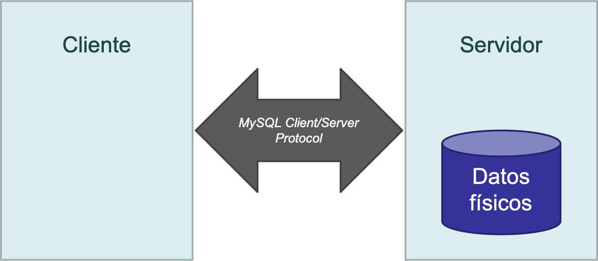
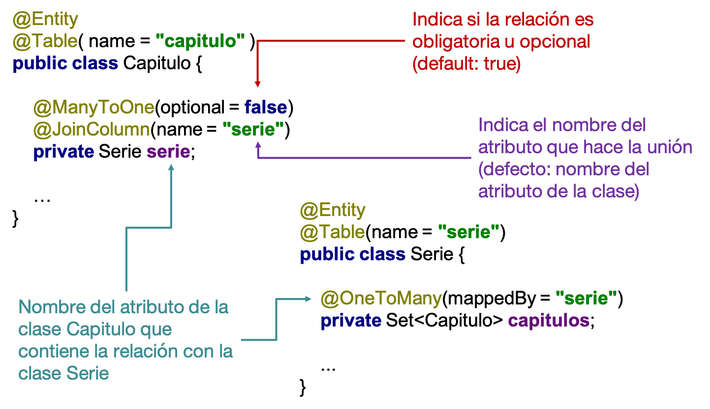
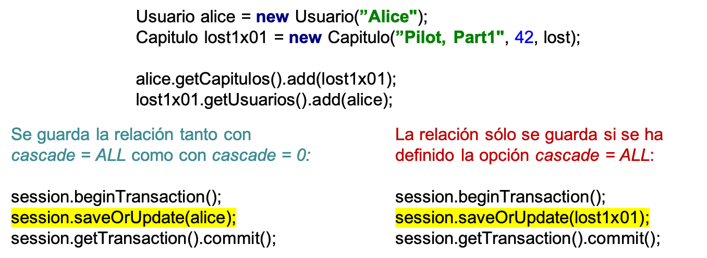
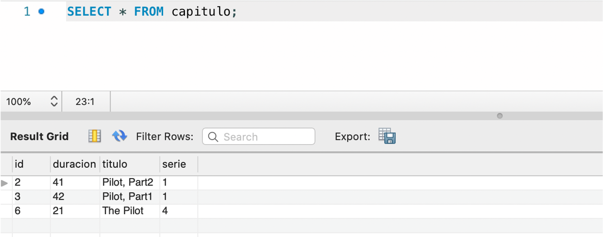
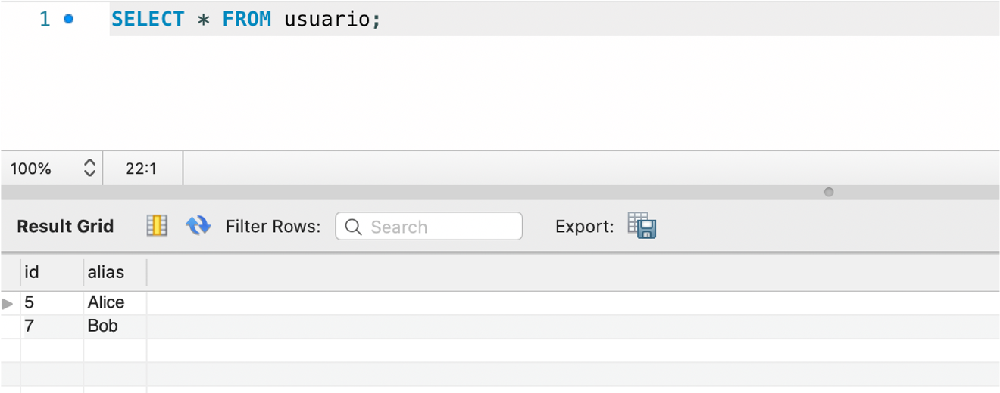

<!-- _class: titlepage -->

# Programación contra bases de datos en Java

## Bases de datos

### Departamento de Sistemas Informáticos

#### E.T.S.I. de Sistemas Informáticos

##### Universidad Politénica de Madrid

[](https://creativecommons.org/licenses/by-nc-sa/4.0/)


---

# Índice

1. Arquitectura cliente-servidor
2. Drivers nativos
3. Object Relational Mapping (ORM)

---

# ARQUITECTURA CLIENTE-SERVIDOR<!-- _class: section -->

---

# Arquitectura cliente-servidor

Las bases de datos funcionan de acuerdo con una arquitectura **cliente-servidor**

- El servidor, que contiene los datos, escucha las peticiones de los   clientes
- Los clientes solicitan al servidor que realicen operaciones sobre los datos: creación, actualización, borrado y consulta de los datos
- Habitualmente, el servidor y los clientes se ejecutan en dispositivos físicos diferentes.

---

# MySQL Client/Server Protocol

Para comunicarse, el servidor y los clientes necesitan _hablar_ el mis mo idioma

MySQL dispone de un protocolo que implementan tanto el servidor como los clientes para establecer la comunicación<sup>1</sup>:

- Se denomina MySQL Client/Server Protocol.
- Se ejecuta sobre TCP.
- El cuerpo de los mensajes incluye sentencias SQL.

> <sup>1</sup> Más información en <https://dev.mysql.com/doc/internals/en/client-server-protocol.html>

---

# Esquema (I)

Esquema básico de la arquitectura:



---

# Esquema (y II)

En las sesiones de prácticas de la asignatura, la arquitectura era la siguiente


---

# Esquema con varios clientes

Lo habitual es que un mismo servidor reciba conexiones de diferentes clientes


---

# Clientes de MySQL

Pueden ser cualquier software que implemente el _MySQL Client/Server Protocol_

- _phpMyAdmin_ es un ejemplo, pero hay muchos otros, por ejemplo:
  - MySQL Workbench<sup>2</sup>
  - Cliente de línea de comandos general y específicos <sup>3</sup>
- Además, prácticamente todo lenguajes de programación incorpora bibliotecas para comunicarse con _MySQL_ a través de clases y funciones de alto nivel

En definitiva, **la base de datos es común para todos los programas**

- Cada programa se comunica con la base de datos a través de su conector

> <sup>2</sup> Más información en <https://www.mysql.com/products/workbench/>  
> <sup>3</sup> Más información en <https://dev.mysql.com/doc/refman/8.0/en/programs-client.html>

---

# DRIVERS NATIVOS<!-- _class: section -->

---

# _Open Database Connectivity_ (ODBC)

Estándar de acceso a las bases de datos

- Su objetivo es hacer posible el acceder a cualquier dato desde cualquier aplicación

Crea una capa intermedia entre la aplicación y el SGBD

- Esta capa actúa de traductor entre ODBC y el SGBD.
- Permite utilizar diferentes bases de datos sin cambiar la aplicación.


---

# ¿Qué es _Java Database Connectivity_ (JDBC)?

API para ejecutar operaciones sobre bases de datos desde Java

- Independiente a la base de datos y al sistema operativo
- Clases e interfaces para gestionar conexión y CRUD con la base de datos

---

# _Java Database Connectivity_ (JDBC)

JDBC ha evolucionado con 4 versiones:

- **Tipo 1**: Transforma las llamadas _JDBC_ en llamadas _ODBC_ (lenta)
- **Tipo 2**: Transforma las llamadas *JDBC* en llamadas nativas de la
  API del SGBD
  - Evita el proceso de traducción pero requiere instalar la librería
    del SGBD en el cliente.
- **Tipo 3**: Capa intermedia (_middleware_) para gestionar las llamadas
  al SGBD
  - Evita instalar la librería del SGBD en el cliente pero el
    _middleware_ añade latencia
- **Tipo 4**: Llamada directa a la API de cada SGBD
  - Java puro y sin latencia, pero cada SGBD requiere un driver específico

---

# JDBC Tipo 4

En la actualidad, se usa JDBC de Tipo 4 por ser el que mejor rendimiento reporta


---

# MySQL Connector/J8.0

La implementación más reciente de JDBC para MySQL es _MySQL Connector/J8.0_<sup>4</sup>

- Requiere Java 1.8.x para funcionar
- Funciona con MySQL 5.6, 5.7 y 8.0
- Implementa JDBC 4.2
- Incluido en el JDK de Java
- Es gratuito (pero no es _software libre_)

> <sup>4</sup> Más información en <https://dev.mysql.com/doc/connector-j/en/>
---

# Instalación

Depende de la plataforma (Windows/Linux/macOS).

- Consiste en un `.jar` que debemos añadir al `CLASSPATH` de nuestro proyecto
- Contiene todas las primitivas necesarias para operar con el servidor de MySQL
- Está disponible en Maven:

```xml
<dependency>
  <groupId>mysql</groupId>
  <artifactId>mysql-connector-java</artifactId>
  <version>8.0.18</version>
</dependency>
  ```

---

# Uso del conector

Toda aplicación que use de _MySQL Connector/J8.0_ debe seguir los siguientes pasos:

1. Definir el SGBD a utilizar (cargar el driver)
2. Establecer conexión con la base de datos
3. Ejecutar sentencias o llamadas a procedimientos
4. Liberar recursos

---

# Paso 1: definir la base de datos a utilizar

```java
// se importan las clases de JDK
import java.sql.Connection;
import java.sql.DriverManager;
import java.sql.SQLException;
public class LoadDriver {
  public static void main(String[] args) {
    try {
      // usamos el driver JDBC de MySQL
      Class.forName("com.mysql.cj.jdbc.Driver").newInstance();
    } catch (Exception ex) {
      // manejar el error ...
    }
  }
}
```

---

# Paso 2: conexión con la base de datos

```java
import java.sql.Connection;
import java.sql.DriverManager;
import java.sql.SQLException;

Connection conn = null;
// ...
try {
  conn = DriverManager.getConnection("jdbc:mysql://localhost/test?" + "user=minty&password=greatsqldb");
  // trabajar con la BBDD ...
} catch (SQLException ex) {
  // manejar los errores ...
}
```

La conexión con la base de datos se define mediante una **cadena de conexión**. Una alternativa para especificarla es:

```java
conn = DriverManager.getConnection("jdbc:mysql://localhost/test", "user", "pass");
```

---

# Sintaxis de la URL de conexión

Para conectar con una base de datos debemos definir la URL de conexión

- Debe tener el siguiente formato

```text
protocol://hosts[:port][/database][?properties]
```

Por ejemplo, para conectarnos a la base de datos de las reformas, usaríamos

```text
jdbc:mysql://localhost:3306/reformas?user=usuario&password=pass
```

---
<style scoped>
  li {font-size: 0.9rem}
  p {font-size: 0.9rem}
</style>

# Paso 3: ejecutar sentencias (I)

Las sentencias se ejecutan con la clase `Statement`

- Se pueden crear nuevos `Statement` a partir del método `createStatement()` de la clase `Connection`
- Para ejecutar las sentencias usaremos:
  - `executeQuery(String)` si la sentencia es un `SELECT`.
  - `executeUpdate(String)` si la sentencia es un `INSERT`, `UPDATE` o `DELETE`
  - `execute(String)` para cualquier tipo de sentencia
- Los resultados se devuelven en una instancia de la clase `ResultSet`

---

# Paso 3: ejecutar sentencias (II)

```java
import java.sql.Connection;
import java.sql.DriverManager;
import java.sql.SQLException;
import java.sql.Statement;
import java.sql.ResultSet;

// se asume que hay creada una conexión JDBC

Statement stmt = null;
ResultSet rs = null;
try {
  stmt = conn.createStatement();
  rs = stmt.executeQuery("SELECT foo FROM bar");
  // ahora se pueden utilizar los resultados...
} catch (SQLException ex){
  // manejar los errores
}
```

---
<style scoped>
  pre {font-size: 0.7rem}
</style>

# Paso 3: ejecutar sentencias (y III)

```java
import java.sql.Connection;
import java.sql.DriverManager;
import java.sql.SQLException;
import java.sql.Statement;
import java.sql.ResultSet;

// se asume que hay creada una conexión JDBC

Statement stmt = null;
ResultSet rs = null;
try {
  stmt = conn.createStatement();
  if (stmt.execute("SELECT foo FROM bar")) {
    rs = stmt.getResultSet();
  }
  // ahora se pueden utilizar los resultados...
} catch (SQLException ex){
  // manejar los errores
}
```

---

# Paso 3: llamar a procedimientos (I)

Los procedimientos se invocan con `CallableStatement`, lo que implica:

1. Preparar la llamada (alto coste computacional, conviene reutilizar llamadas anteriores si es posible).
2. Registrar los parámetros de salida (si existen)
3. Establecer los parámetros de entrada (si existen)
4. Llamar al procedimiento
5. Recuperar los resultados

---

# Paso 3: llamar a procedimientos (y II)

Supongamos que tenemos definido el siguiente procedimiento:

```sql
CREATE PROCEDURE demoSp (IN inputParam VARCHAR(255), INOUT inOutParam INT)
...

```

La ejecución desde código quedaría:

```java
import java.sql.CallableStatement;
import java.sql.Types;

CallableStatement cStmt = conn.prepareCall("{call demoSp(?, ?)}");

cStmt.setString(1, "abc");  // alternativa: cStmt.setString("inputParam", "abc );
cStmt.registerOutParameter(2, Types.INTEGER);
cStmt.setInt(2, 1);  // alternativa: cStmt.setInt("inOutParam", 1);
cStmt.execute();

outputValue = cStmt.getInt(2);  // alternativa: outputValue = cStmt.getInt("inOutParam");
```

---

# Paso 4: liberar recursos

**Debemos** cerrar todos los recursos que se hayan abierto

Para cerrar `Statement`:

```java
Statement stmt;
// ...
stmt.close();
```

Para cerrar conexiones:

```java
Connection conn;
// ...
conn.close();
```

---

# `PreparedStatement` (I)

Usar `Statement` esta desaconsejado cuando se quiere parametrizar una sentencia

- Con `Statement` solo podemos parametrizar concatenando cadenas de texto

```java
String name = "Alice";
int age = 27;

Statement stmt = conn.createStatement();
stmt.executeUpdate("INSERT INTO people (name, age) VALUES ('" + name + "'," + age + ")");
```

Esto favorece los ataques de tipo _SQL Injection_<sup>5</sup>

> <sup>5</sup> Más información en <https://owasp.org/www-community/attacks/SQL_Injection>

---

# `PreparedStatement` (y II)

Alternativamente podemos usar las clase `PreparedStatement`.

- Parametriza una llamada mediante la inclusión del carácter `?` en la sentencia SQL
- Requiere establecer el valor de cada parámetro antes de ejecutar la llamada:

```java
String name = "Alice";
int age = 27;

PreparedStatement stmt = conn.prepareStatement("INSERT INTO people (name, age) VALUES (?, ?)");

// CUIDADO: los índices empiezan en 1
stmt.setString(1, name);
stmt.setInt(2, age);

stmt.executeUpdate();
```

---

# `ResultSet` (I)

Nos permite recuperar los resultados devueltos por una consulta

- Funciona como un cursor que apunta a una fila del resultado
  - El método `next()` permite avanzar el cursor:
  - Devuelve el valor falso cuando ha alanzado la última posición.
  - El cursor se inicia en la posición anterior a la primera fila.

Se proporcionan _getters_ para recuperar los atributos de una fila

- Se puede hacer mediante número de columna o por su nombre (_case-insensitive_)

---

# `ResultSet` (y II)

```java
PreparedStatement stmt;
stmt = conn.prepareStatement("SELECT name, age FROM people WHERE age > ?");

stmt.setInt(1, 30);

// CUIDADO: solo executeQuery devuelve una instancia de ResultSet
ResultSet rs = stmt.executeQuery();

while (rs.next()) {
  String name = rs.getString("name"); // Podemos acceder por nombre...
  int age = rs.getInt(2);             // ... y por índice

  System.out.println("name = " + name + "; age = " + age);
}

rs.close(); // estamos obligados a cerrar el objeto
```

---

# OBJECT RELATIONAL MAPPING (ORM)<!-- _class: section -->

---

# Por qué necesitamos ORM

Casi todo lenguaje de programación es orientado a objetos, pero el modelo relacional no

- Tienen importantes diferencias que dificultan el desarrollo software
- Necesitan de tiempo y recursos para desarrollar aplicaciones que se comuniquen con la base de datos.
- Los ORM buscan reducir la brecha entre ambos paradigmas para simplificar el proceso de desarrollo software

---

# Características de un ORM

Representan las tablas de la base de datos mediante una estructura de clases

- Toda la interacción entre programa y base de datos se realiza a través del ORM:
  - Creación de tablas
  - Inserción y modificación de datos
  - Consultas
- No requiere conocer SQL, pero es muy recomendable entender su funcionamiento

---

# Cuándo debemos usar un ORM

Distinguimos **dos** tipos de aplicaciones

- **Centradas en los datos**
  - Alta dependencia con el SGBD
  - Delegan la mayoría operativa a procedimientos almacenados
  - **No aptas para ORM**
- **Centradas en el modelo de datos**
  - La lógica gira en torno al modelo de datos
  - Las consultas de datos son simples
  - La mayoría de aplicaciones actuales siguen esta filosofía
  - **Aptas para ORM**

---

# Hibernate

Es el ORM más popular para Java

- Independiente del SGBD
- Define el modelo de clases mediante anotaciones
- Se encarga de traducir métodos de Java en consultas SQL
- No es necesario conocer SQL para su utilización


---

# Hibernate: Instalación

Haremos uso de Maven para instalar la librería en nuestro proyecto
(fichero `pom.xml`). Requerimos tanto _Hibernate_ como _Connector/J_

```xml
<dependencies>
    <dependency>
        <groupId>org.hibernate</groupId>
        <artifactId>hibernate-core</artifactId>
        <version>5.4.9.Final</version>
    </dependency>
    <dependency>
        <groupId>mysql</groupId>
        <artifactId>mysql-connector-java</artifactId>
        <version>8.0.18</version>
    </dependency>
</dependencies>
```

---

# Hibernate: ejemplo de uso

Se quiere desarrollar una aplicación para gestionar las visualizaciones de series por parte de los usuarios

Un usuario estará definido por su alias y podrá ver todos los capítulos de las series que quiera

Un capítulo, que dispondrá de un título y una duración, pertenecerá a una serie

Una serie estará caracterizada por su título y género y dispondrá de un número indeterminado de capítulos

---

# Hibernate: ejemplo de uso (modelo ER)


---

# Hibernate: ejemplo de uso (modelo relacional)


---

# Hibernate: ejemplo de uso (clases Java, I)


Las relaciones entre las entidades se logran a través de los atributos de las clases

<div class="columns">
<div class="column">

- **Relación 1:N** con una instancia de la clase.
- **Relación N:M** con un `Set` de instancias de la clase.

</div>
<div class="column">

```java
public class Usuario {
  private Long id;
  private String alias;
  private Set<Capitulo> capitulos;
  // …
}
```

</div>
</div>

---

# Hibernate: ejemplo de uso (clases Java, II)


En el caso de las series, incluiremos un conjunto de capítulos que le pertenezcan

```java
public class Serie {
  private Long id;
  private String titulo;
  private String genero;
  private Set<Capitulo> capitulos;
  // …
}
```

---

# Hibernate: ejemplo de uso (clases Java, y III)


Para los capítulos, incluiremos una referencia a la serie a la que pertenecen

```java
public class Capitulo {
  private Long id;
  private String titulo;
  private Integer duracion;
  private Serie serie;
  private Set<Usuario> usuarios;
  // …
}
```

---

# Hibernate: ejemplo de uso (anotaciones)

Debemos indicar cómo construir nuestro modelo relacional a partir de las clases anteriores; para ello:

- `@Entity`: define una clase como una entidad de nuestro modelo
- `@Table`: define una tabla asociada a una entidad
- `@Column`: define una columna de una tabla
- `@Id`: define una columna de una tabla como clave primaria de dicha tabla
- `@ManyToOne` / `@OneToMany`: define relaciones 1:N
- `@ManyToMany`: define relaciones N:M

---

# Hibernate: ejemplo (anotaciones básicas, I)

```java
@Entity
@Table(name = "usuario")
public class Usuario {

  @Id
  @Column(name = "id")
  private Long id;

  @Column(name = "alias", nullable = false)
  private String alias;

  // ...
}
```

---

# Hibernate: ejemplo (anotaciones básicas, II)

```java
@Entity
@Table(name = "capitulo")
public class Capitulo {
  @Id
  @Column(name = "id")
  private Long id;

  @Column(name = "titulo", nullable = false)
  private String titulo;

  @Column(name = "duracion", nullable = false)
  private Integer duracion;

  // ...
}
```

---

# Hibernate: ejemplo (anotaciones básicas, y III)

```java
@Entity
@Table(name = "serie")
public class Serie {
  @Id
  @Column(name = "id")
  private Long id;

  @Column(name = "titulo", nullable = false)
  private String titulo;

  @Column(name = "genero", nullable = false)
  private String genero;

  // ...
}
```

---

# Hibernate: atributo `@Column`

Permite vincular un atributo de la clase con una columna de un tabla:

- `name`: nombre de la columna (default: nombre del atributo).
- `unique`: el valor del atributo no puede repetirse (default: false).
- `nullable`: el valor puede ser nulo (default: true).
- `length`: longitud de la cadena de caracteres si el atributo es de tipo String (default: 255).
- `precision`: número de dígitos decimales si el atributo es Double (default: 0).

---

# Hibernate: atributo `@GeneratedValue`

Permite crear identificadores únicos de forma automática

- Dichos atributos se instancian **cuando el objeto se crea** en la base de datos

```java
@Entity
@Table(name = "serie")
public class Serie {
  @Id @GeneratedValue @Column(name = "id") private Long id;
}
Serie lost = new Serie("Lost", "SciFi");
System.out.println(lost.getId()); // null
session.beginTransaction();
session.save(lost);
session.getTransaction().commit();
System.out.println(lost.getId()); // 1
```

---

# Hibernate: relaciones 1:N

Las relaciones 1:N requieren dos anotaciones:

<div class="columns">
<div class="column">

- `@ManyToOne`: Muchos objetos de una clase se relacionan con uno de otra
  - Requiere definir el atributo de dicha relación mediante la etiqueta `@JoinColumn`
- `@OneToMany`: Un objeto de una clase clase se relaciona con muchos de otra

</div>
<div class="column">



</div>
</div>

---

# Hibernate: relaciones 1:N (cascada)

`@ManyToOne` y `@OneToMany` admiten el parámetro `cascade = CascadeType.ALL`

- Permite que las actualizaciones en el modelo se propaguen a la base de datos
- Por defecto está **desactivado** (`cascade = 0`)

```java
Serie lost = new Serie("Lost", "SciFi");
Capitulo lost1x01 = new Capitulo("Pilot, Part1", 42, lost);
Capitulo lost1x02 = new Capitulo("Pilot, Part2", 41, lost);

lost.getCapitulos().add(lost1x01);
lost.getCapitulos().add(lost1x02);

session.beginTransaction();
// si CascadeType.ALL se insertarán en la BD tanto la serie como los capítulos
session.saveOrUpdate(lost);
session.getTransaction().commit();
```

---

# Hibernate: relaciones N:M

<div class="columns">
<div class="column">

Las relaciones **N:M** requieren **etiquetar las dos clases** con `@ManyToMany`

- La clase poseedora de la relación.
- La clase no-poseedora (inversa) de la relación.

</div>
<div class="column">


</div>
</div>

`@JoinTable` en la clase poseedora sirve para definir la tabla de relación

---

# Hibernate: relaciones N:M (cascada)

Al igual que en las relaciones 1:N, `@ManyToMany` admite
`cascade = CascadeType.ALL`

- Permite mantener la consistencia entre clases y datos almacenados en el SGBD
- Si no se define, las nuevas filas de la tabla de relación sólo se generan al guardar los cambios en la clase poseedora



---

# Hibernate: creación de las tablas

_Hibernate_ genera automáticamente todas las tablas en la base de datos

- **No es necesario** que ejecutemos ninguna sentencia `CREATE TABLE`
- Si las tablas ya existieran, _Hibernate_ usará dichas tablas
- Su estructura debe coincidir con las anotaciones que hayamos hecho en las clases

---

# Hibernate: Session

Hibernate gestiona todas las conexione al SGBD a través de la clase
`Session`

- Sus objetos son creadas mediante un patrón factoría con el objeto
  `SessionFactory`<sup>6</sup>

```java
// configuración de la factoría
StandardServiceRegistry registry = new StandardServiceRegistryBuilder().configure().build();

// creación de la factoría
SessionFactory sessionFactory = new MetadataSources(registry).buildMetadata().buildSessionFactory();

// apertura, uso y cierre de sesión
Session session = sessionFactory.openSession();
// uso...
session.close();
```

> <sup>6</sup> Más información en
> <https://refactoring.guru/design-patterns/factory-method>
---

# Hibernate: Configuración de `SessionFactory`

Para configurar `SessionFactory` necesitamos el fichero de configuración `hibernate.cfg.xml`

- En el se definen las propiedades para conectar _Hibernate_ con el SGBD
- Este fichero **es dependiente del SGBD**

Es un **error muy común** olvidarse de configurar este fichero, por lo que el proyecto no funcionará

---

# Hibernate: Fichero de configuración

```xml
<hibernate-configuration>
    <session-factory>
      <!-- Parámetros de conexión al SGBD -->
      <property name="connection.driver_class">com.mysql.jdbc.Driver</property>
      <property name="connection.url">jdbc:mysql://localhost:3306/series</property>
      <property name="connection.username">root</property>
      <property name="connection.password">root</property>
      <!-- Dialecto: MySQL 8.0 -->
      <property name="dialect">org.hibernate.dialect.MySQL8Dialect</property>
      <!-- Propiedades de la conexión -->
      <property name="connection.pool_size">10</property>
      <property name="hibernate.current_session_context_class">thread</property>
      <!-- Gestión del modelo de datos -->
      <property name="hibernate.hbm2ddl.auto">update</property>
      <!-- IMPORTANTE: clases que tienen anotaciones -->
      <mapping class="datamodel.Serie"/>
      <mapping class="datamodel.Capitulo"/>
      <mapping class="datamodel.Usuario"/>
    </session-factory>
</hibernate-configuration>
```

---

# <!-- fit -->Hibernate: Propiedad `hibernate.hbm2ddl.auto`

Esta propiedad del fichero de configuración permite definir la gestión del modelo de datos

- `validate`: Valida el esquema, **no** hace cambios en la base de datos
- `update`: Actualiza el esquema si es necesario
- `create`: Cera el esquema **destruyendo los datos existentes**
- `create-drop`: Borra el esquema cuando `SessionFactory` es cerrado explícitamente

---

# Hibernate: funcionamiento transaccional

Todas las operaciones de escritura de Hibernate con el SGBD es recomendable hacerlas de manera transaccional, esto es:

1. Apertura de la transacción
2. Operaciones de escritura
3. _Commit_ de la transacción

```java
session.beginTransaction();
// ... cosas
session.getTransaction().commit();
```

---

# Hibernate: operaciones de escritura (I)

Crear un nuevo registro (`INSERT`):

```java
Serie lost = new Serie("Lost", "SciFi");
session.beginTransaction();
session.save(lost);
session.getTransaction().commit();
```

Actualizar un registro (`UPDATE`):

```java
lost.setGenero("Sci-Fi");
session.beginTransaction();
session.update(lost);
session.getTransaction().commit();
```

---

# Hibernate: operaciones de escritura (y II)

Crear o actualizar un registro:

```java
Serie lost = new Serie("Lost", "SciFi");
session.beginTransaction();
session.saveOrUpdate(lost);
session.getTransaction().commit();
```

Borrar un registro (DELETE):

```java
session.beginTransaction();
session.delete(lost);
session.getTransaction().commit();
```

---

# Hibernate: operaciones de lectura

Las operaciones de lectura **no** requieren transacciones.

Recuperar un registro a partir de su clave primaria:

```java
Serie lost = session.load(Serie.class, 1L);
```

Para consultas más avanzadas se utiliza _Hibernate Query Language (HQL)_

```java
Query query = session.createQuery("from Serie where genero = :genero");
query.setParameter("genero", "SciFi");
List <Serie> list = query.getResultList();
```

---

# Hibernate: consideraciones finales

- Las clases anotadas deben tener un constructor vacío para que _Hibernate_ pueda funcionar
- Se pueden añadir todos los constructores y métodos que sean necesario a las clases para su funcionamiento dentro de la aplicación
- Para hacer persistente un cambio debe llamarse a `save`, `update` o `saveOrUpdate`
- Los identificadores numéricos deben ser de tipo `Long`
- Todos los métodos vistos anteriormente pueden arrojar excepciones que **deben ser tratadas**

---

# Hibernate: secuencia de comandos (I)

```java
// creación de la serie lost
Serie lost = new Serie("Lost", "SciFi");

// creación de dos capítulos
Capitulo lost1x01 = new Capitulo("Pilot, Part1", 42, lost);
Capitulo lost1x02 = new Capitulo("Pilot, Part2", 41, lost);

// vinculación de los capítulos a su serie
lost.getCapitulos().add(lost1x01);
lost.getCapitulos().add(lost1x02);

// los cambios se almacenan en la base de datos
session.beginTransaction();
session.saveOrUpdate(lost);
session.getTransaction().commit();
```

---

# Hibernate: secuencia de comandos (II)

```java
// actualización de la serie Lost
lost.setGenero("Sci-Fi");

// cambios a la base de datos
session.beginTransaction();
session.saveOrUpdate(lost);
session.getTransaction().commit();
```

---

# Hibernate: secuencia de comandos (III)

```java
// creación de la serie Friends
Serie friends = new Serie ("Friends", "Comedia");

// creación de un capítulo y vinculación con la serie
Capitulo friends1x01 = new Capitulo("The Pilot", 21, friends);
friends.getCapitulos().add(friends1x01);

// cambios a la base de datos
session.beginTransaction();
session.saveOrUpdate(friends);
session.getTransaction().commit();
```

---

# Hibernate: secuencia de comandos (y IV)

```java
// creación de dos usuarios
Usuario alice = new Usuario("Alice");
alice.getCapitulos().add(lost1x01);
lost1x01.getUsuarios().add(alice);
alice.getCapitulos().add(friends1x01);
friends1x01.getUsuarios().add(alice);

Usuario bob = new Usuario("Bob");
bob.getCapitulos().add(friends1x01);
friends1x01.getUsuarios().add(bob);

session.beginTransaction();
session.saveOrUpdate(alice);
session.saveOrUpdate(bob);
session.getTransaction().commit();
```

---

# Hibernate: estado de la tabla `Serie`


---

# Hibernate: estado de la tabla `Capitulo`



---

# Hibernate: estado de la tabla `Usuario`



---

# Hibernate: estado de la tabla `Visualizaciones`


---

# Licencia<!--_class: license -->

Esta obra está licenciada bajo una licencia [Creative Commons Atribución-NoComercial-CompartirIgual 4.0 Internacional](https://creativecommons.org/licenses/by-nc-sa/4.0/).

Puede encontrar su código en el siguiente enlace: <https://github.com/etsisi/Aprendizaje-profundo>
