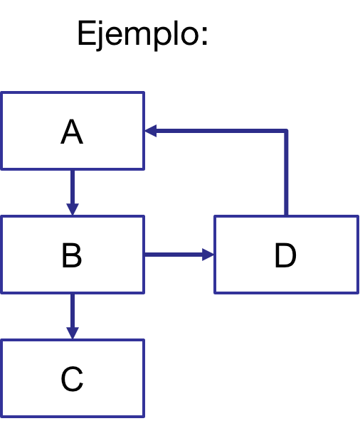
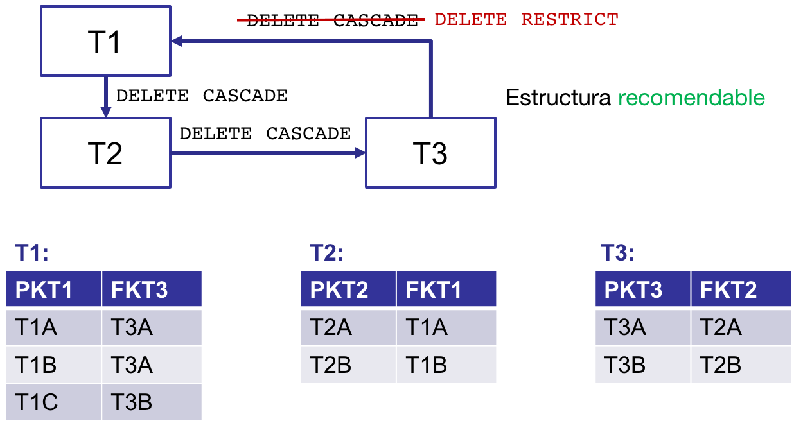
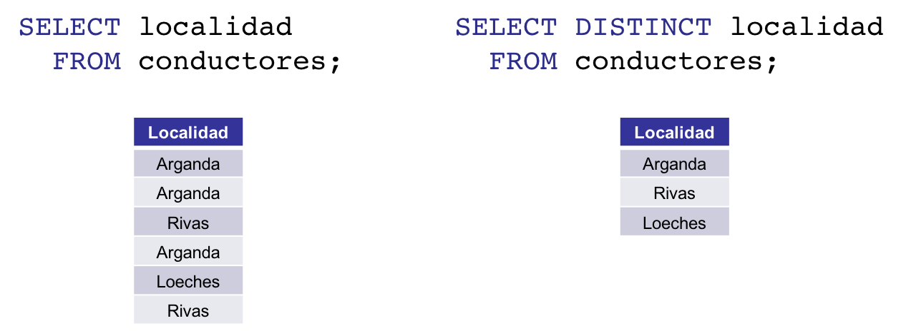

<!--
_header: ''
_footer:  Esta obra está bajo una [licencia de Creative Commons Reconocimiento-NoComercial-CompartirIgual 4.0 Internacional](http://creativecommons.org/licenses/by-nc-sa/4.0/). Icono diseñado por Flaticon
-->
<style>
img[alt~="center"] {
  display: block;
  margin: 0 auto;
}
img {
  background-color: transparent!important;
}
li {
  text-align: justify;
}
s {
  background-color: yellow;
  text-decoration: none;
}
p {
  text-align: justify;
}
/*Tablas centradas*/
table {
  width: auto;
  margin-left: auto;
  margin-right: auto
}
</style>

# TEMA 4

# El lenguaje SQL


---

## Índice

1. Introducción
2. Lenguaje de definición de datos
3. Integridad referencial
4. Consultas
5. Actualización y borrado de datos

---

# INTRODUCCIÓN

## El lenguaje SQL

---

## Por qué necesitamos SQL


---

## SQL: Structured Query Language

- Lenguaje de consulta estructurado para bases de datos relacionales.
- Es mucho más que un lenguaje de consulta, puesto que permite además funciones de definición y control de datos.
- La estandarización ha sido crucial para su difusión.
- Prácticamente la mayoría de los sistemas relacionales soportan las bases de SQL estándar y suelen incluir aportaciones propias.
- Utilizado masivamente en la industria.

---
<style scoped>
  td {font-size: 0.65rem}
  thead {font-size: 0.7rem}
</style>

## Evolución de SQL

| Año  | Nombre   | Comentarios                                           |
|------|----------|-------------------------------------------------------|
| 1986 | SQL-86   | Primera versión hecha por ANSI                        |
| 1989 | SQL-89   | Revisión menor                                        |
| 1992 | SQL-92   | Revisión mayor                                        |
| 1999 | SQL:1999 | Expresiones regulares, consultas recursivas, triggers |
| 2003 | SQL:2003 | XML básico, sequence, autoincrment                    |
| 2005 | SQL:2005 | XML avanzado                                          |
| 2008 | SQL:2008 | `ORDER BY`, `TRUNCATE`                                |
| 2011 | SQL:2011 | Datos temporales, `FETCH`                             |
| 2016 | SQL:2016 | Patrones y JSON                                       |

Fuente: [Wikipedia](https://es.wikipedia.org/wiki/SQL#Orígenes_y_evolución)

---

## Soporte CRUD

- ~~C~~reate:
  - Creación de tablas (`CREATE TABLE`)
  - Inserción de datos (`INSERT INTO`)
- ~~R~~ead:
  - Lectura de datos (`SELECT`)
- ~~U~~pdate:
  - Actualización de tablas (`ALTER TABLE`)
  - Actualización de datos (`UPDATE`)
- ~~D~~elete:
  - Borrado de tablas (`DROP`)
  - Borrado de datos (`TRUNCATE` y `DELETE`)

---

## Características de SQL

- Lenguaje de **definición** de datos (*DDL*):
  - Permite diseñar, definir, modificar y borrar las estructuras de almacenamiento de datos.
- Lenguaje de **manipulación** de datos (*DML*):
  - Permite insertar, recuperar, manipular, modificar y borrar datos.
- Lenguaje de **control** de datos (*DCL*):
  - Permite controlar y gestionar los permisos de la base de datos.

---
<style scoped>
li {
  font-size: 0.9rem;
}
</style>

## Sentencias SQL (I)

- Las sentencias SQL están formadas por:
  - Palabras reservadas.
  - Palabras definidas por el usuario (nombres de tablas, atributos, etc).
- Características de las sentencias:
  - _Case insensitive_: es indiferente escribir las palabras en mayúsculas o minúsculas.
  - Cada cláusula o palabra puede aparecer en líneas diferentes.
  - Se puede utilizar la indentación que se quiera.
  - Una sentencia o comando SQL finaliza con la aparición del símbolo `;`, aunque es opcional si el comando es único.

---
<style scoped>
li {
  font-size: 1rem;
}
</style>

## Sentencias SQL (II)

Explicaremos las sentencias SQL mediante notación BNF:

- Palabras en mayúsculas representan palabras reservadas.
- Palabras en minúsculas representan palabras definidas por el usuario.
- El símbolo `|` indica una elección entre alternativas.
- Las llaves `{}` representan elementos requeridos.
- Los corchetes `[]` representan elementos opcionales.
- Los `...` indican repetición opcional (0 ó más).

---

# LENGUAJE DE DEFINICIÓN DE DATOS

## El lenguaje SQL

---

## Schemas

En *MySQL* un schema en una agrupación de lógica de tablas que constituyen un modelo datos:


---

## Schemas

Sintaxis:

```bnf
CREATE {DATABASE | SCHEMA} [IF NOT EXISTS] nombre_del_schema
 [ [DEFAULT] CHARACTER SET [=] charset_name
 | [DEFAULT] COLLATE [=] collation_name
 | DEFAULT ENCRYPTION [=] {'Y' | ‘N’}];

```

Ejemplo de uso:

```SQL
CREATE SCHEMA etsisi
  DEFAULT CHARACTER SET utf8
  COLLATE utf8_spanish2_ci;
```

Más información sobre `COLLATE`: [documentación](https://dev.mysql.com/doc/refman/8.0/en/charset.html)

---

## Creación de tablas

```SQL
CREATE TABLE [schema.]nombre_tabla (
  atributo_1 tipo_1 [UNIQUE] [NOT NULL],
  atributo_2 tipo_2 [UNIQUE] [NOT NULL],
  …
  atributo_n tipo_n [UNIQUE] [NOT NULL]
);
```

Modificadores de columna:

- `UNIQUE`: No se permiten valores duplicados.
- `NOT NULL`: No se permiten valores nulos.

---

## Tipos de datos en SQL

| Familia    | Tipos                      |
|------------|----------------------------|
| Numericos  | `INTEGER`, `DECIMAL`       |
| Texto      | `VARCHAR(size)`, `TEXT`    |
| Enumerados | `ENUM('val1', ..., 'valn')`|
| Fecha      | `DATETIME`, `TIMESTAMP`    |

Más tipos de datos: [documentación](https://dev.mysql.com/doc/refman/8.0/en/data-types.html)

---
<style scoped>
  td {font-size: 0.75rem}
  thead {font-size: 0.75rem}
  s {text-decoration: underline; background-color: transparent}
</style>

# Creación de tablas: Ejemplo

| ~~ID~~ | NOMBRE | APELLIDOS    | DNI        | FECHA DE NACIMIENTO |
|--------|--------|--------------|------------|---------------------|
| 3      | Juan   | Gómez Pérez  | 00000000-T | 3 de mayo de 1983   |
| 67     | Lucía  | Álvarez León | 99999999-R | 7 de julio de 1995  |

```SQL
CREATE TABLE corporacion.personas (
  id        INTEGER     UNIQUE NOT NULL,
  nombre    VARCHAR(30) NOT NULL,
  apellidos VARCHAR(30) NOT NULL,
  dni       VARCHAR(10) UNIQUE NOT NULL,
  fecha_nac DATETIME
);
```

---

## Claves primarias

- Toda definición de una tabla debe indicar una clave primaria.
- Esta debe referenciarse a un atributo (o conjunto de atributos) que identifiquen unívocamente cada fila.
- El/los atributo/s deben declararse de la forma habitual.

```SQL
CREATE TABLE [schema.]nombre_tabla (
  ...
  PRIMARY KEY (atributo_1[, …, atributo_n])
);
```

---
<style scoped>
  td {font-size: 0.75rem}
  thead {font-size: 0.75rem}
  s {text-decoration: underline; background-color: transparent}
</style>

## Claves primarias: Ejemplo

| ~~ID~~ | NOMBRE | APELLIDOS    | DNI        | FECHA DE NACIMIENTO |
|--------|--------|--------------|------------|---------------------|
| 3      | Juan   | Gómez Pérez  | 00000000-T | 3 de mayo de 1983   |
| 67     | Lucía  | Álvarez León | 99999999-R | 7 de julio de 1995  |

```SQL
CREATE TABLE corporacion.personas (
  id        INTEGER     UNIQUE NOT NULL,
  nombre    VARCHAR(30) NOT NULL,
  apellidos VARCHAR(30) NOT NULL,
  dni       VARCHAR(10) UNIQUE NOT NULL,
  fecha_nac DATETIME,
  PRIMARY KEY (id)
);
```

---

## Modificación de tablas

Añadir un nuevo atributo:

```SQL
ALTER TABLE [schema.]nombre_tabla
ADD definición_de_atributo;
```

Modificar un atributo:

```SQL
ALTER TABLE [schema.]nombre_tabla
MODIFY definición_de_atributo;
```

Eliminar un atributo:

```SQL
ALTER TABLE [schema.]nombre_tabla
DROP nombre_de_atributo;
```

---

## Eliminación de tablas

Vaciar una tabla (eliminar todas sus filas pero mantener la estructura):

```SQL
TRUNCATE TABLE [schema.]nombre_tabla;
```

Eliminar una tabla (todas sus filas **y también la estructura**):

```SQL
DROP TABLE [schema.]nombre_tabla;
```

---

## Inserción de datos

- Los datos deben añadirse fila a fila.
- Los datos añadidos deben cumplir las restricciones de la tabla:
  - La clave debe ser única.
  - No existirán valores nulos si se ha definido el atributo como `NOT NULL`.
  - Los tipos de datos deben coincidir.
  - No se admiten repeticiones si se ha definido el atributo como `UNIQUE`.

---

## Inserción de datos

Inserción de una fila de datos:

```SQL
INSERT INTO [schema.]tabla (atributo_1, …, atributo_n)
  VALUES (valor 1, …, valor_n);
```

La lista de atributos es opcional. En ese caso, se asume el orden definido en el `CREATE TABLE`:

```SQL
INSERT INTO [schema.]tabla
  VALUES (valor 1, …, valor_n);
```

**Solo podrán omitirse columnas que no hayan sido definidas como** `NOT NULL`.

---
<style scoped>
  td {font-size: 0.8rem}
  thead {font-size: 0.8rem}
  s {text-decoration: underline; background-color: transparent}
</style>

## Inserción de datos: ejemplos

`PERSONAS`:

| ~~ID~~ | NOMBRE        | DNI        | FECHA_NAC              |
|--------|---------------|------------|------------------------|
| 3      | Juan Gómez    | 00000000-T | 3 de mayo de 1983      |
| 67     | Lucía Duque   | 99999999-R | 7 de julio de 1995     |
| 101    | Diana Álvarez | 12345678-Z | 9 de diciembre de 2000 |

```SQL
INSERT INTO corporacion.personas (id, nombre, dni, fecha_nac)
  VALUES (3, “Juan Gómez”, “00000000-T”, “1983-05-03”);

INSERT INTO corporacion.personas
  VALUES (67, “Lucía Duque”, “99999999-R”, “1995-07-07”);

INSERT INTO corporacion.personas (nombre, fecha_nac, dni, id)
  VALUES (“Diana Álvarez”, “2000-12-09”, “12345678-Z”, 101);
```

---
<style scoped>
  td {font-size: 0.8rem}
  thead {font-size: 0.8rem}
  s {text-decoration: underline; background-color: transparent}
</style>

## Inserción de datos: ejemplos

Es posible insertar varias filas con una única sentencia `INSERT INTO`.

| ~~ID~~ | NOMBRE        | DNI        | FECHA_NAC              |
|--------|---------------|------------|------------------------|
| 3      | Juan Gómez    | 00000000-T | 3 de mayo de 1983      |
| 67     | Lucía Duque   | 99999999-R | 7 de julio de 1995     |
| 101    | Diana Álvarez | 12345678-Z | 9 de diciembre de 2000 |

```SQL
INSERT INTO corporacion.personas VALUES
  (3,   “Juan Gómez”,    “00000000-T”, “1983-05-03”),
  (67,  “Lucía Duque”,   “99999999-R”, “1995-07-07”),
  (101, “Diana Álvarez”, “12345678-Z”, “2000-12-09”);
```

---

## Valores por defecto

- Es posible definir valores por defecto a los atributos.
- Se definen en la sentencia CREATE TABLE:

```SQL
CREATE TABLE [schema.]tabla (
  …
  atributo tipo [UNIQUE] [NOT NULL] [DEFAULT valor],
  …
);
```

- Si no se especifica el valor al realizar el `INSERT INTO`, se pone el valor por defecto.

---
<style scoped>
li {
  font-size: 0.8rem;
}
</style>

## Generación automática de claves

- Es posible generar claves únicas de forma automática.
- Se debe definir un atributo numérico como `AUTO_INCREMENT`.
- El atributo tomará un valor incremental cada vez que se inserte una nueva fila.
  - No debe especificarse su valor cuando se realiza el `INSERT INTO`.

```SQL
CREATE TABLE corporacion.personas (
  id        INTEGER UNIQUE NOT NULL AUTO_INCREMENT,
  nombre    VARCHAR(30) NOT NULL,
  apellidos VARCHAR(30) NOT NULL,
  fecha_nac DATETIME,
  PRIMARY KEY (id)
);

INSERT INTO corporacion.personas (nombre, apellidos, fecha_nac)
  VALUES (“Juan”, “Gómez”, “1983-05-03”);
```

---

# INTEGRIDAD REFERENCIAL

## El lenguaje SQL

---

## Qué es la integridad referencial

- Implantación de restricciones referenciales de acuerdo con un conjunto predefinido de reglas de `INSERT`, `UPDATE` Y `DELETE` que gobiernan las operaciones de inserción, borrado, actualización y carga sobre tablas relacionadas mediante claves primarias y claves ajenas.
- La integridad referencial se encarga de conservar y garantizar automáticamente la integridad de todos los datos almacenados.

---
<style scoped>
  td {font-size: 0.6rem}
  thead {font-size: 0.7rem}
  p {font-size: 0.7rem}
  s {text-decoration: underline; background-color: transparent}
</style>

## Integridad referencial: ejemplo

Supongamos que tenemos las siguientes tablas:

`EMPLEADOS`

| ~~ID_E~~ | NOMBRE   | APELLIDOS    | ID_D |
|----------|----------|--------------|------|
| 11       | Fernando | Ruíz Pérez   | 2    |
| 67       | Raúl     | Gómez García | 4    |

`DEPARTAMENTOS`

| ~~ID_D~~ | NOMBRE               |
|----------|----------------------|
| 2        | I+D+i                |
| 4        | Dirección y gobierno |

¿Puedo borrar el departamento 2 sin que afecte a Fernando?
¿Puedo actualizar el departamento 4 sin que afecte a Raúl?

---

## Restricción referencial

- Para mantener la **Integridad Referencial** debemos añadir **Restricciones Referenciales** cuando definimos las tablas.
- Una Restricción Referencial permite “vincular” la clave foránea de una tabla con la clave primaria de otra tabla (o la misma).
- Se deben definir las opciones de integridad referencial:
  - Política de actualización.
  - Política de borrado.

---

## Restricción referencial en SQL


---
<style scoped>
li {
  font-size: 0.85rem;
}
</style>

## Reglas de integridad referencial

- `ON DELETE` permite definir qué sucede con la clave foránea cuando se elimina la clave primaria.
- `ON UPDATE` permite definir qué sucede con la clave foránea cuando se actualiza la clave primaria.
- Cuatro opciones:
  - `RESTRICT` (o `NO ACTION`): impide la propagación de la operación. **Opción por defecto**.
  - `SET NULL`: se pone a `NULL` la clave ajena, siempre que sea posible.
  - `CASCADE`: se propaga la operación.
  - `SET DEFAULT`: se pone al valor por defecto la clave ajena, si es posible.

---

## Restricción referencial: ejemplo

```SQL
CREATE TABLE corp.departamentos (
  id_d      INTEGER     UNIQUE NOT NULL AUTO_INCREMENT,
  nombre    VARCHAR(60) NOT NULL,
  PRIMARY KEY (id)
);

CREATE TABLE Corp.empleados (
  id_e       INTEGER     UNIQUE NOT NULL AUTO_INCREMENT,
  nombre     VARCHAR(60) NOT NULL,
  apellidos  VARCHAR(60) NOT NULL,
  id_d       INTEGER     NOT NULL,
  PRIMARY KEY (id),
  CONSTRAINT
    FOREIGN KEY (id_d)
    REFERENCES copr.departamentos (id_d)
    ON DELETE NO ACTION
    ON UPDATE CASCADE
);

```

---

## Estructura referencial

- Definiremos una estructura referencial como el conjunto de tablas y restricciones entre ellas de modo que cada tabla del conjunto es padre o dependiente de otra u otras del mismo conjunto.
  - Gráficamente se indica una flecha desde la clave foránea a la clave primaria.
- Existen tres tipos de estructuras:
  - Lineal.
  - Cíclica.
  - Cíclica-autoreferencial.

---

## Estructura lineal


---

## Estructura lineal


---

## Estructura cíclica



---

## Estructura cíclica


Eliminamos de T1 la fila con clave T1A. ¿Qué sucede?

---

## Estructura cíclica



Eliminamos de T1 la fila con clave T1A. ¿Qué sucede?

---

## Estructura cíclica autoreferencial


---

# CONSULTAS

## El lenguaje SQL

---

## Consultas con SQL

La sintaxis para realizar consultas con SQL es la siguiente:

```SQL
SELECT [DISTINCT | ALL] {*|expresión [[AS] alias] [,...]}
  FROM tabla [[AS] alias] [,...]
  [WHERE condición]
  [GROUP BY lista_de_atributos
  [HAVING condición_de_grupo]]
  [ORDER BY lista_de_atributos [ASC|DESC]];
```

---

## Consultas con SQL

- `SELECT`: indica la información que se desea obtener.
- `FROM`: especifica la tabla (o tablas) en las que se encuentra los atributos implicados en la consulta.
- `WHERE`: define la condición de búsqueda.
- `GROUP BY`: permite agrupar los resultados.
- `HAVING`: especifica condiciones de grupo (sólo se se emplea `GROUP BY`).
- `ORDER BY`: ordena los resultados.

---

## Operadores

SQL define los siguientes operadores para expresar condiciones de fila (`WHERE`) o grupo (`HAVING`).

- De comparación: `<`, `<=`, `>`, `>=`, `<>`, `=`
- Lógicos: `AND`, `OR`, `NOT`
- De rango: `BETWEEN ... AND ...`
- De cadenas: `LIKE`
- De conjuntos: `IN`
- `IS NULL`
- Cuantificadores: `ANY`, `SOME`, `ALL`
- Existenciales: `EXISTS`

---

## Base de datos de ejemplo


---

## Recuperación simple

> Obtener todos los datos de todos los proyectos:

```SQL
SELECT codP, descripcion, localidad, cliente, teléfono
  FROM proyectos;
SELECT * -- equivale a todas las columnas de la tabla
  FROM proyectos;
```

> Obtener los códigos de máquina `CodM` para todas las máquinas utilizadas:

```SQL
-- Necesitamos poner DISTINCT para no devolver
-- códigos repetidos
SELECT DISTINCT codM
  FROM trabajos;
```

---

## Cláusula `DISTINCT`

Elimina los valores duplicados del resultado. Por ejemplo, para la consulta *Obtener las localidades de los conductores*



---
<style scoped>
  td {font-size: 0.6rem}
  thead {font-size: 0.7rem}
  s {text-decoration: underline; background-color: transparent}
</style>

## Cláusula `WHERE`

La cláusula `WHERE` contiene una condición simple o compuesta para *filtrar* filas.

> Obtener los códigos de los conductores de Arganda:

```SQL
SELECT codC
  FROM conductores
  WHERE localidad = 'Arganda';
```

| CodC |
|------|
| C01  |
| C02  |
| C04  |

---
<style scoped>
  td {font-size: 0.9rem}
  thead {font-size: 0.9rem}
  s {text-decoration: underline; background-color: transparent}
</style>

## Cláusula `WHERE`

> Obtener los códigos de los conductores de Arganda que tengan categoría inferior a 18:

```SQL
SELECT codC
  FROM conductores
  WHERE localidad = ‘Arganda’
    AND categoría < 18;
```

| CodC |
|------|
| C02  |

---
<style scoped>
  td {font-size: 0.7rem}
  thead {font-size: 0.7rem}
  blockquote {font-size: 0.8rem}
  li {font-size: 0.8rem}
  pre {font-size:0.7rem}
</style>

## Operador `BETWEEN`

- Establece una comparación en un rango.
- Se utiliza con valores numéricos o de fecha.
- También se puede utilizar `NOT BETWEEN`.

> Obtener el nombre de las máquinas cuyo precio por hora esté comprendido entre 70 y 90 euros:

```SQL
SELECT nombre, precioHora
  FROM maquinas
  WHERE precioHora BETWEEN 70 AND 90;
  ```

| Nombre     | PrecioHora |
|------------|------------|
| Excavadora | 90         |
| Volquete   | 70         |

---
<style scoped>
  td {font-size: 0.7rem}
  thead {font-size: 0.7rem}
  blockquote {font-size: 0.8rem}
  li {font-size: 0.8rem}
  pre {font-size:0.7rem}
  p {font-size: 0.8rem}
</style>

## Operador `LIKE`

Establece una comparación entre cadenas de caracteres con la inclusión de comodines:

- `%`: secuencia de cero o más caracteres.
- `_`: sustituye a un único carácter.

> Obtener los conductores que se apellidan 'Pérez'

```SQL
SELECT nombre
  FROM conductores
  WHERE nombre LIKE ’%Pérez%’;
```

| Nombre       |
|--------------|
| Juan Pérez   |
| Carmen Pérez |

---
<style scoped>
  td {font-size: 0.7rem}
  thead {font-size: 0.7rem}
  blockquote {font-size: 0.8rem}
  li {font-size: 0.8rem}
  pre {font-size:0.7rem}
  p {font-size: 0.8rem}
</style>

## Operador `IN`

Comprueba la pertenencia de un valor a un conjunto dado.

> Obtener el nombre de los conductores que residan en Arganda o Rivas:

```SQL
SELECT nombre
  FROM conductores
  WHERE localidad IN (’Arganda’, ‘Rivas’);
```

| Nombre       |
|--------------|
| José Sánchez |
| Manuel Díaz  |
| Juan Pérez   |
| Luis Ortiz   |
| Carmen Pérez |

---
<style scoped>
  td {font-size: 0.7rem}
  thead {font-size: 0.7rem}
  blockquote {font-size: 0.8rem}
  li {font-size: 0.8rem}
  pre {font-size:0.7rem}
  p {font-size: 0.8rem}
</style>

## Operador `IN`

También se puede utilizar con el modificador `NOT`.

> Obtener el nombre de los conductores que no sean de Arganda:

```SQL
SELECT nombre
  FROM conductores
  WHERE localidad NOT IN (’Arganda’);
```

| Nombre        |
|---------------|
| Juan Pérez    |
| Carmen Pérez  |
| Javier Martín |

---
<style scoped>
  td {font-size: 0.7rem}
  thead {font-size: 0.7rem}
  blockquote {font-size: 0.8rem}
  li {font-size: 0.7rem}
  pre {font-size:0.7rem}
  p {font-size: 0.8rem}
</style>

## Operador `IS NULL`

- Comprueba si un valor es nulo.
- No es posible determinar si un valor es o no nulo utilizando operadores de igualdad `=` o diferencia `<>`.
- También se puede utilizar `IS NOT NULL`.

> Obtener los partes de trabajo que no figuren con el tiempo empleado:

```SQL
SELECT codC, codM, codP, fecha
  FROM trabajos
  WHERE tiempo IS NULL;
```

| CodC | CodM | CodP | Fecha    |
|------|------|------|----------|
| C02  | M03  | P02  | 15/09/11 |
| C01  | M02  | P04  | 17/09/11 |
| C02  | M03  | P01  | 18/09/11 |

---
<style scoped>
  td {font-size: 0.5rem}
  thead {font-size: 0.5rem}
  blockquote {font-size: 0.6rem}
  li {font-size: 0.6rem}
  pre {font-size:0.6rem}
  p {font-size: 0.7rem}
</style>

## Operadores `ALL` y `ANY`

- Permiten comparar valores con respecto de un conjunto.
- El segundo operando **debe** ser una subconsulta.
- Van acompañados de un operador de comparación (`>`, `>=`, `<`, `<=`, `=`, `<>`):
- `ALL` implica que la condición se cumpla respecto de todo el conjunto.
- `ANY` implica que la condición se cumpla respecto de, al menos, un elemento del conjunto.

> Obtener proyectos que no sean ninguna de las localidades de aquellos conductores con categoría superior a 17:

```SQL
SELECT descripcion, localidad
  FROM proyectos
  WHERE localidad <> ALL (SELECT localidad
                          FROM conductores
                          WHERE categoria > 17);
```

| Descripción | Localidad |
|-------------|-----------|
| Techado     | Loeches   |

---
<style scoped>
  td {font-size: 0.7rem}
  thead {font-size: 0.7rem}
  blockquote {font-size: 0.8rem}
  li {font-size: 0.9rem}
  pre {font-size:0.8rem}
  p {font-size: 0.9rem}
</style>

## Operador `EXISTS`

- Indica la existencia o no de un conjunto.
- El operando suele ser una subconsulta.
- Devuelve `TRUE` o `FALSE` dependiendo si la subconsulta devuelve resultado o no, respectivamente.

> Obtener nombres de las máquinas que se han utilizado en el proyecto P03:

```SQL
SELECT nombre
  FROM maquinas
  WHERE EXISTS (SELECT *
                FROM trabajos
                WHERE trabajos.codM = maquinas.codM
                  AND codP = ‘P03’);
```

---

## Operadores `UNION`, `MINUS` e `INTERSECT`

- Realizan operaciones sobre conjuntos de resultados.
- Los conjuntos deben ser unión-compatibles.
- Tener las mismas columnas.
  - `UNION`: une dos conjuntos.
  - `MINUS` (o `EXCEPT`): diferencia de conjuntos.
  - `INTERSECT`: intersección de dos conjuntos.

```SQL
SelectSQL {UNION | MINUS | INTERSECT} [ALL] SelectSQL
```

La opción `ALL` **no** elimina duplicados

---

## Operador `UNION`

Las consultas a unir tienen que estar definidas sobre los mismos dominios.

> Obtener los códigos de aquellos conductores que residan en Rivas o tengan categoría inferior a 18:

```SQL
SELECT codC
  FROM conductores
  WHERE localidad = ‘Rivas’

UNION

SELECT codC
  FROM conductores
  WHERE categoría < 18;
```

---
<style scoped>
  pre {font-size: 0.7rem}
</style>

## Operador `UNION`

Pueden concatenarse varios `UNION`.

> Obtener los códigos de aquellos conductores que residan en Rivas o tengan categoría inferior a 18 o hayan manejado la máquina M01:

```SQL
SELECT codC
  FROM conductores
  WHERE localidad = ‘Rivas’
UNION ALL
SELECT codC
  FROM conductores
  WHERE categoría < 18
UNION ALL
SELECT codC
  FROM trabajos
  WHERE codM = ‘M01’;
```

---

## Operador `MINUS`

Elimina las filas del primer operando que se encuentren en el segundo. **MySQL no soporta este operador**, por lo que hay que usar `NOT IN` en su lugar.

> Obtener los códigos de aquellos conductores que tengan categoría inferior a 18 y no hayan trabajado con la máquina M03:

```SQL
SELECT codC
  FROM conductores
  WHERE categoría < 18 AND codC NOT IN (
    SELECT codC
    FROM trabajos
    WHERE codM = 'M03'
  );
```

---

## Operador `INTERSECT`

Obtiene las filas comunes al resultado de dos subconsultas. **MySQL no soporta este operador**, por lo que hay que usar `IN` en su lugar.

> Obtener los códigos de los conductores que hayan utilizado las máquinas M01 y M03.

```SQL
SELECT codC
  FROM trabajos
  WHERE codM = ‘M01’ AND codC IN (
    SELECT codC
    FROM trabajos
    WHERE codM = ‘M03’;
  )
```

---

## Funciones agregadas

- Permiten combinar los resultados de varias filas.
- Existen cinco funciones agregadas:
  - `COUNT`: cuenta el número de filas considerando valores duplicados y nulos.
  - `AVG`: media aritmética de un atributo o expresión numérica.
  - `SUM`: suma de atributos o expresiones numéricas.
  - `MAX`: valor máximo de una atributo.
  - `MIN`: valor mínimo de un atributo.

---
<style scoped>
p {font-size: 0.8rem}
pre {font-size: 0.7rem}
</style>

## Funciones agregadas: ejemplos

> Obtener el número total de proyectos en los se está trabajando:

```SQL
SELECT COUNT(*)
  FROM trabajos;  -- Devuelve 12
```

> Obtener el número total de máquinas que se han utilizado en ‘P02’:

```SQL
SELECT COUNT(DISTINCT codM)
  FROM trabajos
  WHERE codP = ‘P02’; -- Devuelve 3
```

> Obtener el precio medio por hora de las máquinas:

```SQL
SELECT AVG(precioHora)
  FROM maquinas;  -- Devuelve 84
```

---
<style scoped>
p {font-size: 0.8rem}
pre {font-size: 0.7rem}
</style>

## Funciones agregadas: ejemplos (II)

> Obtener el máximo para el nombre y el precioHora de las máquinas:

```SQL
SELECT MAX(nombre), MAX(precioHora)
  FROM maquinas;  -- Devuelve (Volquete, 10)
```

> Obtener la máxima fecha, el mínimo tiempo y la suma y media del tiempo de la tabla trabajos:

```SQL
SELECT MAX(fecha), MIN(tiempo), SUM(tiempo), AVG(tiempo)
  FROM trabajos;  -- Devuelve (18/09/11, 20, 1260, 140)
```

> Contar el número de filas de la tabla trabajos, número de valores de la columna tiempo y número de valores distintos de dicha columna:

```SQL
SELECT COUNT(*), COUNT(tiempo), COUNT(DISTINCT tiempo) FROM trabajos;
-- Devuelve (12, 9, 8)
```

---

## Cláusula `GROUP BY`

- Agrupa los resultados en base a una “clave”.
- Se devuelve una única fila por grupo.
- Todos los atributos que aparezcan en el `SELECT` deben aparecer en el `GROUP BY.
- Suele combinarse con funciones agregadas.

> Obtener por cada conductor que haya trabajado, el código de éste y la cantidad total de tiempo empleado:

```SQL
SELECT codC, SUM(tiempo)
  FROM trabajos
  GROUP BY codC;
```

---

## Cláusula `GROUP BY`


---
<style scoped>
  td {font-size: 0.7rem}
  thead {font-size: 0.7rem}
  blockquote {font-size: 0.8rem}
  li {font-size: 0.7rem}
  pre {font-size:0.6rem}
  p {font-size: 0.7rem}
  h2 {font-size: 1rem}
</style>

## Cláusula `HAVING`

- Especifica una condición de grupo.
- Siempre va a acompañado de la cláusula `GROUP BY`.

> Obtener para los conductores que figuren con más de un trabajo realizado, la suma de tiempos trabajados:

```SQL
SELECT codC, SUM(tiempo)
  FROM trabajos
  GROUP BY codC
  HAVING COUNT(*) > 1;
```

| CodC | SUM(Tiempo) |
|------|-------------|
| C01  | 300         |
| C02  | 130         |
| C03  | 5500        |
| C05  | 240         |

---
<style scoped>
  td {font-size: 0.7rem}
  thead {font-size: 0.7rem}
  blockquote {font-size: 0.8rem}
  li {font-size: 0.9rem}
  pre {font-size:0.8rem}
  p {font-size: 0.9rem}
</style>

## Cláusula `HAVING`

> Obtener para los conductores que hayan utilizado la misma máquina más de una vez entre el 12/09/02 y el 18/09/02, el código de conductor, el código de máquina y el tiempo total empleado.

```SQL
SELECT codC, codM, SUM(tiempo)
  FROM trabajos
  WHERE fecha BETWEEN ‘12/09/11’ AND ‘18/09/11’
  GROUP BY codC, codM
  HAVING COUNT(*) > 1;
```

| CodC | CodM | SUM(Tiempo) |
|------|------|-------------|
| C01  | M02  | 120         |
| C02  | M03  | 30          |

---

## Cláusula `HAVING`


---

## Cláusula `ORDER BY`

- Permite ordenar los resultados de una consulta en función de uno o varios campos.
- Los atributos de ordenación deben aparecer en el `SELECT`.
- Se puede ordenar en sentido inverso mediante el modificador `DESC`.

Sintaxis:

```SQL
ORDER BY atributo_1 [DESC] [,...]
```

---
<style scoped>
  td {font-size: 0.7rem}
  thead {font-size: 0.7rem}
  blockquote {font-size: 0.8rem}
  li {font-size: 0.9rem}
  pre {font-size:0.8rem}
  p {font-size: 0.9rem}
</style>

## Cláusula `ORDER BY`

> Obtener los partes de trabajo correspondientes al proyecto P04 ordenados ascendentemente por conductor y máquina:

```SQL
SELECT CodC, CodM, CodP
  FROM trabajos
  WHERE codP = ‘P04’
  ORDER BY codC, codM;
```

| CodC | CodM | CodP |
|------|------|------|
| C01  | M02  | P04  |
| C01  | M03  | P04  |
| C03  | M01  | P04  |
| C05  | M03  | P04  |

---

## Alias de columnas

- Es posible modificar el nombre de una columna como resultado de una consulta.
- Permite distinguir entre dos columnas con el mismo nombre.
- Los alias pueden ir entre comillas \` para definir alias que contengan caracteres especiales.

Sintaxis:

```SQL
SELECT atributo_1 [[AS] alias_1] [,...]
```

---

## Alias de columnas: ejemplo

> Obtener el código (como 'cod conductor') y el nombre de aquellos conductores de Rivas:

```SQL
SELECT codC AS `cod conductor`, nombre
  FROM conductores
  WHERE localidad = ‘Rivas’;
```

| cod conductor | nombre       |
|---------------|--------------|
| C03           | Juan Pérez   |
| C06           | Carmen Pérez |

---

## Alias de tablas

- Es posible modificar el nombre de una tabla para su uso dentro de una consulta.
- Permite hacer más legibles consultas complicadas.

Sintaxis:

```SQL
...
FROM tabla_1 [[AS] alias_1] [,...]
...
```

---
<style scoped>
li {font-size: 0.85rem}
thead {font-size: 0.8rem}
td {font-size: 0.8rem}
</style>

## Expresiones en la cláusula `SELECT`

- Se permite añadir expresiones en las que aparezcan atributos y/o constantes y operadores aritméticos.
- Deben definirse junto a los atributos a devolver por el `SELECT`.

```SQL
SELECT nombre, ‘coste final:’ AS texto, (precioHora*1.15) AS nuevoPrecio
  FROM maquinas
  WHERE precioHora < 110;
```

| nombre      | texto        | nuevoPrecio |
|-------------|--------------|-------------|
| Excavadora  | coste final: | 103,50      |
| Hormigonera | coste final: | 79,35       |
| Volquete    | coste final: | 80,50       |

---

## Consultas con más de una tabla

- Se permite seleccionar dos tablas para obtener información común.
- Suele realizarse mediante la Unión Natural o Join:
  - Subconjunto del producto cartesiano de dos tablas en las que se seleccionan las filas con el mismo valor de los atributos comunes.
- Debe existir al menos un atributo común entre las tablas participantes.
  - Habitualmente se emparejan las claves primarias con las claves foráneas.

---
<style scoped>
pre {font-size: 0.6rem}
p {font-size: 0.9rem}
</style>

## Consultas con más de una tabla: ejemplos

> Obtener nombres de conductores que han utilizado la máquina ‘M02’.

```SQL
-- Consulta anidada:
SELECT nombre
  FROM conductores
  WHERE codC IN (SELECT codC
                 FROM trabajos
                 WHERE codM = ‘M02’);
```

```SQL
-- Join implícito:
SELECT nombre
  FROM conductores, trabajos
  WHERE conductores.codC = trabajos.codC
    AND codM = ‘M02’;
```

```SQL
-- Join explícito:
SELECT nombre
  FROM conductores INNER JOIN trabajos
         ON conductores.codC = trabajos.codC
  WHERE codM = ‘M02’;
```

---

## Consultas anidadas

- Las consultas anidadas establecen una comparación entre dos operandos.
- Posibilidades:
  - Operador `IN`.
  - Operador `ANY`.
  - Operador `ALL`.
  - Operador de comparación (`<`, `<=`, `>`, `>=`, `=`, `<>`).
  - Operador `EXISTS`.

---

## Consultas anidadas: ejemplos

Operador `IN`

> Obtener la descripción y cliente de aquellos proyectos en los que hayan trabajado máquinas con un precio hora superior a 75 conducidas por conductores de Rivas:

```SQL
SELECT descripción, cliente
FROM proyectos
WHERE codP IN (SELECT codP
               FROM trabajos
               WHERE codM IN (SELECT codM
                              FROM maquinas
                              WHERE precioHora > 75)
                 AND codC IN (SELECT codC
                              FROM conductores
                              WHERE localidad = ‘Rivas’);  
```

---

## Consultas anidadas: ejemplos

Operador `ANY`

> Obtener los trabajadores con categoría inferior a la de algún trabajador de Arganda:

```SQL
SELECT nombre
FROM conductores
WHERE categoria < ANY (SELECT categoria
                       FROM conductores
                       WHERE localidad = ‘Arganda’);
```

---

## Consultas anidadas: ejemplos

Operador `ALL`

> Obtener conductores que no ha participado en el proyecto ‘P01’:

```SQL
SELECT nombre
FROM conductores
WHERE codC <> ALL (SELECT codC
                   FROM trabajos
                   WHERE codP = ‘P01’);
```

---

## Consultas anidadas: ejemplos

Operador de comparación

> Obtener el conductor de Arganda que tenga la categoría más alta de entre los que sean de Arganda:

```SQL
SELECT nombre
FROM conductores
WHERE categoria = (SELECT MAX(categoría)
                   FROM conductores
                   WHERE localidad = ‘Arganda’)
  AND localidad = ‘Arganda’;
```

---

## Consultas anidadas: ejemplos

Operador `EXISTS`

> Encontrar todos los conductores que no tengan un homónimo en la misma localidad:

```SQL
SELECT *
FROM conductores C1
WHERE NOT EXISTS (SELECT *
                   FROM conductores C2
                   WHERE C1.nombre = C2.nombre
                     AND C1.localidad = C2.localidad
                     AND C1.categoría <> C2.categoría);
```

---

## Consultas

El alcance (scope) de las “variables” de una subconsulta se limita a la subconsulta y sus descendientes.

```SQL
SELECT *
FROM conductores
WHERE codC IN (SELECT codC
               FROM trabajos T1
               WHERE codM = ‘M02’)
   OR codC IN (SELECT codC
               FROM trabajos T2
               WHERE T2.fecha = T1.fecha);
```

La consulta **es incorrecta**, porque T1 no es visible desde la segunda subconsulta.

---

## Join implícito

Se debe poner una condición de unión en el `WHERE` por cada atributo común entre las tablas relacionadas que figuren en la cláusula `FROM`.

> Obtener para cada máquina utilizada de precio hora superior a 80, el nombre del conductor, la descripción del proyecto y el nombre de la máquina:

```SQL
SELECT c.nombre AS cond, descripcion, m.nombre AS maq
FROM conductores c, trabajos t, proyectos p, maquinas m
WHERE c.codC = t.codC
  AND t.codP = p.codP
  AND t.codM = m.codM
  AND precioHora > 80;
```

---
<style scoped>
pre {font-size: 0.6rem}
p {font-size: 0.8rem}
li {font-size: 0.8rem}
</style>

## Cláusula `JOIN` (explícito)

```SQL
FROM tabla_1 [tipo_join] JOIN tabla_2 ON condicion_join
```

Tipos:

- `INNER`: es la unión natural (por defecto). Sólo se tienen en cuenta las filas con igualdad en los atributos comunes.
- `LEFT [OUTER]`: se tienen en cuenta todas las filas de la tabla del primer operando (izquierda).
- `RIGHT [OUTER]`: se tienen en cuenta todas las filas de la tabla del segundo operando (derecha).
- `FULL [OUTER]`: se tienen en cuenta todas las filas de ambas tablas.

Condición:

```SQL
tabla_1.atributo_común = tabla_2.atributo_comun
```

---
<style scoped>
li {font-size: 0.85rem}
thead {font-size: 0.7rem}
td {font-size: 0.7rem}
</style>

## Cláusula `INNER JOIN`

> Obtener el nombre del conductor y tiempo empleado para aquellos trabajos realizados el 10/09/11:

```SQL
SELECT nombre, tiempo
FROM conductores INNER JOIN trabajos
       ON conductores.codC = trabajos.codC
WHERE fecha = ’10/09/11’;
```

| Nombre        | tiempo |
|---------------|--------|
| Manuel Díaz   | 100    |
| Juan Pérez    | 200    |
| Luis Ortiz    | 90     |
| Javier Martín | 150    |

---

## Cláusula `NATURAL JOIN`

- Si los atributos comunes tienen el mismo nombre (y dominio), puede emplearse `NATURAL JOIN` en lugar de `INNER JOIN` y no poner la cláusula `ON`.
- **CUIDADO**: unirá todas las columnas comunes que dispongan del mismo nombre y dominio, sin importar si estas representan la misma información.

> Obtener el nombre del conductor y tiempo empleado para aquellos trabajos realizados el 10/09/11:

```SQL
SELECT nombre, tiempo
FROM conductores NATURAL JOIN trabajos
WHERE fecha = ’10/09/11’;
```

---

## `INNER JOIN` vs `LEFT`, `RIGHT` y `FULL`

`INNER JOIN`:

```SQL
SELECT nombre, codM, codP, tiempo
FROM conductores INNER JOIN trabajos
       ON conductores.codC = trabajos.codC
WHERE localidad = ’Rivas’;
```

| nombre     | codM | codP | tiempo |
|------------|------|------|--------|
| Juan Pérez | P02  | M01  | 200    |
| Juan Pérez | P04  | M01  | 300    |

---

## `INNER JOIN` vs `LEFT`, `RIGHT` y `FULL`

`LEFT JOIN`:

```SQL
SELECT nombre, codM, codP, tiempo
FROM conductores LEFT JOIN trabajos
       ON conductores.codC = trabajos.codC
WHERE localidad = ’Rivas’;
```

| nombre       | codM   | codP   | tiempo |
|--------------|--------|--------|--------|
| Juan Pérez   | P02    | M01    | 200    |
| Juan Pérez   | P04    | M01    | 300    |
| Carmen Pérez | `NULL` | `NULL` | `NULL` |

---

## `INNER JOIN` vs `LEFT`, `RIGHT` y `FULL`

`RIGHT JOIN`:

```SQL
SELECT nombre, codM, codP, tiempo
FROM trabajos RIGHT JOIN conductores
       ON conductores.codC = trabajos.codC
WHERE localidad = ’Rivas’;
```

| nombre       | codM   | codP   | tiempo |
|--------------|--------|--------|--------|
| Juan Pérez   | P02    | M01    | 200    |
| Juan Pérez   | P04    | M01    | 300    |
| Carmen Pérez | `NULL` | `NULL` | `NULL` |

---
<style scoped>
pre {font-size: 0.5rem}
thead {font-size: 0.5rem}
td {font-size: 0.5rem}
p {font-size: 0.7rem}
h2{font-size: 1rem}
</style>

## `INNER JOIN` vs `LEFT`, `RIGHT` y `FULL`

`FULL JOIN`:

```SQL
SELECT nombre, codM, descripcion, tiempo
FROM conductores
  FULL JOIN trabajos ON conductores.codC = trabajos.codC
  FULL JOIN proyectos ON trabajos.codP = proyectos.codP
WHERE conductores.localidad = ’Rivas’
   OR proyectos.localidad = ’Rivas’;
```

| nombre        | codM   | codP       | tiempo |
|---------------|--------|------------|--------|
| José Sánchez  | M02    | Solado     | 120    |
| Manuel Díaz   | M03    | Solado     | `NULL` |
| Juan Pérez    | M01    | Solado     | 200    |
| Juan Pérez    | M01    | Techado    | 300    |
| Luis Ortiz    | M03    | Solado     | 90     |
| Javier Martín | M03    | Solado     | 150    |
| Carmen Pérez  | `NULL` | `NULL`     | `NULL` |
| `NULL`        | `NULL` | Buhardilla | `NULL` |

---
<style scoped>
li {font-size: 0.8rem}
pre {font-size: 0.8rem}
</style>

## Vistas

- Una vista es una tabla virtual cuyo contenido está definido por una consulta.
- Suelen emplearse para simplificar y personalizar una base de datos.

```SQL
CREATE VIEW [schema.]nombre_vista [nombre_columna [,…]]
  AS select_sql
  [WITH CHECK OPTIONS]
```

- Si no se definen los nombres de las columnas se emplean los definidos en el `SELECT SQL`.
- `WITH CHECK OPTIONS` fuerza que todas las instrucciones de modificación de datos que se ejecuten en la vista sigan los criterios establecidos en el `SELECT SQL`.

---

# ACTUALIZACIÓN Y BORRADO DE DATOS

## El lenguaje SQL

---

## Modificación de filas

```SQL
UPDATE [schema.]tabla
  SET atributo = {expresion|selectSQL|NULL|DEFAULT} [,...]
  [WHERE condición]
```

- `tabla` puede ser una tabla base o una vista actualizable.
- El valor que se asigne a un atributo puede ser una expresión, el resultado de una subconsulta (que deberá ir entre paréntesis), el valor `NULL` o el valor por defecto del atributo.
- La modificación afectará a todas las filas que cumplan la condición. Si no se indica, afecta a todas la filas.

---

## Modificación de filas: ejemplo

> Incrementar un 15% el valor de la categoría de los conductores de Rivas:

```SQL
UPDATE conductores
  SET categoria = categoría * 1.15
  WHERE localidad = ‘Rivas’;
```

> Establecer la categoría por defecto a todos los conductores de Loeches:

```SQL
UPDATE conductores
  SET categoria = DEFAULT
  WHERE localidad = ‘Loeches’;
```

---

## Eliminación de filas

```SQL
DELETE FROM [schema.]tabla
  [WHERE condición]
```

- No se pueden eliminar partes de una fila.
- Si no aparece la cláusula `WHERE` se vacía la tabla (se eliminan todas la filas).
- El borrado de una fila puede provocar el borrado de filas de otras tablas si hay definida una restricción de integridad referencial con opción `CASCADE`.

> Eliminar todos los proyectos realizados al cliente Felipe Sol.

```SQL
DELETE FROM proyectos
  WHERE cliente = ‘Felipe Sol’;
```

---

### Estas diapositivas está basadas en el siguiente material

- Pedro Pablo Alarcón (2012), *Lenguaje SQL*. Aplicación de la Gestión de Información, Departamento de OEI, Escuela Universitaria de Informática, Universidad Politécnica de Madrid.
- Eugenio Santos (2006), *Integridad Referencial*. Aplicación de la Gestión de Información, Departamento de OEI, Escuela Universitaria de Informática, Universidad Politécnica de Madrid.
